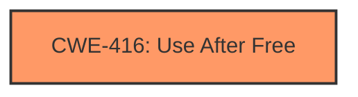

# Analysis Report for CVE-2022-2858

# Vulnerability Analysis Report: CVE-2022-2858

## Description

Use after free in Sign-In Flow in Google Chrome prior to 104.0.5112.101 allowed a remote attacker to potentially exploit heap corruption via specific UI interaction.

## Vulnerability Description Key Phrases

**Rootcause:** Use after free
**Impact:** heap corruption
**Vector:** specific UI interaction
**Attacker:** remote attacker
**Product:** Google Chrome
**Version:** prior to 104.0.5112.101
**Component:** Sign-In Flow

## Analysis (with Relationship Data)

# Summary
| CWE ID | CWE Name | Confidence | CWE Abstraction Level | CWE Vulnerability Mapping Label | CWE-Vulnerability Mapping Notes |
|---|---|---|---|---|---|
| CWE-416 | Use After Free | 0.95 | Variant | Allowed | Primary CWE |

## Evidence and Confidence

*   **Confidence Score:** 0.95
*   **Evidence Strength:** HIGH

- **Analysis and Justification:**  
  - *Explanation:* The vulnerability description explicitly states "**Use after free** in Sign-In Flow". This perfectly matches the description of CWE-416, "The product reuses or references memory after it has been freed." The CVE reference links further confirm this, stating the **root_cause** and **weaknesses** as "**Use after free**". The impact described, "heap corruption," is a common consequence of use-after-free vulnerabilities. CWE-416 is a Variant level CWE, which is a preferred level of abstraction. The MITRE mapping guidance for CWE-416 indicates this is ALLOWED.

  - *Relationship Analysis:* While CWE-416 doesn't have direct relationships listed that are immediately applicable, it's often a consequence of other weaknesses. It can be triggered by race conditions (like CWE-362) or improper resource management. However, without more information pinpointing the prerequisite weakness, focusing on the direct cause (CWE-416) is appropriate.

- **Confidence Score:**  
  - Confidence: 0.95 (High confidence due to explicit mention of "use after free" in the vulnerability description and CVE details)

## Criticism of Analysis

Okay, here's a review of the provided analysis, taking into account the full CWE specifications:

**Overall Assessment:**

The analysis is very good, especially in its identification of CWE-416 as the primary weakness. The high confidence score (0.95) is justified, given the explicit mention of "use after free" in the vulnerability description and CVE details. The justification is well-articulated and uses the CWE specification appropriately.  The inclusion of potential chaining and relationship analysis is a plus.

**Specific Comments and Suggestions:**

1.  **CWE-416: Use After Free (Primary CWE)**

    *   **Strengths:**
        *   Excellent identification and justification. The description provided in the initial analysis is spot on, reflecting the core definition of CWE-416.
        *   Correctly identifies it as a Variant level CWE.
        *   Acknowledges that the MITRE mapping guidance allows for this mapping.
    *   **Suggestions:**
        *   The analysis could benefit from a brief mention of the *specific* memory management model likely in use in the affected code.  Is it manual memory management (C/C++) or something else?  This context, even if speculative, can reinforce the identification of CWE-416.  The "Potential Mitigations" section of CWE-416 suggests using languages with automatic memory management, which directly addresses the root cause in environments where manual memory management is used.

2.  **Alternative CWE Considerations and Their Rejection:**

    *   The analysis briefly touches on race conditions (CWE-362) as a *possible* contributing factor. This is good, but could be expanded.  The "Relationships" section of the CWE-416 specification lists `CanFollow -> CWE-362`, suggesting that a race condition *could* lead to a use-after-free. However, the analysis correctly refrains from assigning CWE-362 *without* concrete evidence of concurrent access and improper synchronization *leading* to the UAF. This is appropriate. If there were more information about *how* the memory was freed, then considering CWE-362 (or its children like CWE-366 or CWE-367) would be warranted. For example if the race condition is related to locking then consider CWE-667 (Improper Locking).

    *   **Double Free (CWE-415):**  The analysis does not consider Double Free (CWE-415). While a double free *can* sometimes lead to a use-after-free condition, it's a distinct vulnerability.  The description should explicitly state why it *isn't* a double free, perhaps noting that there's no indication of the same memory being freed twice *before* the reuse.

    *   **Uninitialized Resource (CWE-908) / Uninitialized Variable (CWE-457):** These are not directly relevant in this scenario, as the issue is with *freed* memory, not uninitialized memory.

    *   **Type Confusion (CWE-843):** This is unlikely in this case, unless there's reason to believe that the type of the freed memory is being misinterpreted *after* it's freed. Without more information about the specific code, it's a less likely candidate.

    *   **Buffer Overflow (CWE-122, CWE-120):** Buffer overflows are a different class of vulnerability.  While a use-after-free can *lead* to heap corruption that *resembles* a buffer overflow, the initial cause is the use of freed memory. These are not primary causes, although CWE-416 can precede CWE-120 and CWE-123.

3.  **CWE Examples:**

    *   The inclusion of CVE examples for CWE-362 is good, but perhaps not relevant in this context since the analysis has determined that CWE-362 is likely not a contributing factor. Only include examples that are relevant to the analysis and the final assigned CWE.

4.  **Mitigations:**

    *   The analysis focuses on identifying the root cause (CWE-416) and does not cover mitigations. However, consider adding a brief section on *potential* mitigations based on the CWE specifications.  For CWE-416, this could include:
        *   **Language Selection:** (Architecture and Design) Choosing languages with automatic memory management.
        *   **Setting Pointers to NULL:** (Implementation)  As a defense-in-depth measure, set freed pointers to NULL. (Although, as the spec notes, this isn't foolproof with complex data structures).

**Revised Summary Table (Example - Add Mitigations):**

| CWE ID | CWE Name | Confidence | CWE Abstraction Level | CWE Vulnerability Mapping Label | CWE-Vulnerability Mapping Notes | Example Mitigations |
|---|---|---|---|---|---|---|
| CWE-416 | Use After Free | 0.95 | Variant | Allowed | Primary CWE | 1. Language Selection (Automatic Memory Management), 2. Set freed pointers to NULL |

**In conclusion:**

This is a very strong analysis.  The primary area for improvement is to add a *brief* consideration of other CWEs, explicitly stating why they are *not* the best fit, and to include a short section on *potential* mitigations based on the chosen CWE. This will make the analysis more comprehensive and demonstrate a deeper understanding of the CWE framework.

## Final Resolution

# Summary
| CWE ID | CWE Name | Confidence | CWE Abstraction Level | CWE Vulnerability Mapping Label | CWE-Vulnerability Mapping Notes |
|---|---|---|---|---|---|
| CWE-416 | Use After Free | 0.95 | Variant | Allowed | Primary CWE |

## Evidence and Confidence

*   **Confidence Score:** 0.95
*   **Evidence Strength:** HIGH

## Relationship Analysis
The primary relationship considered is that CWE-416 is a Variant and thus appropriately specific. Although CWE-416 can be part of a vulnerability chain, with other CWEs potentially preceding or following it, there is insufficient evidence to identify any specific related CWEs in this case. The analysis appropriately refrains from assigning other CWEs without concrete evidence.

## Vulnerability Chain
The vulnerability chain starts with a memory allocation, followed by the memory being freed, and subsequently reused after being freed, leading to heap corruption.
  - Initial Flaw: Memory allocated and used.
  - Weakness: Memory freed.
  - Consequence: Use of freed memory.
  - Impact: Heap corruption.
There are no identified missing links, based on the evidence.

## Summary of Analysis
The initial analysis correctly identified CWE-416 as the primary **weakness**. The vulnerability description explicitly mentions "Use after free," which directly corresponds to the definition of CWE-416. The analysis also correctly points out that CWE-416 is a Variant level CWE, making it an appropriate level of specificity. The criticism suggests considering other CWEs, such as CWE-362 (Race Condition), CWE-415 (Double Free), CWE-908 (Uninitialized Resource), CWE-843 (Type Confusion), and buffer overflows (CWE-122, CWE-120). However, without more information, these are not applicable. The high confidence level of 0.95 is justified due to the clear evidence in the vulnerability description. The final decision is based on the direct match between the vulnerability description and the CWE definition, as well as the appropriate level of specificity of CWE-416.

*Report generated on 2025-03-18 12:29:55*
