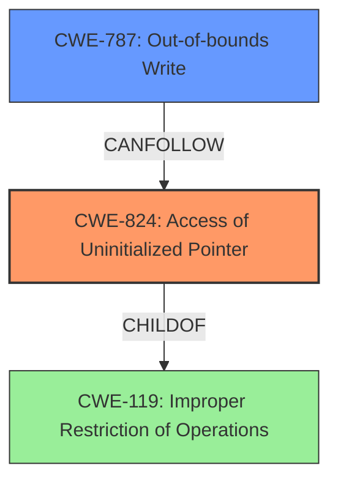

# Final Resolution for CVE-2022-28690

# Summary

| CWE ID | CWE Name | Confidence | CWE Abstraction Level | CWE Vulnerability Mapping Label | CWE-Vulnerability Mapping Notes |
|---|---|---|---|---|---|
| CWE-824 | Access of Uninitialized Pointer | 0.95 | Base | Primary | Allowed |
| CWE-787 | Out-of-bounds Write | 0.85 | Base | Secondary | Allowed |

## Evidence and Confidence

*   **Confidence Score:** 0.95
*   **Evidence Strength:** HIGH

## Relationship Analysis
The primary relationship influencing the decision is the CANPRECEDE relationship between CWE-824 (**Access of Uninitialized Pointer**) and CWE-787 (**Out-of-bounds Write**). This relationship accurately reflects the vulnerability description, where an uninitialized pointer leads to an out-of-bounds write. CWE-824 is a child of CWE-119 (**Improper Restriction of Operations within the Bounds of a Memory Buffer**), but choosing CWE-824 provides a more specific classification as it directly addresses the root cause.

## Vulnerability Chain
The vulnerability chain starts with the **ROOTCAUSE** being an **uninitialized pointer** (CWE-824). This allows the program to potentially access an arbitrary memory location. Dereferencing this **uninitialized pointer** leads to an **out-of-bounds write** (CWE-787), which can then result in arbitrary code execution.

## Summary of Analysis
The initial analysis and criticism are both accurate and well-supported by evidence from the vulnerability description. The description clearly states "out-of-bounds write via uninitialized pointer", which directly supports the selection of CWE-824 and CWE-787.

The graph relationships, particularly the CANPRECEDE relationship between CWE-824 and CWE-787, reinforces this decision. Selecting CWE-824 as the primary **WEAKNESS** accurately reflects the **ROOTCAUSE** of the vulnerability. The selection of these CWEs is at the optimal level of specificity because they directly address the flaws described in the vulnerability report. Higher level CWEs, such as CWE-119, would not be as precise in describing the root cause and consequence of this vulnerability.

The confidence remains high at 0.95 due to the explicit evidence in the vulnerability description and the confirming relationships between the selected CWEs.