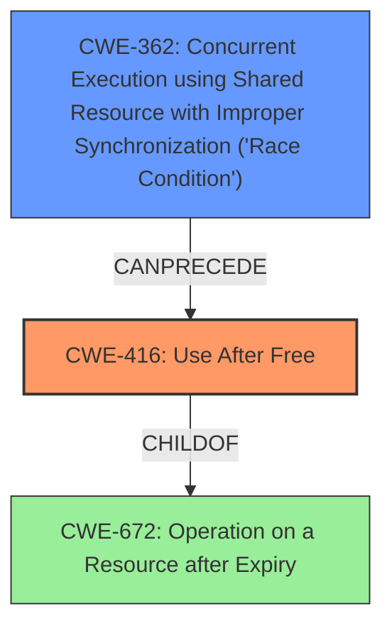

# Final Resolution for CVE-2022-28796

# Summary
| CWE ID | CWE Name | Confidence | CWE Abstraction Level | CWE Vulnerability Mapping Label | CWE-Vulnerability Mapping Notes |
|---|---|---|---|---|---|
| CWE-416 | Use After Free | 0.95 | Variant | Allowed | Primary CWE: The code accesses memory after it has been freed. |
| CWE-362 | Concurrent Execution using Shared Resource with Improper Synchronization ('Race Condition') | 0.9 | Class | Allowed-with-Review | Secondary CWE: A race condition leads to the use-after-free. |

## Evidence and Confidence

*   **Confidence Score:** 0.95
*   **Evidence Strength:** HIGH

## Relationship Analysis
The primary relationship is that CWE-362 (**Race Condition**) can lead to CWE-416 (**Use After Free**). CWE-416 is a variant of CWE-672 (Operation on a Resource after Expiry). While CWE-362 is a class-level CWE, no child CWE offers a more specific fit in this scenario. The analysis considered CWE-367 (TOCTOU) but determined it was not applicable.

## Vulnerability Chain
The vulnerability chain starts with a **race condition** (CWE-362) where `jbd2_journal_wait_updates` and `jbd2_journal_commit_transaction` concurrently access `journal->j_running_transaction` without proper synchronization. This leads to a situation where `transaction_t` is accessed after it has been freed, resulting in a **use-after-free** (CWE-416).

## Summary of Analysis
The initial analysis and criticism both accurately identified CWE-416 as the primary issue and CWE-362 as a contributing factor. The evidence from the CVE description, stating that a `transaction_t` structure is accessed after being freed, directly supports the classification of CWE-416. The **race condition** is explicitly mentioned, making CWE-362 a relevant secondary CWE.

The graph relationships confirm that CWE-362 can indeed lead to CWE-416. Although CWE-362 is a class-level CWE, the analysis considered and rejected other, more specific CWEs like CWE-367 (TOCTOU) because they did not accurately reflect the nature of the vulnerability. The selection of CWEs is at the optimal level of specificity based on the available evidence.

The confidence score is increased to 0.95 because both initial analysis and criticism aligned, and there is clear evidence in the vulnerability description to support this. The chosen CWEs are at the appropriate level of abstraction, with CWE-416 being a Variant and CWE-362 being a Class that accurately describes the **race condition** leading to the **use-after-free**.