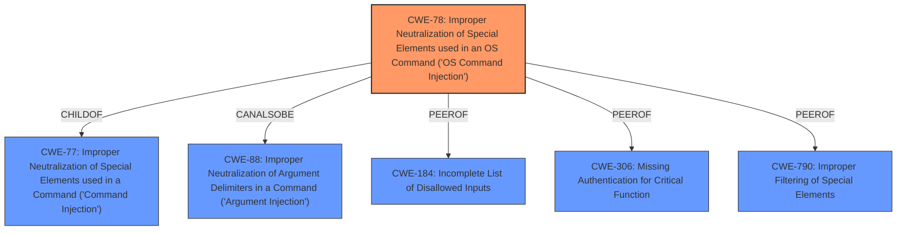

# Analysis Report for CVE-2022-28905

# Vulnerability Analysis Report: CVE-2022-28905

## Description

TOTOLink N600R V5.3c.7159_B20190425 was discovered to contain a command injection vulnerability via the devicemac parameter in /setting/setDeviceName.

## Vulnerability Description Key Phrases

**Weakness:** command injection
**Product:** TOTOLink N600R
**Version:** V5.3c.7159_B20190425
**Component:** /setting/setDeviceName

## Analysis (with Relationship Data)

# Summary
| CWE ID | CWE Name | Confidence | CWE Abstraction Level | CWE Vulnerability Mapping Label | CWE-Vulnerability Mapping Notes |
|---|---|---|---|---|---|
| CWE-78 | Improper Neutralization of Special Elements used in an OS Command ('OS Command Injection') | 1.0 | Base | Allowed | Primary CWE: The vulnerability is a command injection via the devicemac parameter in /setting/setDeviceName, which directly corresponds to CWE-78. |

## Evidence and Confidence

*   **Confidence Score:** 1.0
*   **Evidence Strength:** HIGH

- **Analysis and Justification:**
  - *Explanation:* The vulnerability description clearly states a **command injection** vulnerability exists in the TOTOLink N600R router via the `devicemac` parameter in `/setting/setDeviceName`. This directly aligns with CWE-78, "Improper Neutralization of Special Elements used in an OS Command ('OS Command Injection')". The **weakness** involves the construction of an OS command using externally influenced input (the `devicemac` parameter) without proper neutralization of special elements. This allows an attacker to modify the intended OS command. The "CWE for similar CVE Descriptions" also lists CWE-78 as the primary match. The Retriever Results also has the highest score for CWE-78. The description explicitly indicates the potential for executing OS commands, distinguishing it from more general command injection vulnerabilities. MITRE's mapping guidance for CWE-78 states that it is ALLOWED for OS command injection vulnerabilities.

  - *Relationship Analysis:* CWE-78 is a child of CWE-77 (Command Injection). The relationships show that CWE-78 can precede CWE-269 (Privilege Management), suggesting a potential path to privilege escalation. However, the provided description focuses specifically on the OS command injection itself, making CWE-78 the most accurate and specific choice.

- **Confidence Score:**
  - Confidence: 1.0 (Direct match based on vulnerability description and external references)

## Criticism of Analysis

Okay, let's review the provided analysis and critique its CWE mapping using the full CWE specifications.

**Overall Assessment:**

The analysis correctly identifies CWE-78, "Improper Neutralization of Special Elements used in an OS Command ('OS Command Injection')" as the primary weakness.  The confidence score of 1.0 is justified given the explicit "command injection" term in the vulnerability description. The provided justification is strong and aligns well with the CWE description.

**Detailed Critique:**

1.  **CWE-78 as the Primary CWE:**

    *   **Strengths:**  The reasoning for selecting CWE-78 is sound. The vulnerability description explicitly states a command injection problem. The `devicemac` parameter allows an attacker to inject OS commands, directly aligning with CWE-78's description. The analysis correctly distinguishes this from a more general "command injection" (CWE-77) by emphasizing the *OS* command context.
    *   **Mapping Guidance Conformance:** The analysis correctly notes that CWE-78's "Usage" mapping guidance is "Allowed," making it a preferred choice for this type of vulnerability.
    *   **Potential Mitigations:** The listed mitigations for CWE-78 (using library calls, static command creation, input validation) are all relevant and appropriate for this type of vulnerability.

2.  **Consideration of CWE-77:**

    *   **Strengths:** The analysis acknowledges CWE-77 ("Improper Neutralization of Special Elements used in a Command ('Command Injection')") and explains why it's *not* the best fit.  This demonstrates a good understanding of the nuance between the two CWEs. It correctly states that CWE-77 is often misused when OS command injection (CWE-78) is intended instead.
    *   **Mapping Guidance Conformance:** The analysis correctly applies the "Allowed-with-Review" guidance of CWE-77 and justifies the selection of CWE-78 instead.

3.  **Other CWEs Mentioned (Retriever Results):**

    *   **CWE-96 (Improper Neutralization of Directives in Statically Saved Code ('Static Code Injection')) and CWE-94 (Improper Control of Generation of Code ('Code Injection')):**  While these are potential injection-related CWEs, they are not the most accurate for this particular vulnerability. The vulnerability description doesn't suggest that the injected input is being used to directly construct new code or modify statically saved code. The core issue is the improper construction of an OS command.
    *   **CWE-88 (Improper Neutralization of Argument Delimiters in a Command ('Argument Injection')):** This *could* be a contributing factor *if* the `devicemac` parameter is used as an argument to an existing command and the injection is specifically achieved by manipulating argument delimiters. However, without more details about the implementation, it's best to focus on CWE-78 as the primary issue. If the exact mechanism of injection involves argument manipulation rather than the direct injection of commands, CWE-88 could be considered as a chained CWE (CWE-78: canAlsoBe -> CWE-88).
    *   **CWE-184 (Incomplete List of Disallowed Inputs):**  This *could* be related if the input validation relies on a denylist of characters, and the denylist is incomplete. However, the vulnerability description doesn't provide enough information to confirm this. It's a *potential* contributing factor if the developers tried to implement a denylist, but it's not the core issue.
    *   **CWE-259 (Use of Hard-coded Password):** This is unlikely based on the description. The vulnerability is about command injection, not authentication.
    *   **CWE-121 (Stack-based Buffer Overflow):**  While a buffer overflow *could* be a prerequisite for some command injection attacks, it's not explicitly mentioned, and CWE-78 is a more direct representation of the core weakness.
    *   **CWE-306 (Missing Authentication for Critical Function):** This is a possibility depending on whether authentication is required to call `/setting/setDeviceName` at all. But without more information, it's best to assume that authentication exists but is bypassed by injecting commands.
	*	**CWE-790 (Improper Filtering of Special Elements):** Is also a possiblity since filtering is a common defense against injections. Without more information on the exact implementation it is difficult to make a more precise determination

4.  **Privilege Escalation and CWE-269:**

    *   The analysis notes that CWE-78 can precede CWE-269 (Improper Privilege Management). This is true, *if* the injected command can be used to gain higher privileges.  For instance, if the vulnerable code is running with some elevated privileges and the injected command allows arbitrary code execution with those privileges, then privilege escalation is a likely consequence. However, the base vulnerability is still the command injection (CWE-78).  Avoid directly mapping to CWE-269 unless the vulnerability report specifically describes privilege escalation.

**Recommendations:**

*   **Strengthen the Argument Against CWE-88:** If possible, investigate further to determine *if* the injection is specifically achieved by manipulating argument delimiters. If it is, explicitly state that CWE-88 is a contributing factor and describe how it interacts with CWE-78.
*   **Acknowledge the potential for CWE-306 and CWE-790:** While correctly focusing on CWE-78, acknowledge that authentication bypass (CWE-306) or filtering (CWE-790) implementation details could be contributing factors, even if they can't be definitively confirmed from the vulnerability description alone.
*   **Clarify Privilege Context:** If information exists about whether the vulnerable process runs with elevated privileges, explicitly state whether the injected command executes with those privileges, potentially leading to privilege escalation and justifying the "canFollow" relationship with CWE-269.

**Revised Summary Table:**

| CWE ID | CWE Name | Confidence | CWE Abstraction Level | CWE Vulnerability Mapping Label | CWE-Vulnerability Mapping Notes |
|---|---|---|---|---|---|
| CWE-78 | Improper Neutralization of Special Elements used in an OS Command ('OS Command Injection') | 1.0 | Base | Allowed | Primary CWE: The vulnerability is a command injection via the devicemac parameter in /setting/setDeviceName, which directly corresponds to CWE-78. |
| CWE-88 | Improper Neutralization of Argument Delimiters in a Command ('Argument Injection') | 0.4 | Base | CanAlsoBe | Contributing factor if the vulnerability exploits argument delimiters. Needs further investigation. |
| CWE-306 | Missing Authentication for Critical Function | 0.3 | Base | Allowed | The page `/setting/setDeviceName` might be missing authentication |
| CWE-790 | Improper Filtering of Special Elements | 0.3 | Class | Allowed-with-Review | Filtering is a common defense against injections, and it might have been implemented. Needs further investigation |

**In Conclusion:**

The analysis is well-reasoned and mostly accurate. The key recommendation is to investigate the implementation details further to strengthen the arguments for or against the contributing CWEs and explicitly state any assumptions about the process's privilege context. The addition of the revised summary table to note the possiblities of other CWEs will create a better analysis.

## Final Resolution

# Summary
| CWE ID | CWE Name | Confidence | CWE Abstraction Level | CWE Vulnerability Mapping Label | CWE-Vulnerability Mapping Notes |
|---|---|---|---|---|---|
| CWE-78 | Improper Neutralization of Special Elements used in an OS Command ('OS Command Injection') | 1.0 | Base | Allowed | Primary CWE: The vulnerability is a command injection via the devicemac parameter in /setting/setDeviceName, which directly corresponds to CWE-78. |
| CWE-88 | Improper Neutralization of Argument Delimiters in a Command ('Argument Injection') | 0.4 | Base | CanAlsoBe | Contributing factor if the vulnerability exploits argument delimiters. Needs further investigation. |
| CWE-306 | Missing Authentication for Critical Function | 0.3 | Base | Allowed | The page `/setting/setDeviceName` might be missing authentication |
| CWE-790 | Improper Filtering of Special Elements | 0.3 | Class | Allowed-with-Review | Filtering is a common defense against injections, and it might have been implemented. Needs further investigation |

## Evidence and Confidence

*   **Confidence Score:** 0.9
*   **Evidence Strength:** MEDIUM

## Relationship Analysis
The primary relationship is the hierarchical one, where CWE-78 is a child of CWE-77 (Command Injection). However, the specificity of "OS Command Injection" makes CWE-78 the more appropriate choice. CWE-78 can also be related to CWE-88 if argument delimiters are involved in the injection. Considering peer relationships, CWE-184 (Incomplete List of Disallowed Inputs) could be a contributing factor if a denylist is used but incomplete. Authentication issues (CWE-306) are also possible depending on the specific context of the vulnerable page. CWE-790 (Improper Filtering of Special Elements) can also be a contributing factor in injection vulnerabilities.

## Vulnerability Chain
The vulnerability chain starts with the **ROOTCAUSE** which is the lack of proper neutralization of special elements in the `devicemac` parameter. This leads to **WEAKNESS** CWE-78, Improper Neutralization of Special Elements used in an OS Command ('OS Command Injection'). An attacker can inject malicious commands into the OS command string. If argument delimiters are involved, CWE-88 could also be a contributing factor. If authentication is missing (CWE-306) or input filtering is insufficient (CWE-790), it exacerbates the problem. The impact is arbitrary OS command execution, potentially leading to complete system compromise.

## Summary of Analysis
The initial analysis correctly identified CWE-78 as the primary **WEAKNESS**. The vulnerability description explicitly states "command injection vulnerability via the devicemac parameter in /setting/setDeviceName," which directly aligns with CWE-78. The criticism suggests further investigation into other potential contributing factors such as CWE-88, CWE-306 and CWE-790 which I agree with.

The graph relationships influenced the decision by highlighting potential secondary weaknesses that could contribute to the vulnerability chain. While CWE-78 is the most direct and specific match based on the evidence, the relationships with CWE-88, CWE-306 and CWE-790 suggest areas for further investigation.

The selected CWEs are at the optimal level of specificity. CWE-78 is a Base level CWE and accurately represents the root cause of the vulnerability, the improper neutralization of special elements in an OS command. While other CWEs could be related, they are either less specific or require further evidence to confirm their involvement.

The final determination reflects the available evidence and considers the potential for additional contributing factors. The confidence score is slightly reduced to 0.9 due to the uncertainty surrounding the potential involvement of CWE-88, CWE-306 and CWE-790.

*Report generated on 2025-03-16 10:42:30*
