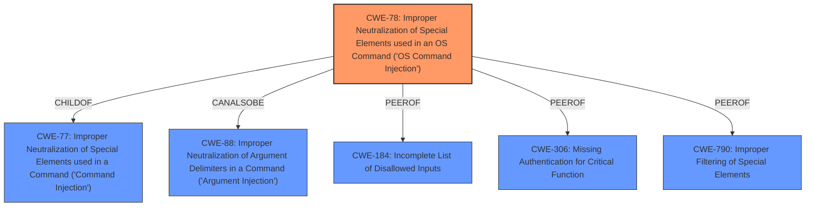

# Final Resolution for CVE-2022-28905

# Summary
| CWE ID | CWE Name | Confidence | CWE Abstraction Level | CWE Vulnerability Mapping Label | CWE-Vulnerability Mapping Notes |
|---|---|---|---|---|---|
| CWE-78 | Improper Neutralization of Special Elements used in an OS Command ('OS Command Injection') | 1.0 | Base | Allowed | Primary CWE: The vulnerability is a command injection via the devicemac parameter in /setting/setDeviceName, which directly corresponds to CWE-78. |
| CWE-88 | Improper Neutralization of Argument Delimiters in a Command ('Argument Injection') | 0.4 | Base | CanAlsoBe | Contributing factor if the vulnerability exploits argument delimiters. Needs further investigation. |
| CWE-306 | Missing Authentication for Critical Function | 0.3 | Base | Allowed | The page `/setting/setDeviceName` might be missing authentication |
| CWE-790 | Improper Filtering of Special Elements | 0.3 | Class | Allowed-with-Review | Filtering is a common defense against injections, and it might have been implemented. Needs further investigation |

## Evidence and Confidence

*   **Confidence Score:** 0.9
*   **Evidence Strength:** MEDIUM

## Relationship Analysis
The primary relationship is the hierarchical one, where CWE-78 is a child of CWE-77 (Command Injection). However, the specificity of "OS Command Injection" makes CWE-78 the more appropriate choice. CWE-78 can also be related to CWE-88 if argument delimiters are involved in the injection. Considering peer relationships, CWE-184 (Incomplete List of Disallowed Inputs) could be a contributing factor if a denylist is used but incomplete. Authentication issues (CWE-306) are also possible depending on the specific context of the vulnerable page. CWE-790 (Improper Filtering of Special Elements) can also be a contributing factor in injection vulnerabilities.

## Vulnerability Chain
The vulnerability chain starts with the **ROOTCAUSE** which is the lack of proper neutralization of special elements in the `devicemac` parameter. This leads to **WEAKNESS** CWE-78, Improper Neutralization of Special Elements used in an OS Command ('OS Command Injection'). An attacker can inject malicious commands into the OS command string. If argument delimiters are involved, CWE-88 could also be a contributing factor. If authentication is missing (CWE-306) or input filtering is insufficient (CWE-790), it exacerbates the problem. The impact is arbitrary OS command execution, potentially leading to complete system compromise.

## Summary of Analysis
The initial analysis correctly identified CWE-78 as the primary **WEAKNESS**. The vulnerability description explicitly states "command injection vulnerability via the devicemac parameter in /setting/setDeviceName," which directly aligns with CWE-78. The criticism suggests further investigation into other potential contributing factors such as CWE-88, CWE-306 and CWE-790 which I agree with.

The graph relationships influenced the decision by highlighting potential secondary weaknesses that could contribute to the vulnerability chain. While CWE-78 is the most direct and specific match based on the evidence, the relationships with CWE-88, CWE-306 and CWE-790 suggest areas for further investigation.

The selected CWEs are at the optimal level of specificity. CWE-78 is a Base level CWE and accurately represents the root cause of the vulnerability, the improper neutralization of special elements in an OS command. While other CWEs could be related, they are either less specific or require further evidence to confirm their involvement.

The final determination reflects the available evidence and considers the potential for additional contributing factors. The confidence score is slightly reduced to 0.9 due to the uncertainty surrounding the potential involvement of CWE-88, CWE-306 and CWE-790.