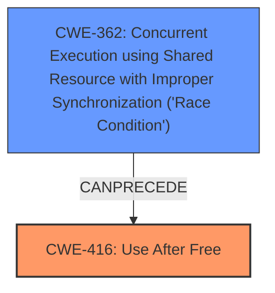

# Analysis Report for CVE-2022-2896

# Vulnerability Analysis Report: CVE-2022-2896

## Description

Measuresoft ScadaPro Server (All Versions) allows use after free while processing a specific project file.

## Vulnerability Description Key Phrases

**Weakness:** use after free
**Product:** Measuresoft ScadaPro Server
**Version:** All Versions

## Analysis (with Relationship Data)

# Summary
| CWE ID  | CWE Name                       | Confidence | CWE Abstraction Level | CWE Vulnerability Mapping Label | CWE-Vulnerability Mapping Notes |
| :-------- | :----------------------------- | :--------- | :---------------------- | :------------------------------ | :------------------------------ |
| CWE-416 | Use After Free                 | 1.0        | Variant                 | Allowed                         | Primary CWE                     |

## Evidence and Confidence

*   **Confidence Score:** 1.0
*   **Evidence Strength:** HIGH

- **Analysis and Justification:**  
  - *Explanation:* The vulnerability description clearly states "**use after free** while processing a specific project file." The **CVE Reference Links Content Summary** also confirms "**Use-After-Free (CWE-416)**" as a weakness. CWE-416 is a Variant level CWE, which is a preferred level of abstraction. The Retriever Results also lists CWE-416 as the top candidate with the highest score and graph score of 1.0. MITRE mapping guidance for CWE-416 indicates this is ALLOWED.

  - *Relationship Analysis:* There are multiple relationships for CWE-416, including `CANFOLLOW`, `CANPRECEDE`, `CHILDOF`, `PEEROF`, and `PARENTOF`. However, none of these relationships change the determination that CWE-416 is the best fit.

- **Confidence Score:**  
  - *Example:* Confidence: 1.0 (High evidence from technical description and CVE reference materials)

---

## Criticism of Analysis

Okay, I've reviewed the provided analysis and the full CWE specifications. Here's my critique:

**Overall Assessment:**

The analysis correctly identifies CWE-416 (Use After Free) as the primary weakness. The confidence score of 1.0 is justified given the clear description in the vulnerability information. The justification is sound and accurately reflects the nature of the bug.  The analysis also correctly points out that CWE-416 is an "Allowed" mapping, as it is a Variant level CWE.

**Strengths:**

*   **Accurate Identification:** The core finding of CWE-416 is the correct and most direct mapping based on the provided information.
*   **Good Justification:** The explanation of why CWE-416 is appropriate is clear and well-reasoned.
*   **Awareness of Abstraction Level:** The analysis acknowledges and emphasizes the importance of choosing a Variant-level CWE when possible.
*   **Reference to CWE Mapping Guidance:** The analysis explicitly mentions and follows the CWE's mapping guidance.
* **Consideration of Relationships:** The analysis correctly states that there are multiple relationships for CWE-416, including `CANFOLLOW`, `CANPRECEDE`, `CHILDOF`, `PEEROF`, and `PARENTOF`, but that none of these relationships change the determination that CWE-416 is the best fit.

**Areas for Potential Improvement/Considerations:**

*   **Root Cause Exploration (Limited by Input):** While CWE-416 is the *direct* cause, it's beneficial to consider potential *root causes* *if the data allows*.  The `Retriever Results` hint at possible underlying issues.  For example:

    *   **Race Conditions (CWE-362, CWE-366, CWE-364):** The `Retriever Results` list these. If the project file processing involves multiple threads or asynchronous operations, a race condition *could* be a contributing factor *leading to* the use-after-free.  The provided CVE examples for CWE-416 show several cases where race conditions lead to use-after-free.  *However, the provided data doesn't explicitly state this, so this remains speculative.*  If the underlying cause *is* a race condition, the fix would need to address the synchronization issues as well as preventing the UAF.
    *   **Improper Resource Locking (CWE-413):** One of the CVE examples for CWE-416 is chained to CWE-413. It *could* be that improper resource locking is the root cause; however, the information provided doesn't suggest this.
    *   **Memory Management Errors (CWE-401, CWE-415):** While less likely given the explicit "use after free" wording, consider if there were any indications of related memory management problems that could set the stage for the UAF.

    *Even if a race condition isn't the direct cause, the `Potential Mitigations` for CWE-362 and related race condition CWEs could inform the overall security strategy for the product.*

*   **Mitigation Strategies Beyond Language Choice/Nulling:** The current analysis mentions mitigation strategies based on language selection and setting pointers to NULL. While valid, the mitigation section could be slightly broadened to hint at more specific, lower-level strategies, especially if the language *is* fixed. For instance:

    *   **Smart Pointers (C++):** If C++ is used, promoting the use of smart pointers (unique\_ptr, shared\_ptr) can automatically manage memory and prevent UAF errors.
    *   **Memory Sanitizers (Compile-Time/Runtime):** Tools like AddressSanitizer (ASan) and MemorySanitizer (MSan) can detect UAF errors during development and testing. Integrating these tools into the build process would be a valuable mitigation.
    *   **Code Reviews Focused on Memory Management:** Targeted code reviews specifically looking for potential double-frees, dangling pointers, and incorrect memory allocation/deallocation patterns.
    *   **Object Lifecyle Management:** Ensuring objects and resources have well-defined lifecycles, and that any functions using those objects are aware of those lifecycles.

* **Chains:** The analysis mentions relationship types for CWE-416, but does not explore potential chains, which could reveal more about the underlying root cause(s). For example, if the crafted project file triggers the UAF because it causes a signal handler to call `free()` on a resource, and then the main thread later accesses that memory address, the full chain might be CWE-364 -> CWE-416.

**Specific CWE Considerations:**

*   **CWE-362 et al. (Race Conditions):** *If* concurrency is involved, consider the "Potential Mitigations" for these CWEs. They emphasize synchronization primitives (mutexes, locks, etc.) and thread-safe data structures. If the UAF happens due to a race condition, then not only must the UAF be fixed, but the underlying race needs to be addressed, or the UAF might just be a symptom of a larger issue.
*   **CWE-401 (Memory Leak):** While a UAF is different from a memory leak, sometimes they can be related to similar coding errors. It's worth considering, as a secondary concern, whether the code involved in the UAF might *also* have a potential for memory leaks.
*   **CWE-415 (Double Free):** This is a peer of CWE-416, and double-frees can *lead* to UAF vulnerabilities. However, with "use after free" being explicitly mentioned, double-free is a less probable finding.

**Conclusion:**

The analysis is fundamentally correct and well-justified in its core finding of CWE-416. The suggested improvements focus on exploring potential root causes (if more information were available) and expanding the mitigation strategies to provide a more comprehensive security perspective. The Retriever Results provides other CWEs that could be used to define a more complete chain of vulnerabilities.

## Final Resolution

# Summary
| CWE ID  | CWE Name                       | Confidence | CWE Abstraction Level | CWE Vulnerability Mapping Label | CWE-Vulnerability Mapping Notes |
| :-------- | :----------------------------- | :--------- | :---------------------- | :------------------------------ | :------------------------------ |
| CWE-416 | Use After Free                 | 0.9        | Variant                 | Allowed                         | Primary CWE                     |
| CWE-362 | Concurrent Execution using Shared Resource with Improper Synchronization ('Race Condition') | 0.6        | Class                 | Allowed-with-Review                         | Secondary Candidate |

## Evidence and Confidence

*   **Confidence Score:** 0.8
*   **Evidence Strength:** MEDIUM

## Relationship Analysis
The initial analysis correctly identified CWE-416 as the primary issue. The criticism raises a valid point about the potential for underlying race conditions. Although the description focuses on "use after free", the possibility of concurrent access leading to this condition warrants consideration. The relationship between CWE-362 and CWE-416, specifically the `CANPRECEDE` relationship, supports this. While not explicitly stated, the project file processing could involve multiple threads, making a race condition a plausible root cause. Choosing CWE-416 as primary and CWE-362 as secondary captures both the immediate vulnerability and a potential underlying issue that needs investigation.

## Vulnerability Chain
The vulnerability chain potentially starts with a **CWE-362** (Race Condition) where concurrent threads access shared resources without proper synchronization. This leads to a **CWE-416** (Use After Free) condition when one thread frees memory that another thread is still using. The impact is potential arbitrary code execution or denial of service. A missing link is explicit evidence of the race condition, which requires deeper investigation.

## Summary of Analysis
The initial analysis correctly identifies **CWE-416** (Use After Free) as the primary vulnerability. The criticism highlights the potential for a root cause such as a race condition (**CWE-362**). The provided vulnerability description mentions "use after free while processing a specific project file," which directly aligns with **CWE-416**. However, the Retriever Results and CVE examples associated with **CWE-416** suggest race conditions as possible contributing factors. Given that the project file processing *could* involve multiple threads, **CWE-362** becomes a plausible secondary CWE, especially considering the `CANPRECEDE` relationship between **CWE-362** and **CWE-416**. Selecting **CWE-416** as the primary and **CWE-362** as a secondary candidate provides a more comprehensive view of the vulnerability while acknowledging the limitations of the provided evidence. The confidence score is reduced to 0.9 for CWE-416 and 0.6 for CWE-362 to reflect the speculative nature of the race condition. Choosing both CWEs provides a path forward for further investigation and remediation, starting with confirming or denying the presence of a race condition.

*Report generated on 2025-03-18 12:32:43*
