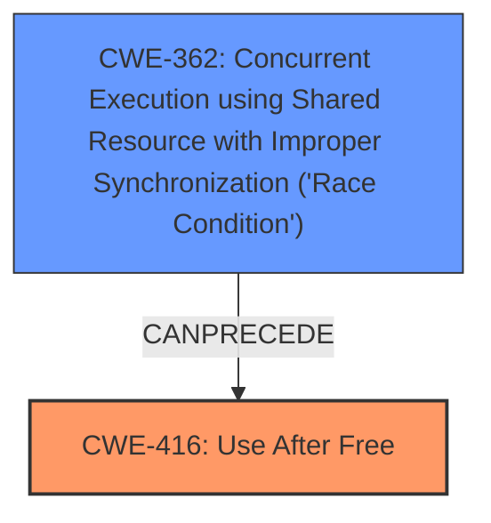

# Final Resolution for CVE-2022-2896

# Summary
| CWE ID  | CWE Name                       | Confidence | CWE Abstraction Level | CWE Vulnerability Mapping Label | CWE-Vulnerability Mapping Notes |
| :-------- | :----------------------------- | :--------- | :---------------------- | :------------------------------ | :------------------------------ |
| CWE-416 | Use After Free                 | 0.9        | Variant                 | Allowed                         | Primary CWE                     |
| CWE-362 | Concurrent Execution using Shared Resource with Improper Synchronization ('Race Condition') | 0.6        | Class                 | Allowed-with-Review                         | Secondary Candidate |

## Evidence and Confidence

*   **Confidence Score:** 0.8
*   **Evidence Strength:** MEDIUM

## Relationship Analysis
The initial analysis correctly identified CWE-416 as the primary issue. The criticism raises a valid point about the potential for underlying race conditions. Although the description focuses on "use after free", the possibility of concurrent access leading to this condition warrants consideration. The relationship between CWE-362 and CWE-416, specifically the `CANPRECEDE` relationship, supports this. While not explicitly stated, the project file processing could involve multiple threads, making a race condition a plausible root cause. Choosing CWE-416 as primary and CWE-362 as secondary captures both the immediate vulnerability and a potential underlying issue that needs investigation.

## Vulnerability Chain
The vulnerability chain potentially starts with a **CWE-362** (Race Condition) where concurrent threads access shared resources without proper synchronization. This leads to a **CWE-416** (Use After Free) condition when one thread frees memory that another thread is still using. The impact is potential arbitrary code execution or denial of service. A missing link is explicit evidence of the race condition, which requires deeper investigation.

## Summary of Analysis
The initial analysis correctly identifies **CWE-416** (Use After Free) as the primary vulnerability. The criticism highlights the potential for a root cause such as a race condition (**CWE-362**). The provided vulnerability description mentions "use after free while processing a specific project file," which directly aligns with **CWE-416**. However, the Retriever Results and CVE examples associated with **CWE-416** suggest race conditions as possible contributing factors. Given that the project file processing *could* involve multiple threads, **CWE-362** becomes a plausible secondary CWE, especially considering the `CANPRECEDE` relationship between **CWE-362** and **CWE-416**. Selecting **CWE-416** as the primary and **CWE-362** as a secondary candidate provides a more comprehensive view of the vulnerability while acknowledging the limitations of the provided evidence. The confidence score is reduced to 0.9 for CWE-416 and 0.6 for CWE-362 to reflect the speculative nature of the race condition. Choosing both CWEs provides a path forward for further investigation and remediation, starting with confirming or denying the presence of a race condition.