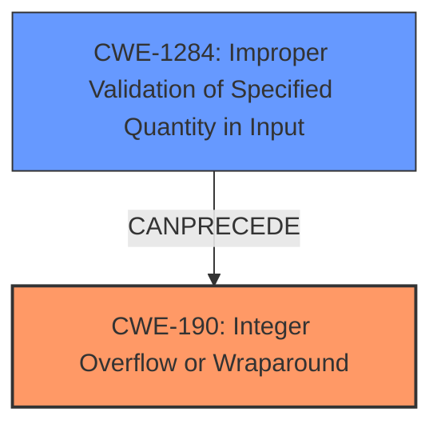

# Final Resolution for CVE-2022-29203

# Summary
| CWE ID  | CWE Name | Confidence | CWE Abstraction Level | CWE Vulnerability Mapping Label | CWE-Vulnerability Mapping Notes |
|---|---|---|---|---|---|
| CWE-190 | Integer Overflow or Wraparound | 1.0 | Base | Allowed | Primary CWE. The vulnerability stems from an integer overflow in the implementation of `tf.raw_ops.SpaceToBatchND`. |
| CWE-1284 | Improper Validation of Specified Quantity in Input | 0.8 | Base | Allowed | Secondary Candidate. The dimensions of the input tensor and block shape are not validated to be within a range that would prevent an integer overflow when multiplied, directly contributing to the CWE-190 condition. |

## Evidence and Confidence

*   **Confidence Score:** 0.95
*   **Evidence Strength:** HIGH

## Relationship Analysis
The primary relationship is that the lack of input validation (CWE-1284) directly enables the integer overflow (CWE-190). While CWE-190 stands as the immediate cause, the absence of proper validation on the input quantities sets the stage for this overflow. Both are Base level CWEs, making them suitable for direct mapping.

## Vulnerability Chain
The vulnerability chain starts with the **ROOTCAUSE** of improper input validation (**CWE-1284**). The dimensions of the input tensor and block shape are not validated to be within a safe range. This lack of validation **CANPRECEDE** an **integer overflow** (**CWE-190**) when these unchecked dimensions are multiplied to calculate the output tensor size. The overflow leads to the allocation of a smaller-than-expected buffer. This subsequently causes a denial of service due to an assertion failure when the program attempts to write data into the undersized buffer.

## Summary of Analysis
The initial analysis correctly identified CWE-190 as the primary weakness. The criticism suggested strengthening the link between CWE-1284 and CWE-190, which has been addressed by explicitly stating how the lack of validation directly leads to the integer overflow. The final assessment is highly based on the provided evidence: "The vulnerability description clearly states that the root cause is an **integer overflow** in the `tf.raw_ops.SpaceToBatchND` function within TensorFlow." and "The vulnerability occurs because the dimensions of the input tensor and block shape are multiplied without proper validation to prevent overflows". The graph relationships influenced the final selection by highlighting the chain of events: improper validation leading to an integer overflow. The selected CWEs are at the optimal level of specificity because they directly represent the **ROOTCAUSE** and contributing factors of the vulnerability.