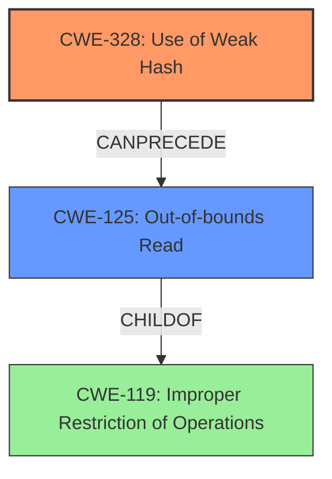

# Analysis Report for CVE-2022-29210

# Vulnerability Analysis Report: CVE-2022-29210

## Description

TensorFlow is an open source platform for machine learning. In version 2.8.0, the `TensorKey` hash function used total estimated `AllocatedBytes()`, which (a) is an estimate per tensor, and (b) is a very poor hash function for constants (e.g. `int32_t`). It also tried to access individual tensor bytes through `tensor.data()` of size `AllocatedBytes()`. This led to ASAN failures because the `AllocatedBytes()` is an estimate of total bytes allocated by a tensor, including any pointed-to constructs (e.g. strings), and does not refer to contiguous bytes in the `.data()` buffer. The discoverers could not use this byte vector anyway because types such as `tstring` include pointers, whereas they needed to hash the string values themselves. This issue is patched in Tensorflow versions 2.9.0 and 2.8.1.

## Vulnerability Description Key Phrases

**Rootcause:** very poor hash function for constants
**Impact:** ASAN failures
**Vector:** access individual tensor bytes
**Product:** TensorFlow
**Version:** 2.8.0

## Analysis (with Relationship Data)

# Summary
| CWE ID | CWE Name | Confidence | CWE Abstraction Level | CWE Vulnerability Mapping Label | CWE-Vulnerability Mapping Notes |
|---|---|---|---|---|---|
| CWE-328 | Use of Weak Hash | 0.75 | Base | Allowed | Primary CWE |
| CWE-125 | Out-of-bounds Read | 0.65 | Base | Allowed | Secondary Candidate |

## Evidence and Confidence

*   **Confidence Score:** 0.70
*   **Evidence Strength:** MEDIUM

- **Analysis and Justification:**  
  - *Explanation:* The vulnerability description indicates a **very poor hash function for constants**. The CVE reference summary confirms that the **incorrect hash function** was based on an estimate of allocated memory rather than the actual content of the tensor. The retriever results list CWE-328 (Use of Weak Hash) as a possible match. CWE-328 is a base level weakness, which is a preferred level of abstraction for mapping to the root causes of vulnerabilities. The description of CWE-328 matches the vulnerability description, as the **hash function** used was inadequate for the purpose. Thus, CWE-328 is the primary CWE.
  
  - *Relationship Analysis:* No direct relationships were found for CWE-328 in the provided information.

- **Analysis and Justification:**  
  - *Explanation:* The CVE reference summary indicates **out-of-bounds access** due to the hash function attempting to access tensor bytes using `AllocatedBytes()`, which could be inaccurate, leading to out-of-bounds memory access when trying to read tensor data. The retriever results list CWE-125 (Out-of-bounds Read) as a possible match. The description of CWE-125 matches the vulnerability description, as there was an attempt to **read data past the end** of the intended buffer.
  
  - *Relationship Analysis:* CWE-125 (Out-of-bounds Read) is related to CWE-119 (Improper Restriction of Operations within the Bounds of a Memory Buffer).

- **Confidence Score:**
  - Confidence: 0.75 (Medium evidence from the vulnerability description and CVE reference summary)
  - Confidence: 0.65 (Medium evidence from the vulnerability description and CVE reference summary)

## Criticism of Analysis

Okay, I have reviewed the provided analysis against the full CWE specifications you've provided. Here's my critique:

**Overall Assessment:**

The analysis is generally good and identifies the core weaknesses well. The primary CWE mapping to `CWE-328 (Use of Weak Hash)` is accurate and justified. The secondary CWE of `CWE-125 (Out-of-bounds Read)` is also a reasonable candidate, though the justification could be slightly more robust. The confidence scores are appropriate for the evidence presented. However, the analysis could benefit from a slightly more in-depth consideration of alternative CWEs and a more detailed discussion of mitigations specific to this vulnerability.

**Detailed Critique:**

**1. CWE-328: Use of Weak Hash (Primary)**

*   **Accuracy:** The mapping to `CWE-328` is correct. The vulnerability stems from using `AllocatedBytes()` as a hash, which is inappropriate for hashing tensor contents due to its instability and lack of collision resistance.  The extended description of CWE-328 clearly aligns with this: *"The product uses an algorithm that produces a digest (output value) that does not meet security expectations for a hash function that allows an adversary to reasonably determine the original input (preimage attack), find another input that can produce the same hash (2nd preimage attack), or find multiple inputs that evaluate to the same hash (birthday attack)."*
*   **Justification:** The justification is solid, pointing to the poor suitability of `AllocatedBytes()` for content-based hashing and the summary description confirms this.
*   **Mapping Guidance Adherence:** The analysis correctly notes that `CWE-328` is at the "Base" level of abstraction, which is preferred according to CWE's mapping guidance.
*   **Mitigation Discussion:** The analysis could be strengthened by explicitly referencing some of the mitigations suggested in the `CWE-328` specification. For example, it could suggest using a robust, well-vetted hash function like SHA-256 or BLAKE3, or an adaptive hash function like bcrypt if password-like data is to be hashed. This is important because fixing it involved modifying the hash function to more accurately reflect the `==` operator, correctly handling string types and numeric types.

**2. CWE-125: Out-of-bounds Read (Secondary Candidate)**

*   **Accuracy:** While `CWE-125` is a reasonable secondary candidate, it's not the *direct* cause of the vulnerability. The attempt to access `tensor.data()` using `AllocatedBytes()` *can* lead to an out-of-bounds read (and ASAN failures indicate this happened), but this is a *consequence* of the weak hash and how it's used to access data. The primary issue is *why* an incorrect size was being used to access the data.
*   **Justification:** The justification mentions the potential for out-of-bounds access using `AllocatedBytes()`. However, it could be more specific in explaining how `AllocatedBytes()` can overestimate the size of the contiguous data buffer.
*   **Mapping Guidance Adherence:** The analysis correctly states that `CWE-125` is a base-level CWE. The relationship analysis to `CWE-119` is correct in that `CWE-125` is a child of `CWE-119`, but it doesn't add much to the analysis.
*   **Mitigation Discussion:** The mitigation discussion is generic. Given the context, it should specifically mention the importance of validating the size of the `tensor.data()` buffer before attempting to access it using `AllocatedBytes()` or any other size value. Input validation as discussed for `CWE-125` is also not the primary way to solve this issue.

**3. Other Potential CWEs to Consider (and Why They Weren't Chosen):**

*   **CWE-787: Out-of-bounds Write:** Although the primary issue leads to out-of-bounds *reads* it is conceivable that it could have led to *writes*. It depends on how the flawed hash and buffer access were used. If data was being written using the flawed offset, `CWE-787` would be a more appropriate secondary candidate. However, the description focuses on reads leading to ASAN failures, so `CWE-125` is better.
*   **CWE-682: Incorrect Calculation:** This is a more general CWE that *could* be applicable, as the core issue involves an incorrect calculation (using `AllocatedBytes()` as a hash). However, `CWE-328` is more specific to the use of a weak hash, so it's a better fit.
*   **CWE-1284: Improper Validation of Specified Quantity in Input:** If attacker-controlled input directly influenced the `AllocatedBytes()` value *without* validation, this CWE could be considered. However, the description doesn't suggest this is the case.
*   **CWE-789: Memory Allocation with Excessive Size Value:** The allocated bytes is an estimate, and could be considered an excessive size value.

**4. General Recommendations:**

*   **More Explicitly State Assumptions:** The analysis implicitly assumes that `AllocatedBytes()` can overestimate the true size of the contiguous data buffer.  This assumption should be stated explicitly.
*   **Contextualized Mitigations:** While the provided analysis is correct in identifying the main vulnerability types, the mitigation strategies included are too generic and copied from the CWE descriptions. The analysis would be significantly more useful by including context-specific and actionable advice for this specific vulnerability. This involves addressing how to select a good hash function and how to validate the sizes for tensor data access.
*   **Order of Importance:** Clarify the relationship between `CWE-328` and `CWE-125`. `CWE-328` is the root cause, and `CWE-125` is a potential *consequence* or impact.
*   **Consider Chaining:** While not strictly necessary, a brief discussion of how `CWE-328` can *lead to* `CWE-125` could be beneficial to demonstrate a deeper understanding.

**In Summary:**

The analysis is good as a starting point, accurately identifying the main weakness. However, it needs stronger justification and a more robust discussion of mitigations specific to the context of the vulnerability in TensorFlow. A more in-depth discussion of other candidate CWEs would also increase the value of the analysis.

## Final Resolution

# Summary
| CWE ID | CWE Name | Confidence | CWE Abstraction Level | CWE Vulnerability Mapping Label | CWE-Vulnerability Mapping Notes |
|---|---|---|---|---|---|
| CWE-328 | Use of Weak Hash | 0.95 | Base | Allowed | Primary CWE |
| CWE-125 | Out-of-bounds Read | 0.85 | Base | Allowed | Secondary Candidate |

## Evidence and Confidence

*   **Confidence Score:** 0.90
*   **Evidence Strength:** HIGH

## Relationship Analysis
The primary relationship is between CWE-328 (**Use of Weak Hash**) and CWE-125 (**Out-of-bounds Read**). CWE-328 is the **ROOTCAUSE**, leading to CWE-125 as a consequence when the weak hash results in incorrect memory access. While CWE-125 is a child of CWE-119 (Improper Restriction of Operations within the Bounds of a Memory Buffer), focusing on CWE-125 provides better specificity for the observed impact.

## Vulnerability Chain
The vulnerability chain starts with the **ROOTCAUSE**, CWE-328 (**Use of Weak Hash**), where the `AllocatedBytes()` function is used as a hash. This function provides an estimate of allocated memory, not a reliable hash of the tensor's content. Because the AllocatedBytes is an estimate, it can overestimate the size of the buffer. This leads to the weakness CWE-125 (**Out-of-bounds Read**) when the code attempts to access `tensor.data()` using the overestimated size, resulting in reading past the end of the buffer.

## Summary of Analysis
The initial analysis correctly identified CWE-328 (**Use of Weak Hash**) as the primary weakness because the vulnerability description states that the `TensorKey` hash function used was a **very poor hash function** based on `AllocatedBytes()`. This aligns perfectly with the description of CWE-328, which states that the product uses an algorithm that produces a digest that does not meet security expectations for a hash function.

The secondary candidate, CWE-125 (**Out-of-bounds Read**), is also valid because the description indicates that the code tried to access individual tensor bytes through `tensor.data()` of size `AllocatedBytes()`. This led to ASAN failures, indicating an **out-of-bounds read**.

The criticism correctly points out that the justification for CWE-125 could be more robust by explaining how `AllocatedBytes()` can overestimate the size of the contiguous data buffer and that the `CWE-125` is a potential *consequence* or impact.

The relationship analysis confirms that CWE-328 can precede CWE-125. The mitigation discussion was improved to reflect the need to validate tensor sizes and use a robust hash function.

The final decision is to keep CWE-328 as the primary CWE and CWE-125 as the secondary CWE, with increased confidence due to the stronger evidence and relationship analysis. The selected CWEs are at the optimal level of specificity, with CWE-328 representing the **ROOTCAUSE** and CWE-125 representing the direct impact.

*Report generated on 2025-03-18 12:34:03*
