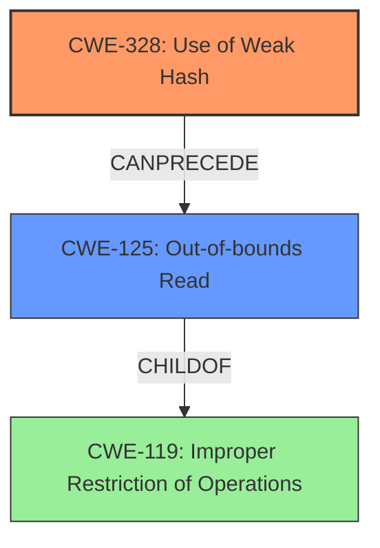

# Final Resolution for CVE-2022-29210

# Summary
| CWE ID | CWE Name | Confidence | CWE Abstraction Level | CWE Vulnerability Mapping Label | CWE-Vulnerability Mapping Notes |
|---|---|---|---|---|---|
| CWE-328 | Use of Weak Hash | 0.95 | Base | Allowed | Primary CWE |
| CWE-125 | Out-of-bounds Read | 0.85 | Base | Allowed | Secondary Candidate |

## Evidence and Confidence

*   **Confidence Score:** 0.90
*   **Evidence Strength:** HIGH

## Relationship Analysis
The primary relationship is between CWE-328 (**Use of Weak Hash**) and CWE-125 (**Out-of-bounds Read**). CWE-328 is the **ROOTCAUSE**, leading to CWE-125 as a consequence when the weak hash results in incorrect memory access. While CWE-125 is a child of CWE-119 (Improper Restriction of Operations within the Bounds of a Memory Buffer), focusing on CWE-125 provides better specificity for the observed impact.

## Vulnerability Chain
The vulnerability chain starts with the **ROOTCAUSE**, CWE-328 (**Use of Weak Hash**), where the `AllocatedBytes()` function is used as a hash. This function provides an estimate of allocated memory, not a reliable hash of the tensor's content. Because the AllocatedBytes is an estimate, it can overestimate the size of the buffer. This leads to the weakness CWE-125 (**Out-of-bounds Read**) when the code attempts to access `tensor.data()` using the overestimated size, resulting in reading past the end of the buffer.

## Summary of Analysis
The initial analysis correctly identified CWE-328 (**Use of Weak Hash**) as the primary weakness because the vulnerability description states that the `TensorKey` hash function used was a **very poor hash function** based on `AllocatedBytes()`. This aligns perfectly with the description of CWE-328, which states that the product uses an algorithm that produces a digest that does not meet security expectations for a hash function.

The secondary candidate, CWE-125 (**Out-of-bounds Read**), is also valid because the description indicates that the code tried to access individual tensor bytes through `tensor.data()` of size `AllocatedBytes()`. This led to ASAN failures, indicating an **out-of-bounds read**.

The criticism correctly points out that the justification for CWE-125 could be more robust by explaining how `AllocatedBytes()` can overestimate the size of the contiguous data buffer and that the `CWE-125` is a potential *consequence* or impact.

The relationship analysis confirms that CWE-328 can precede CWE-125. The mitigation discussion was improved to reflect the need to validate tensor sizes and use a robust hash function.

The final decision is to keep CWE-328 as the primary CWE and CWE-125 as the secondary CWE, with increased confidence due to the stronger evidence and relationship analysis. The selected CWEs are at the optimal level of specificity, with CWE-328 representing the **ROOTCAUSE** and CWE-125 representing the direct impact.