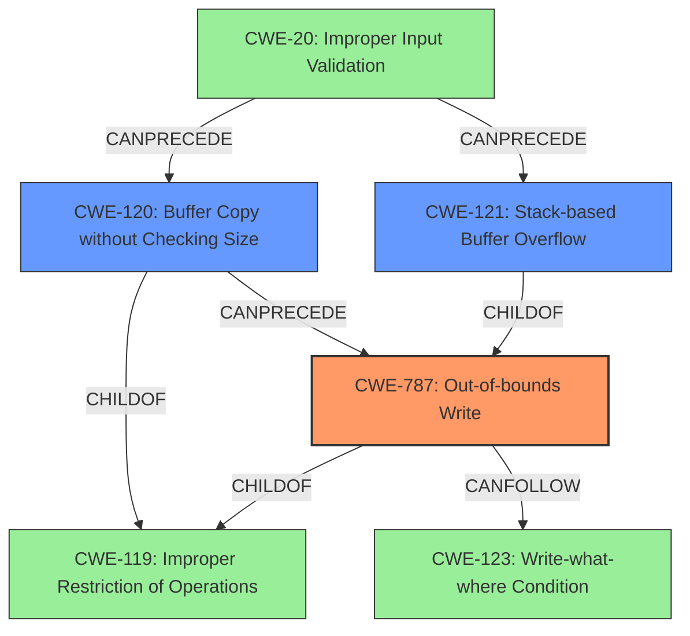

# Final Resolution for CVE-2022-29397

# Summary
| CWE ID | CWE Name | Confidence | CWE Abstraction Level | CWE Vulnerability Mapping Label | CWE-Vulnerability Mapping Notes |
|---|---|---|---|---|---|
| **CWE-787** | **Out-of-bounds Write** | 1.0 | Base | Allowed | Primary CWE |
| **CWE-121** | **Stack-based Buffer Overflow** | 0.85 | Variant | Allowed | Secondary Candidate |
| **CWE-120** | **Buffer Copy without Checking Size of Input ('Classic Buffer Overflow')** | 0.7 | Base | Allowed-with-Review | Secondary Candidate |

## Evidence and Confidence

*   **Confidence Score:** 0.95
*   **Evidence Strength:** HIGH

## Relationship Analysis
The primary relationship influencing the decision is the hierarchical relationship between CWE-787, CWE-121, and CWE-120. CWE-121 (Stack-based Buffer Overflow) is a variant (child) of CWE-787 (**Out-of-bounds Write**), making CWE-787 a more general, but highly relevant, classification. CWE-120 (Buffer Copy without Checking Size of Input) is also related as a potential cause of an out-of-bounds write but is less specific than CWE-787 for this particular vulnerability. All three are children of CWE-119 (Improper Restriction of Operations within the Bounds of a Memory Buffer), but using CWE-119 would be too general.

## Vulnerability Chain
The vulnerability chain starts with a lack of input validation (CWE-20), leading to a buffer copy operation without proper size checks (CWE-120 or direct memory writes). This results in an out-of-bounds write (CWE-787) on the stack, potentially causing a stack-based buffer overflow (CWE-121). The consequence of this overflow could be arbitrary code execution (CWE-123).

## Summary of Analysis
The initial analysis and the criticism both correctly identified CWE-787 as the primary weakness. The vulnerability description clearly states "stack overflow via the comment parameter in the function FUN_004196c8," which directly leads to an **out-of-bounds write**. The analysis also considered CWE-121 and CWE-120 as secondary candidates, which is reasonable.

The criticism's suggestions for improvement, such as adding mitigation details and explicitly mentioning CWE-119, are valuable. The suggestion to include CWE-20 is also relevant, highlighting the root cause of missing input validation. Finally, including CWE-123 as a potential consequence of the **out-of-bounds write** is a good addition.

The final decision is to keep CWE-787 as the primary weakness, with increased confidence in CWE-121 and CWE-120. The reasoning is based on the following:

*   **Evidence:** The vulnerability description explicitly mentions a "stack overflow" due to a lack of size checks on the `comment` parameter. The CVE reference confirms this by stating, "The `comment` parameter, without size checks, is copied directly into local variables on the stack. If the supplied string exceeds the buffer's capacity, a stack buffer overflow occurs." This provides strong evidence for **CWE-787 (Out-of-bounds Write)** and **CWE-121 (Stack-based Buffer Overflow)**.
*   **Relationship Analysis:** CWE-787 is a base-level CWE and a parent of CWE-121. CWE-121 being a more specific case (stack-based), warrants its inclusion as a secondary candidate. CWE-120 is also a possible contributor, as the buffer copy without size checking enables the **out-of-bounds write**.
*   **Mapping Guidance:** All three CWEs have "Allowed" or "Allowed-with-Review" usage, making them acceptable choices. The analysis correctly considered the MITRE mapping guidance for CWE-120, which advises caution when using it.
*   **Mitigation Analysis:** The mitigations suggested (language selection, safe libraries, compiler protections, ASLR, DEP) are all relevant to preventing buffer overflows and **out-of-bounds writes**.

The selected CWEs are at the optimal level of specificity. CWE-787 captures the fundamental weakness, while CWE-121 and CWE-120 provide additional context about the specific type of overflow and its cause. CWE-119 is avoided because it's too general, and its usage is discouraged. CWE-20 and CWE-123 add valuable information about the root cause and potential impact.