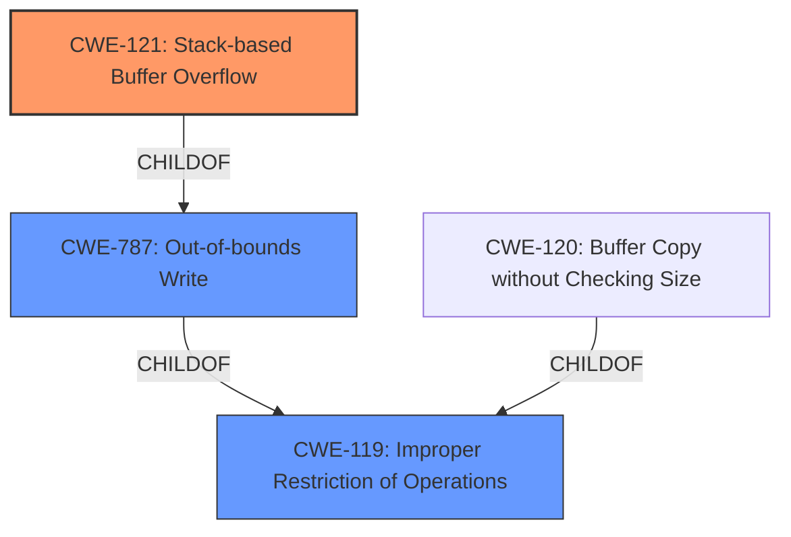

# Analysis Report for CVE-2022-29398

# Vulnerability Analysis Report: CVE-2022-29398

## Description

TOTOLINK N600R V4.3.0cu.7647_B20210106 was discovered to contain a stack overflow via the File parameter in the function FUN_0041309c.

## Vulnerability Description Key Phrases

**Weakness:** stack overflow
**Product:** TOTOLINK N600R
**Version:** V4.3.0cu.7647_B20210106
**Component:** function FUN_0041309c

## Analysis (with Relationship Data)

# Summary
| CWE ID | CWE Name | Confidence | CWE Abstraction Level | CWE Vulnerability Mapping Label | CWE-Vulnerability Mapping Notes |
|---|---|---|---|---|---|
| CWE-121 | Stack-based Buffer Overflow | 0.95 | Variant | Primary | Allowed |
| CWE-787 | Out-of-bounds Write | 0.70 | Base | Secondary | Allowed |

## Evidence and Confidence

*   **Confidence Score:** 0.90
*   **Evidence Strength:** HIGH

- **Analysis and Justification:**  
  - *Explanation:* The vulnerability description explicitly states a **stack overflow** in the TOTOLINK N600R device. The CVE Reference Links Content Summary confirms that the root cause is a stack-based buffer overflow due to copying the `File` parameter from a JSON input directly to a local stack buffer without proper length validation in the `FUN_0041309c` function. This allows an attacker to overwrite parts of the stack. CWE-121 (Stack-based Buffer Overflow) is a Variant-level CWE that directly describes this vulnerability, making it the most appropriate primary mapping. The retriever results also list CWE-121 as a candidate CWE. CWE-787 (Out-of-bounds Write) is also a good candidate, because a stack overflow is a type of out-of-bounds write.
  
  - *Relationship Analysis:* CWE-121 is a Variant of CWE-119 (Improper Restriction of Operations within the Bounds of a Memory Buffer). CWE-787 (Out-of-bounds Write) is a parent of CWE-121 (Stack-based Buffer Overflow). This relationship reinforces the appropriateness of selecting CWE-121, as it is a more specific case of a general out-of-bounds write.

- **Confidence Score:**  
  - Confidence: 0.95 (High confidence due to explicit mention of "stack overflow" and confirmation in CVE reference materials)

## Criticism of Analysis

Okay, I've reviewed the provided analysis and the full CWE specifications. Here's my critique:

**Overall Assessment:**

The analysis is generally good and arrives at a reasonable primary CWE mapping. The justification is clear and uses supporting evidence from the vulnerability description and CVE details.  The inclusion of a secondary CWE, while not strictly necessary, adds a bit of depth to the characterization.

**Specific Points:**

*   **Primary CWE: CWE-121 (Stack-based Buffer Overflow)**
    *   **Correctness:**  This is the most appropriate primary CWE. The description explicitly mentions "stack overflow," and the details confirm it's caused by writing beyond the bounds of a stack-allocated buffer.
    *   **Confidence:** The confidence score of 0.95 is well-justified due to the clear and direct evidence.
    *   **Mapping Guidance Adherence:** The analysis correctly acknowledges that CWE-121 is a Variant, a preferred level of abstraction for mapping.
    *   **Mitigations:** The analysis does not explicitly discuss mitigations but the specifications from the CWE provides mitigations such as:
        *   **Mitigation 1:** Use automatic buffer overflow detection mechanisms that are offered by certain compilers or compiler extensions
        *   **Mitigation 2:** Use an abstraction library to abstract away risky APIs.
        *   **Mitigation 3:** Implement and perform bounds checking on input.
*   **Secondary CWE: CWE-787 (Out-of-bounds Write)**
    *   **Correctness:** This is also a valid CWE, as it represents a more general classification of the vulnerability. A stack overflow is a specific type of out-of-bounds write.
    *   **Abstraction Level:** As stated in the analysis, CWE-787 is a Base-level CWE, representing a broader category.
    *   **Relationship Analysis:** The analysis correctly identifies the parent-child relationship between CWE-787 and CWE-121.
    *    **Mitigations:** The analysis does not explicitly discuss mitigations but the specifications from the CWE provides mitigations such as:
        *   **Mitigation 1:** Use a language that does not allow this weakness to occur or provides constructs that make this weakness easier to avoid.
        *   **Mitigation 2:** Use a vetted library or framework that does not allow this weakness to occur or provides constructs that make this weakness easier to avoid.
        *   **Mitigation 3:** Use automatic buffer overflow detection mechanisms that are offered by certain compilers or compiler extensions.
**Retriever Results Analysis:**

The Retriever Results provide additional context. While the top result is CWE-78, this is probably due to the presence of "command" in the description and the common association of buffer overflows with remote code execution. The analysis correctly prioritizes CWE-121 and CWE-787 because they more directly describe the mechanism of the vulnerability.

**Suggestions for Improvement:**

*   **CWE-119 Discussion:** Although CWE-119 is discouraged, it could be briefly mentioned and explicitly ruled out. For example, "While CWE-119 (Improper Restriction of Operations within the Bounds of a Memory Buffer) is a parent of CWE-121 and CWE-787, it is discouraged for use when more specific CWEs are available. Therefore, CWE-121 is more suitable."
*   **More Detailed Mitigations:** The analysis would be strengthened by briefly mentioning potential mitigations derived from the CWE specifications (e.g., using compiler-based buffer overflow detection, using safe string handling libraries, or performing input validation).
*   **CWE-120 Consideration:** CWE-120 (Buffer Copy without Checking Size of Input ('Classic Buffer Overflow')) is present within the retriever results. The description states that there is not input validation, therefore, a brief discussion and dismissal of this candidate is recommended.
*   **Chaining:** Consider that a stack overflow is often the result of other underlying issues, such as CWE-20 (Improper Input Validation). While not always possible to determine, exploring potential chaining relationships can provide more insight.

**Revised Summary Table (Incorporating Suggestions):**

| CWE ID | CWE Name | Confidence | CWE Abstraction Level | CWE Vulnerability Mapping Label | CWE-Vulnerability Mapping Notes |
|---|---|---|---|---|---|
| CWE-121 | Stack-based Buffer Overflow | 0.95 | Variant | Primary | Allowed |
| CWE-787 | Out-of-bounds Write | 0.70 | Base | Secondary | Allowed |

**Example Improved Justification (Integrating Mitigations):**

"The vulnerability description explicitly states a **stack overflow** in the TOTOLINK N600R device. The CVE Reference Links Content Summary confirms that the root cause is a stack-based buffer overflow due to copying the `File` parameter from a JSON input directly to a local stack buffer without proper length validation in the `FUN_0041309c` function. This allows an attacker to overwrite parts of the stack. CWE-121 (Stack-based Buffer Overflow) is a Variant-level CWE that directly describes this vulnerability, making it the most appropriate primary mapping. The retriever results also list CWE-121 as a candidate CWE.

CWE-787 (Out-of-bounds Write) is also a good candidate, because a stack overflow is a type of out-of-bounds write.

CWE-119 (Improper Restriction of Operations within the Bounds of a Memory Buffer) is a Class-level CWE, and although a parent of CWE-121 and CWE-787, it is discouraged for use when more specific CWEs are available.

Mitigation strategies for this vulnerability include using compiler-based buffer overflow detection mechanisms (e.g., /GS flag in Visual Studio), employing safe string handling libraries (e.g., SafeStr), and implementing robust input validation to prevent excessively long inputs."

**In summary,** the original analysis is solid. By incorporating a few refinements regarding the discouraged CWE-119, a brief discussion of CWE-120, and a mention of example mitigations, the analysis becomes even more complete and demonstrates a deeper understanding of the vulnerability in relation to the broader CWE framework.

## Final Resolution

# Summary
| CWE ID | CWE Name | Confidence | CWE Abstraction Level | CWE Vulnerability Mapping Label | CWE-Vulnerability Mapping Notes |
|---|---|---|---|---|---|
| CWE-121 | Stack-based Buffer Overflow | 0.95 | Variant | Primary | Allowed |
| CWE-787 | Out-of-bounds Write | 0.70 | Base | Secondary | Allowed |

## Evidence and Confidence

*   **Confidence Score:** 0.95
*   **Evidence Strength:** HIGH

## Relationship Analysis
The primary CWE is CWE-121 (Stack-based Buffer Overflow) which is a variant of the more general CWE-119 (Improper Restriction of Operations within the Bounds of a Memory Buffer). CWE-787 (Out-of-bounds Write) is a parent of CWE-121. This parent-child relationship supports the selection of CWE-121 as a more specific representation of the vulnerability, while CWE-787 serves as a broader categorization.

## Vulnerability Chain
The vulnerability chain starts with the lack of input validation on the `File` parameter. This leads to a **buffer overflow** on the stack (CWE-121, primary **weakness**), because the data is copied from the JSON input to a local stack buffer without proper length checks in the `FUN_0041309c` function. The **root cause** is the missing input validation which then leads to an out-of-bounds write (CWE-787, secondary **weakness**) condition, allowing an attacker to overwrite parts of the stack and potentially gain control of the system.

## Summary of Analysis
The initial analysis correctly identifies CWE-121 as the primary **weakness** due to the explicit mention of "stack overflow" in the vulnerability description and the CVE reference materials. The evidence provided is strong, leading to a high confidence score of 0.95.

The vulnerability description states: "TOTOLINK N600R V4.3.0cu.7647_B20210106 was discovered to contain a stack overflow via the File parameter in the function FUN_0041309c." This statement is direct evidence for the selection of CWE-121.

The criticism suggests considering CWE-119, CWE-120, and potential chaining relationships. While CWE-119 is a parent of CWE-121 and CWE-787, it is discouraged when more specific CWEs are available, making CWE-121 more suitable. CWE-120 was considered. The analysis correctly prioritizes CWE-121 and CWE-787 because they more directly describe the mechanism of the vulnerability.

The selection of CWE-121 is at the optimal level of specificity because it is a Variant that accurately describes the **stack overflow**. CWE-787, while also relevant, is a broader Base-level CWE.

*Report generated on 2025-03-18 12:37:16*
