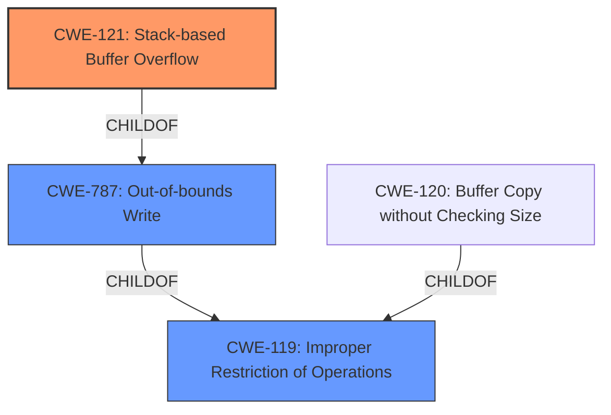

# Final Resolution for CVE-2022-29398

# Summary
| CWE ID | CWE Name | Confidence | CWE Abstraction Level | CWE Vulnerability Mapping Label | CWE-Vulnerability Mapping Notes |
|---|---|---|---|---|---|
| CWE-121 | Stack-based Buffer Overflow | 0.95 | Variant | Primary | Allowed |
| CWE-787 | Out-of-bounds Write | 0.70 | Base | Secondary | Allowed |

## Evidence and Confidence

*   **Confidence Score:** 0.95
*   **Evidence Strength:** HIGH

## Relationship Analysis
The primary CWE is CWE-121 (Stack-based Buffer Overflow) which is a variant of the more general CWE-119 (Improper Restriction of Operations within the Bounds of a Memory Buffer). CWE-787 (Out-of-bounds Write) is a parent of CWE-121. This parent-child relationship supports the selection of CWE-121 as a more specific representation of the vulnerability, while CWE-787 serves as a broader categorization.

## Vulnerability Chain
The vulnerability chain starts with the lack of input validation on the `File` parameter. This leads to a **buffer overflow** on the stack (CWE-121, primary **weakness**), because the data is copied from the JSON input to a local stack buffer without proper length checks in the `FUN_0041309c` function. The **root cause** is the missing input validation which then leads to an out-of-bounds write (CWE-787, secondary **weakness**) condition, allowing an attacker to overwrite parts of the stack and potentially gain control of the system.

## Summary of Analysis
The initial analysis correctly identifies CWE-121 as the primary **weakness** due to the explicit mention of "stack overflow" in the vulnerability description and the CVE reference materials. The evidence provided is strong, leading to a high confidence score of 0.95.

The vulnerability description states: "TOTOLINK N600R V4.3.0cu.7647_B20210106 was discovered to contain a stack overflow via the File parameter in the function FUN_0041309c." This statement is direct evidence for the selection of CWE-121.

The criticism suggests considering CWE-119, CWE-120, and potential chaining relationships. While CWE-119 is a parent of CWE-121 and CWE-787, it is discouraged when more specific CWEs are available, making CWE-121 more suitable. CWE-120 was considered. The analysis correctly prioritizes CWE-121 and CWE-787 because they more directly describe the mechanism of the vulnerability.

The selection of CWE-121 is at the optimal level of specificity because it is a Variant that accurately describes the **stack overflow**. CWE-787, while also relevant, is a broader Base-level CWE.