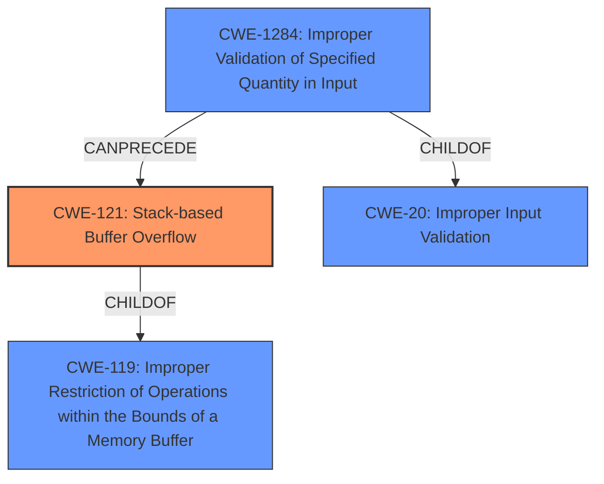

# Final Resolution for CVE-2022-29399

# Summary
| CWE ID | CWE Name | Confidence | CWE Abstraction Level | CWE Vulnerability Mapping Label | CWE-Vulnerability Mapping Notes |
|---|---|---|---|---|---|
| CWE-121 | Stack-based Buffer Overflow | 1.0 | Variant | Allowed | Primary CWE |
| CWE-1284 | Improper Validation of Specified Quantity in Input | 0.7 | Base | Allowed | Secondary Candidate |

## Evidence and Confidence

*   **Confidence Score:** 0.9
*   **Evidence Strength:** HIGH

## Relationship Analysis
The primary weakness is **CWE-121 (Stack-based Buffer Overflow)**, a variant of **CWE-119 (Improper Restriction of Operations within the Bounds of a Memory Buffer)**. **CWE-1284 (Improper Validation of Specified Quantity in Input)** is a contributing factor, as the missing input validation for the length of the 'url' parameter allows the overflow to occur. **CWE-1284** is a child of **CWE-20 (Improper Input Validation)**.

## Vulnerability Chain
The vulnerability chain starts with **CWE-1284 (Improper Validation of Specified Quantity in Input)**, where the length of the 'url' parameter is not validated. This leads to **CWE-121 (Stack-based Buffer Overflow)** when the unchecked 'url' parameter is copied to a stack buffer. The overflow can lead to arbitrary code execution.

## Summary of Analysis
The initial analysis and criticism both correctly identified **CWE-121 (Stack-based Buffer Overflow)** as the primary **WEAKNESS**. The vulnerability description mentions "stack overflow via the url parameter in the function FUN_00415bf0," which is clear evidence. The "CVE Reference Links Content Summary" confirms that the **ROOTCAUSE** is a lack of proper input validation of the `url` parameter, which is copied to stack-based local variables without checking its length.
The criticism suggested adding more specific details about the copy operation for **CWE-121**. The overflow occurs *during a copy operation,* which strengthens the connection to the root cause. It also suggested mentioning mitigations in the analysis based on the CWE specifications, such as using compiler-based protections like /GS or stack canaries (from the CWE-121 Potential Mitigations).

The graph relationships influenced the final selection by confirming that **CWE-121** is a specific variant of **CWE-119**, which is the correct level of specificity. The relationship between **CWE-1284** and **CWE-121** shows how the missing input validation leads to the overflow. **CWE-121** and **CWE-1284** are at the optimal level of specificity because they accurately describe the **ROOTCAUSE** and its manifestation as a stack-based buffer overflow.