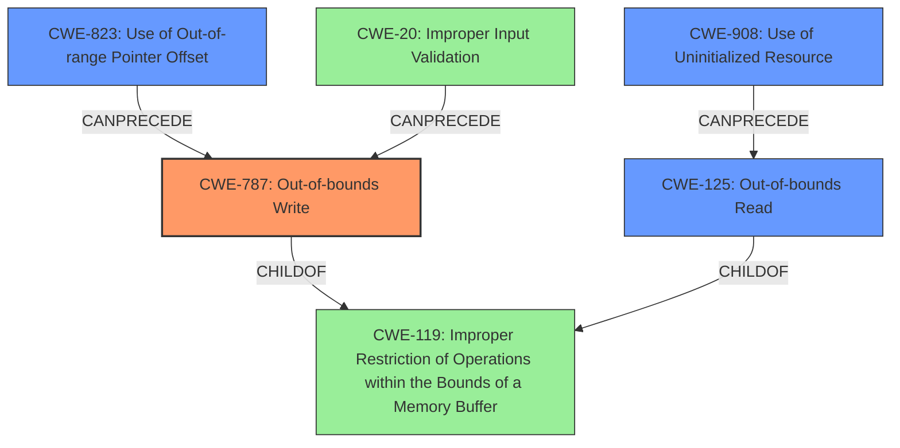

# Analysis Report for CVE-2022-2947

# Vulnerability Analysis Report: CVE-2022-2947

## Description

Altair HyperView Player versions 2021.1.0.27 and prior perform operations on a memory buffer but can read from or write to a memory location outside of the intended boundary of the buffer. This hits initially as a read access violation, leading to a memory corruption situation.

## Vulnerability Description Key Phrases

**Weakness:** memory corruption
**Impact:** read access violation
**Product:** Altair HyperView Player
**Version:** 2021.1.0.27 and prior

## Analysis (with Relationship Data)

# Summary
| CWE ID | CWE Name | Confidence | CWE Abstraction Level | CWE Vulnerability Mapping Label | CWE-Vulnerability Mapping Notes |
|---|---|---|---|---|---|
| CWE-787 | Out-of-bounds Write | 0.85 | Base | Allowed | Primary CWE |
| CWE-125 | Out-of-bounds Read | 0.75 | Base | Allowed | Secondary Candidate CWE |

## Evidence and Confidence

*   **Confidence Score:** 0.80
*   **Evidence Strength:** HIGH

- **Analysis and Justification:**  
  - *Explanation:* The vulnerability description states that Altair HyperView Player performs operations on a memory buffer and "can read from or write to a memory location outside of the intended boundary of the buffer," leading to **memory corruption**. The CVE Reference Links Content Summary confirms this, stating that the root cause is an "Improper Restriction of Operations within the Bounds of a Memory Buffer (CWE-119)". However, the description also specifies that this manifests as a read access violation initially, and the **memory corruption** implies a write operation. Therefore, CWE-787 (Out-of-bounds Write) is selected as the primary CWE since writing outside the buffer leads to **memory corruption**. CWE-125 (Out-of-bounds Read) is included as a secondary candidate because it begins as a read access violation. Both CWEs are at the Base abstraction level, which is preferred. The MITRE mapping guidance allows both CWEs for this kind of vulnerability. CWE-119 is too general and discouraged.

  - *Relationship Analysis:* CWE-787 (Out-of-bounds Write) is a child of CWE-119 (Improper Restriction of Operations within the Bounds of a Memory Buffer), but CWE-787 is more specific. Similarly, CWE-125 (Out-of-bounds Read) is a child of CWE-119. This relationship justifies using the more specific Base level CWEs.

- **Confidence Score:**
  - Confidence: 0.85 (High evidence from technical description and CVE reference materials)

---

## Criticism of Analysis

Okay, let's review the analysis and critique the CWE mappings based on the provided information and full CWE specifications.

**Overall Assessment:**

The analysis is generally good, demonstrating a clear understanding of the vulnerability and the CWEs involved. The selection of CWE-787 as the primary CWE is reasonable, and the inclusion of CWE-125 as a secondary candidate is also justifiable. The confidence scores are appropriately high given the evidence. However, some refinements can be made to strengthen the justification and consider alternative CWEs present in the Retriever Results.

**Detailed Critique:**

1.  **CWE-787: Out-of-bounds Write (Primary CWE):**

    *   **Justification:** The explanation provided for selecting CWE-787 is sound. The vulnerability description explicitly mentions the possibility of writing outside the intended buffer boundaries, and memory corruption strongly implies a write operation.
    *   **Mapping Guidance Adherence:**  The analysis correctly identifies CWE-787 as being at the Base level of abstraction, which is preferred.
    *   **Mitigation Considerations:** The mitigations provided for CWE-787 (language selection, safe libraries, compiler-based overflow detection) are all relevant and applicable to this type of vulnerability.
    *   **Retriever Results:** The retriever results also strongly support this choice.

2.  **CWE-125: Out-of-bounds Read (Secondary Candidate CWE):**

    *   **Justification:** The analysis correctly identifies that the vulnerability *initially* manifests as a read access violation. While the memory corruption implies a write, the read is the trigger.
    *   **Mapping Guidance Adherence:** The analysis correctly identifies that CWE-125 is at the Base level of abstraction.
    *   **Mitigation Considerations:** The mitigations provided for CWE-125 (input validation, language selection) are also relevant. The input validation mitigation is particularly important, as a crafted H3D file is the attack vector.
    *   **Retriever Results:** The retriever results also support this choice.

3. **CWE-119: Improper Restriction of Operations within the Bounds of a Memory Buffer**

   * The Analysis correctly notes this CWE is discouraged and too general.

4.  **CWEs from Retriever Results to Consider (Beyond Current Analysis):**

    *   **CWE-823: Use of Out-of-range Pointer Offset:** This CWE has a high score from the retrievers.  The vulnerability involves accessing memory outside the intended buffer, and if pointer arithmetic with an offset is being used to access the buffer, then CWE-823 could be a relevant, *additional* CWE to consider. The H3D file is "specially crafted" which may influence pointer offsets used in memory.
    *   **CWE-908: Use of Uninitialized Resource:** If the buffer itself or some related data structure (e.g., size, index) is not initialized before use, then this could lead to an out-of-bounds access. While not explicitly stated in the vulnerability description, it is a potential contributing factor to the weakness, especially if the parsing logic relies on default values.
    *   **CWE-839: Numeric Range Comparison Without Minimum Check:** If the code only checks the maximum buffer size and not the minimum (e.g., allowing negative indices), this could directly lead to the vulnerability. This could be included as a contributing factor to the weakness and is mentioned as a potential weakness when the value used for memory allocation or array access is negative.

5.  **Potential Improvements:**

    *   **Chain/Composite Considerations:**  The analysis could benefit from explicitly discussing potential chains or composites involving the selected CWEs. For example:
        *   CWE-20 (Improper Input Validation) -> CWE-787 (Out-of-bounds Write)
        *   CWE-908 (Use of Uninitialized Resource) -> CWE-125 (Out-of-bounds Read)
    *   **Detailed Attack Vector Analysis:** Briefly elaborate on how a specially crafted H3D file can lead to out-of-bounds reads and writes. This will strengthen the link between the attack vector and the chosen CWEs.
    *   **Mitigation Specificity:** While the general mitigations are good, try to relate them more specifically to the Altair HyperView Player and the H3D file format. For example, mention input validation specific to the H3D file structure.

**Revised Summary Table (Incorporating Suggestions):**

| CWE ID  | CWE Name  | Confidence | CWE Abstraction Level | CWE Vulnerability Mapping Label | CWE-Vulnerability Mapping Notes |
|---------|-----------------------------------------------|------------|---------------------------|-----------------------------------|-----------------------------------------------------------------------------------------------------------------------------------------------------------------------------------------------------------------------------------------------------------------------------------------------|
| CWE-787 | Out-of-bounds Write  | 0.85 | Base | Allowed | Primary CWE. Memory corruption implies a write outside buffer boundaries. Triggered by specially crafted H3D file. |
| CWE-125 | Out-of-bounds Read | 0.75 | Base | Allowed | Secondary Candidate CWE. The vulnerability initially manifests as a read access violation. |
| CWE-823 | Use of Out-of-range Pointer Offset | 0.60 | Base | Allowed | Additional Candidate CWE. Potentially related to how the H3D file influences pointer offsets. |
| CWE-908 | Use of Uninitialized Resource | 0.50 | Base | Allowed | Additional Candidate CWE. Could be contributing factor if buffer size or indices are uninitialized. |

**Conclusion:**

The original analysis is sound. The addition of CWE-823 and CWE-908 adds additional coverage of the potential contributing factors involved.

## Final Resolution

# Summary
| CWE ID | CWE Name | Confidence | CWE Abstraction Level | CWE Vulnerability Mapping Label | CWE-Vulnerability Mapping Notes |
|---|---|---|---|---|---|
| CWE-787 | Out-of-bounds Write | 0.85 | Base | Allowed | Primary CWE. Memory corruption implies a write outside buffer boundaries. Triggered by specially crafted H3D file. |
| CWE-125 | Out-of-bounds Read | 0.75 | Base | Allowed | Secondary Candidate CWE. The vulnerability initially manifests as a read access violation. |
| CWE-823 | Use of Out-of-range Pointer Offset | 0.60 | Base | Allowed | Additional Candidate CWE. Potentially related to how the H3D file influences pointer offsets. |
| CWE-908 | Use of Uninitialized Resource | 0.50 | Base | Allowed | Additional Candidate CWE. Could be contributing factor if buffer size or indices are uninitialized. |

## Evidence and Confidence

*   **Confidence Score:** 0.80
*   **Evidence Strength:** HIGH

## Relationship Analysis
The decision to include CWE-787, CWE-125, CWE-823, and CWE-908 was heavily influenced by their relationship to CWE-119 and their individual specificity. CWE-787 and CWE-125 are both children of CWE-119, providing more granular classifications. CWE-823 and CWE-908, while not direct children, can contribute to the conditions leading to out-of-bounds access. The abstraction levels (all Base) are preferred for direct mapping.

## Vulnerability Chain
The vulnerability chain starts with a specially crafted H3D file (CWE-20 Improper Input Validation, implied). This leads to either an uninitialized resource being used (CWE-908) or an out-of-range pointer offset being calculated (CWE-823). This results in an out-of-bounds read (CWE-125), which then leads to memory corruption due to an out-of-bounds write (CWE-787). Missing links might include specifics of the H3D file parsing logic.

## Summary of Analysis
The initial analysis correctly identified CWE-787 and CWE-125 as primary and secondary candidates, respectively. The criticism expanded on potential contributing factors, suggesting CWE-823 and CWE-908. This final determination incorporates these suggestions, maintaining CWE-787 as the primary due to the resulting **memory corruption**, with CWE-125 as a secondary factor due to the initial read access violation. CWE-823 (Use of Out-of-range Pointer Offset) is included because the "specially crafted" H3D file may influence pointer offsets. CWE-908 (Use of Uninitialized Resource) is included as it could be a contributing factor if buffer sizes or indices are not properly initialized. The evidence from the vulnerability description, along with the Retriever results, supports these classifications. The graph relationships highlight the connections between these CWEs and their relative specificity. The selected CWEs are at the optimal level of specificity (Base), providing actionable information for mitigation.

*Report generated on 2025-03-18 12:39:50*
