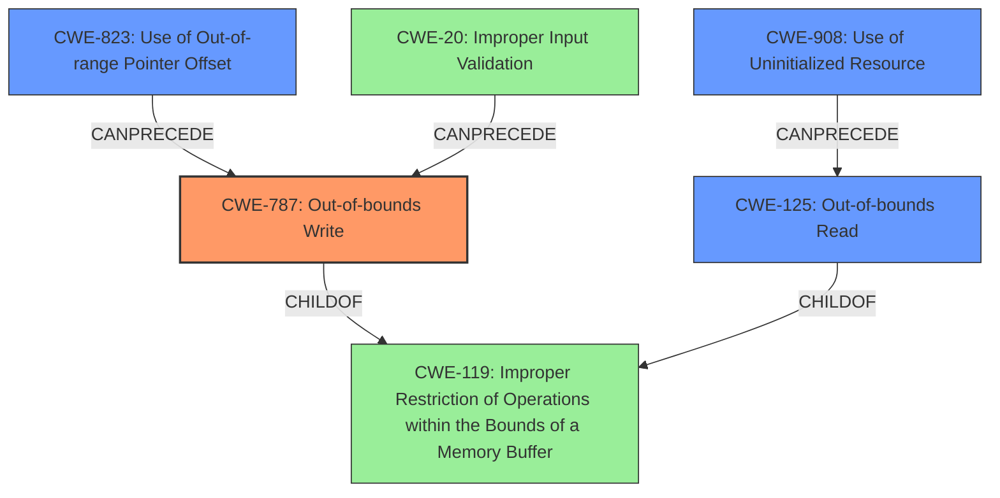

# Final Resolution for CVE-2022-2947

# Summary
| CWE ID | CWE Name | Confidence | CWE Abstraction Level | CWE Vulnerability Mapping Label | CWE-Vulnerability Mapping Notes |
|---|---|---|---|---|---|
| CWE-787 | Out-of-bounds Write | 0.85 | Base | Allowed | Primary CWE. Memory corruption implies a write outside buffer boundaries. Triggered by specially crafted H3D file. |
| CWE-125 | Out-of-bounds Read | 0.75 | Base | Allowed | Secondary Candidate CWE. The vulnerability initially manifests as a read access violation. |
| CWE-823 | Use of Out-of-range Pointer Offset | 0.60 | Base | Allowed | Additional Candidate CWE. Potentially related to how the H3D file influences pointer offsets. |
| CWE-908 | Use of Uninitialized Resource | 0.50 | Base | Allowed | Additional Candidate CWE. Could be contributing factor if buffer size or indices are uninitialized. |

## Evidence and Confidence

*   **Confidence Score:** 0.80
*   **Evidence Strength:** HIGH

## Relationship Analysis
The decision to include CWE-787, CWE-125, CWE-823, and CWE-908 was heavily influenced by their relationship to CWE-119 and their individual specificity. CWE-787 and CWE-125 are both children of CWE-119, providing more granular classifications. CWE-823 and CWE-908, while not direct children, can contribute to the conditions leading to out-of-bounds access. The abstraction levels (all Base) are preferred for direct mapping.

## Vulnerability Chain
The vulnerability chain starts with a specially crafted H3D file (CWE-20 Improper Input Validation, implied). This leads to either an uninitialized resource being used (CWE-908) or an out-of-range pointer offset being calculated (CWE-823). This results in an out-of-bounds read (CWE-125), which then leads to memory corruption due to an out-of-bounds write (CWE-787). Missing links might include specifics of the H3D file parsing logic.

## Summary of Analysis
The initial analysis correctly identified CWE-787 and CWE-125 as primary and secondary candidates, respectively. The criticism expanded on potential contributing factors, suggesting CWE-823 and CWE-908. This final determination incorporates these suggestions, maintaining CWE-787 as the primary due to the resulting **memory corruption**, with CWE-125 as a secondary factor due to the initial read access violation. CWE-823 (Use of Out-of-range Pointer Offset) is included because the "specially crafted" H3D file may influence pointer offsets. CWE-908 (Use of Uninitialized Resource) is included as it could be a contributing factor if buffer sizes or indices are not properly initialized. The evidence from the vulnerability description, along with the Retriever results, supports these classifications. The graph relationships highlight the connections between these CWEs and their relative specificity. The selected CWEs are at the optimal level of specificity (Base), providing actionable information for mitigation.