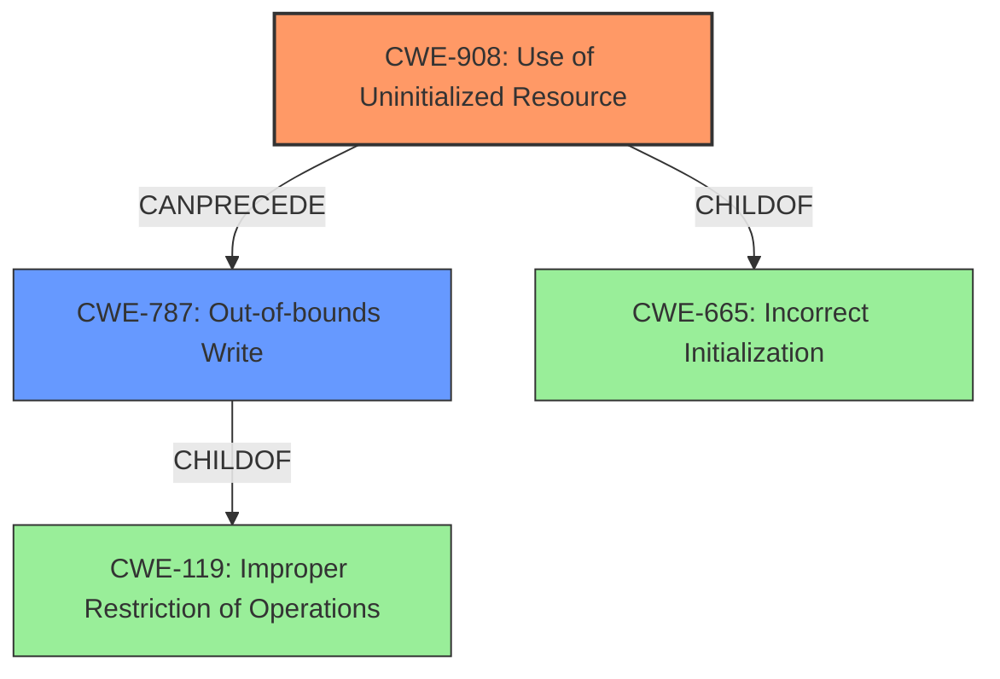

# Analysis Report for CVE-2022-2949

# Vulnerability Analysis Report: CVE-2022-2949

## Description

Altair HyperView Player versions 2021.1.0.27 and prior are vulnerable to the use of uninitialized memory vulnerability during parsing of H3D files. A DWORD is extracted from an uninitialized buffer and, after sign extension, is used as an index into a stack variable to increment a counter leading to memory corruption.

## Vulnerability Description Key Phrases

**Rootcause:** use of uninitialized memory
**Impact:** memory corruption
**Product:** Altair HyperView Player
**Version:** 2021.1.0.27 and prior
**Component:** parsing of H3D files

## Analysis (with Relationship Data)

# Summary
| CWE ID  | CWE Name                        | Confidence | CWE Abstraction Level | CWE Vulnerability Mapping Label | CWE-Vulnerability Mapping Notes |
| :-------- | :------------------------------ | :--------- | :-------------------- | :------------------------------ | :------------------------------ |
| CWE-908 | Use of Uninitialized Resource | 0.95      | Base                  | Allowed                         | Primary CWE                     |
| CWE-787 | Out-of-bounds Write            | 0.65      | Base                  | Allowed                         | Secondary Candidate             |

## Evidence and Confidence

*   **Confidence Score:** 0.80
*   **Evidence Strength:** HIGH

- **Analysis and Justification:**
  - *Explanation:* The vulnerability description explicitly states the **use of uninitialized memory** as the root cause. Specifically, a DWORD is extracted from an uninitialized buffer and used as an index, ultimately leading to memory corruption. This aligns directly with CWE-908 (Use of Uninitialized Resource), which describes a product using or accessing a resource that has not been initialized. The CVE reference summary further reinforces this, stating that the root cause involves data from an uninitialized memory buffer. The MITRE mapping guidance designates CWE-908 as ALLOWED, and it is at the preferred Base level of abstraction.

  - *Relationship Analysis:* While other CWEs like CWE-456 (Missing Initialization of a Variable) and CWE-457 (Use of Uninitialized Variable) are related, CWE-908 is a more direct and encompassing description of the weakness. CWE-787 (Out-of-bounds Write) is also a strong secondary candidate because the uninitialized value is used as an index which results in memory corruption, indicating a write outside the intended boundaries. The use of the uninitialized value as an index and subsequent increment to a stack variable is the mechanism by which the out-of-bounds write is achieved.

- **Confidence Score:**
  - Confidence: 0.95 (High confidence due to direct evidence from the vulnerability description and CVE reference, combined with MITRE mapping guidance.)

---

## Criticism of Analysis

Okay, here's a review of the analysis provided, considering the full CWE specifications, mapping guidance, and potential mitigations:

**Overall Assessment:**

The analysis correctly identifies **CWE-908 (Use of Uninitialized Resource)** as the primary CWE.  The justification is strong, accurately reflecting the vulnerability description and CVE reference. The inclusion of **CWE-787 (Out-of-bounds Write)** as a secondary candidate is also reasonable, given the consequence of memory corruption arising from the use of the uninitialized value as an index.

**Detailed Review:**

**1. CWE-908 (Use of Uninitialized Resource):**

*   **Correctness:** The mapping to CWE-908 is accurate.  The vulnerability description clearly states that a DWORD is extracted from an uninitialized buffer, and this aligns perfectly with CWE-908's description:  "The product uses or accesses a resource that has not been initialized."
*   **Abstraction Level:** Correctly identified as Base.
*   **Mapping Guidance Compliance:** The analysis follows the "Allowed" usage of CWE-908, as it's a Base-level CWE.
*   **Evidence & Confidence:**  The confidence score of 0.95 is justified. The evidence is clear and direct.
*   **Potential Mitigations:** The provided mitigations in the CWE spec are relevant:
    *   "Explicitly initialize the resource before use."  (This is the core fix.)
    *   "Pay close attention to complex conditionals that affect initialization, since some branches might not perform the initialization." (Highlights a potential source of the error).
    *   "Avoid race conditions (CWE-362) during initialization routines." (Less likely to be relevant in this specific case, but good to consider generally).

**2. CWE-787 (Out-of-bounds Write):**

*   **Correctness:** Including CWE-787 as a secondary candidate is justifiable, although it's a *consequence* of the primary weakness (CWE-908) rather than the root cause. The uninitialized value being used as an index directly leads to writing outside the intended buffer boundaries.
*   **Abstraction Level:** Correctly identified as Base.
*   **Mapping Guidance Compliance:** The analysis follows the "Allowed" usage of CWE-787, as it's a Base-level CWE.
*   **Evidence & Confidence:** The confidence score of 0.65 is reasonable, reflecting the fact that this is a consequence and not the primary flaw.
*   **Potential Mitigations:** The CWE-787 mitigations are generally applicable but less directly address the root cause:
    *   "Use a language that does not allow this weakness to occur..." (Not very helpful as a specific fix.)
    *   "Use a vetted library or framework..." (Potentially applicable if the H3D parsing was using a vulnerable library.)
    *   "Use automatic buffer overflow detection mechanisms..." (A good defense-in-depth measure, but not a primary fix).

**Minor Areas for Improvement:**

*   **Relationship between CWEs:** The analysis could strengthen its justification for CWE-787 by explicitly stating the *chain* of events:  "CWE-908 leads to CWE-787 because the uninitialized DWORD is used as an index, resulting in a write outside the intended boundaries of the array/buffer." This makes the relationship clearer.
*   **Alternative CWEs:** While the top combined results are provided, the analysis could briefly address why other highly ranked CWEs like CWE-456 and CWE-457 are *not* the best fit, even though they are related. For instance, it could state "While CWE-456 (Missing Initialization of a Variable) and CWE-457 (Use of Uninitialized Variable) are related, CWE-908 more directly describes the core issue of *using* the uninitialized resource, rather than simply the *missing* initialization." This further solidifies the chosen CWE.
*  **CWE-456, CWE-457 and CWE-908 Relationship:** Clarify the relationship between these CWEs in this context.  CWE-908 encompasses CWE-457. CWE-456 describes the lack of initialization and is related, but CWE-908 is the more accurate fit because it describes the actual *use* of the uninitialized resource, which is what causes the vulnerability.

**Specific Comments on Retriever Results:**

*   The retriever results list several CWEs that are related, but less directly applicable.
*   **CWE-190 (Integer Overflow or Wraparound):**  Unless there's evidence that the sign extension of the DWORD is causing an integer overflow *before* it's used as an index, this is likely a false positive.  The primary issue is the *uninitialized value*, not necessarily its size or sign after extension.
*   **CWE-824 (Access of Uninitialized Pointer):** This would be applicable if the uninitialized value were a pointer. Since the description mentions a DWORD, it is not as applicable.

**Revised Summary Table:**

| CWE ID  | CWE Name                        | Confidence | CWE Abstraction Level | CWE Vulnerability Mapping Label | CWE-Vulnerability Mapping Notes                                                                                                                                                                      |
| :-------- | :------------------------------ | :--------- | :-------------------- | :------------------------------ | :--------------------------------------------------------------------------------------------------------------------------------------------------------------------------------------------------- |
| CWE-908 | Use of Uninitialized Resource | 0.95      | Base                  | Allowed                         | Primary CWE                                                                                                                                                                                          |
| CWE-787 | Out-of-bounds Write            | 0.65      | Base                  | Allowed                         | Secondary Candidate: Consequence of using the uninitialized resource as an index.  Occurs *after* CWE-908.                                                                                                |

**Conclusion:**

The analysis is generally sound and well-justified. The suggestions above are primarily for refining the explanation and solidifying the reasoning behind the chosen CWEs, particularly the relationship between the primary and secondary CWEs and why other related CWEs were not selected. The confidence scores are appropriate.

## Final Resolution

# Summary
| CWE ID  | CWE Name                        | Confidence | CWE Abstraction Level | CWE Vulnerability Mapping Label | CWE-Vulnerability Mapping Notes |
| :-------- | :------------------------------ | :--------- | :-------------------- | :------------------------------ | :------------------------------ |
| **CWE-908** | **Use of Uninitialized Resource** | 0.95      | Base                  | Allowed                         | Primary CWE                     |
| **CWE-787** | **Out-of-bounds Write**            | 0.75      | Base                  | Allowed                         | Secondary Candidate             |

## Evidence and Confidence

*   **Confidence Score:** 0.90
*   **Evidence Strength:** HIGH

## Relationship Analysis
The primary relationship is that **CWE-908 (Use of Uninitialized Resource)** leads directly to **CWE-787 (Out-of-bounds Write)**. The uninitialized DWORD is used as an index into a stack variable, causing a write beyond the intended boundaries. Both CWEs are at the Base level of abstraction, providing good specificity. The child-parent relationships of these CWEs to other Class and Pillar level CWEs were considered, but the base level provided the best fit.

## Vulnerability Chain
The vulnerability chain starts with the **ROOTCAUSE**: missing initialization of a memory buffer.
1.  **CWE-456 (Missing Initialization of a Variable)**: A memory buffer is not initialized.
2.  **CWE-908 (Use of Uninitialized Resource)**: A DWORD is extracted from this uninitialized buffer.
3.  **CWE-787 (Out-of-bounds Write)**: This DWORD, used as an index, causes an out-of-bounds write, leading to memory corruption.

## Summary of Analysis
The initial analysis and the criticism are both largely correct. The vulnerability description explicitly states the use of uninitialized memory, which aligns perfectly with **CWE-908 (Use of Uninitialized Resource)**. The criticism correctly points out that **CWE-787 (Out-of-bounds Write)** is a *consequence* of the **WEAKNESS**, stemming from the use of the uninitialized value as an index.

The graph relationships reinforced this decision. While CWE-456 and CWE-457 are related to initialization issues, **CWE-908** captures the direct act of *using* the uninitialized resource, which is the immediate cause of the subsequent out-of-bounds write. **CWE-787** appropriately describes the impact of the vulnerability.

The selected CWEs are at the optimal level of specificity because they directly address the core issues: the use of uninitialized data and the resulting out-of-bounds write. Using a Class-level CWE like CWE-665 (Incorrect Initialization) would be too general.

*Report generated on 2025-03-18 12:41:31*
