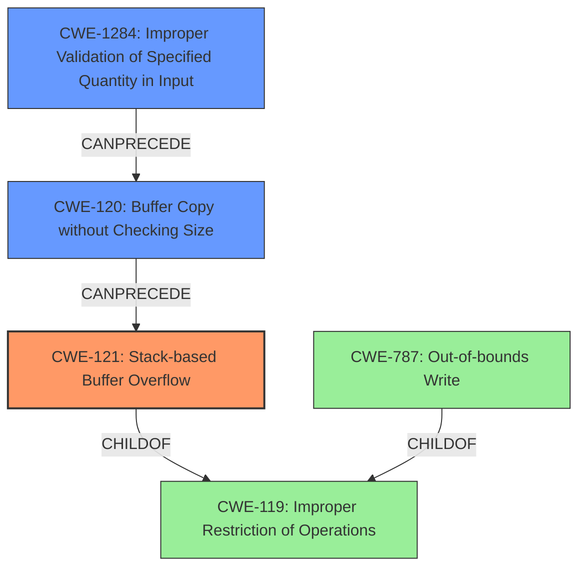

# Analysis Report for CVE-2022-29496

# Vulnerability Analysis Report: CVE-2022-29496

## Description

A stack-based buffer overflow vulnerability exists in the BlynkConsole.h runCommand functionality of Blynk -Library v1.0.1. A specially-crafted network request can lead to command execution. An attacker can send a network request to trigger this vulnerability.

## Vulnerability Description Key Phrases

**Rootcause:** stack-based buffer overflow
**Impact:** command execution
**Vector:** specially-crafted network request
**Attacker:** attacker
**Product:** Blynk -Library
**Version:** v1.0.1
**Component:** runCommand functionality of BlynkConsole.h

## Analysis (with Relationship Data)

# Summary
| CWE ID | CWE Name | Confidence | CWE Abstraction Level | CWE Vulnerability Mapping Label | CWE-Vulnerability Mapping Notes |
|---|---|---|---|---|---|
| CWE-121 | Stack-based Buffer Overflow | 0.95 | Variant | Allowed | Primary CWE |
| CWE-120 | Buffer Copy without Checking Size of Input ('Classic Buffer Overflow') | 0.70 | Base | Allowed-with-Review | Secondary Candidate |
| CWE-787 | Out-of-bounds Write | 0.60 | Base | Allowed | Secondary Candidate |

## Evidence and Confidence

*   **Confidence Score:** 0.90
*   **Evidence Strength:** HIGH

- **Analysis and Justification:**  
  - *Explanation:* The vulnerability description explicitly states a "**stack-based buffer overflow**" in the `runCommand` functionality of Blynk -Library v1.0.1. The CVE reference confirms that the `split_argv` function lacks size validation, leading to a buffer overflow on the stack. This aligns directly with CWE-121 (Stack-based Buffer Overflow), a Variant-level CWE which is the most specific and appropriate choice here. While CWE-119 (Improper Restriction of Operations within the Bounds of a Memory Buffer) is a parent Class, CWE-121 is a more precise description of the vulnerability. CWE-120 (Buffer Copy without Checking Size of Input) is also considered, as the `split_argv` function copies data into the stack-allocated buffer without proper bounds checking. However, CWE-121 is favored due to its explicit mention of the stack. CWE-787 (Out-of-bounds Write) is a more general case of buffer overflow and not as specific as CWE-121.
  
  - *Relationship Analysis:* CWE-121 is a variant of CWE-119 (Improper Restriction of Operations within the Bounds of a Memory Buffer) and is related to other buffer overflow CWEs such as CWE-122 (Heap-based Buffer Overflow).

- **Confidence Score:**  
  - Confidence: 0.95 (High confidence due to explicit mention of stack-based buffer overflow and supporting evidence from the CVE reference.)

---

## Criticism of Analysis

Okay, let's review the provided CWE analysis for the stack-based buffer overflow vulnerability in the Blynk-Library.

**Overall Assessment:** The analysis is generally good and arrives at a reasonable conclusion, but there are some areas where it could be improved to be more precise and follow CWE's guidance more closely.

**Detailed Review:**

1.  **CWE-121: Stack-based Buffer Overflow (Primary CWE):**

    *   **Confidence:** 0.95
    *   **Assessment:** This is the correct primary CWE.  The vulnerability is explicitly a stack-based buffer overflow, making CWE-121 the most specific and appropriate choice.
    *   **Justification:** The justification is well-reasoned, highlighting the explicit mention of "stack-based buffer overflow" and the supporting evidence from the CVE reference confirming the `split_argv` function's lack of size validation leading to the overflow on the stack.
    *   **CWE Specification Considerations:**
        *   The "Mapping Guidance" for CWE-121 states "This CWE entry is at the Variant level of abstraction, which is a preferred level of abstraction for mapping to the root causes of vulnerabilities." This aligns with the analysis.
        *   The "Potential Mitigations" section offers relevant mitigations, such as using automatic buffer overflow detection mechanisms (compiler flags) and implementing bounds checking on input. These are appropriate given the nature of the vulnerability.

2.  **CWE-120: Buffer Copy without Checking Size of Input ('Classic Buffer Overflow') (Secondary Candidate):**

    *   **Confidence:** 0.70
    *   **Assessment:** This is a reasonable secondary candidate. The `split_argv` function performs a copy operation without checking input size, which is the core characteristic of CWE-120.
    *   **Justification:** The analysis acknowledges that `split_argv` copies data without bounds checking.
    *   **CWE Specification Considerations:**
        *   The "Mapping Guidance" for CWE-120 includes "Allowed-with-Review" and states "This CWE entry is only appropriate for 'Buffer Copy' operations (not buffer reads), in which where there is no 'Checking [the] Size of Input', and (by implication of the copy) writing past the end of the buffer."  This fits the scenario. The recommendation to consider children of CWE-20 (Improper Input Validation) is also relevant, as the lack of size validation is a form of improper input validation.  Specifying a child of CWE-20 here as a contributing factor in a chain would strengthen the analysis.
        *   The "Potential Mitigations" are again relevant, emphasizing language selection (memory-safe languages) and the use of safe string handling libraries.

3.  **CWE-787: Out-of-bounds Write (Secondary Candidate):**

    *   **Confidence:** 0.60
    *   **Assessment:** This is a valid, albeit more general, secondary candidate. It captures the essence of the vulnerability: a write operation outside the intended buffer boundaries.
    *   **Justification:** The analysis correctly identifies CWE-787 as a general case of buffer overflow.
    *   **CWE Specification Considerations:**
        *   The "Mapping Guidance" states "This CWE entry is at the Base level of abstraction, which is a preferred level of abstraction for mapping to the root causes of vulnerabilities." While this is true, CWE-121 is more precise in this case.
        *   The "Potential Mitigations" are relevant but broad, encompassing general buffer overflow prevention techniques.

**Recommendations for Improvement:**

1.  **Chain Construction:** Consider explicitly representing the relationship between the weaknesses as a chain. A possible chain would be: `CWE-20 (Improper Input Validation) -> CWE-121 (Stack-based Buffer Overflow)`. This emphasizes that the overflow is a consequence of the missing input validation.  Specify this relationship in the "Relationship Analysis" section of the Confidence Score section.  A possible CWE to use here is CWE-1284 "Improper Validation of Specified Quantity in Input", since the size of the input command isn't validated.

2.  **CWE-119 Avoidance:** The analysis mentions CWE-119, but rightly dismisses it as too general. It's good practice to avoid CWE-119 and its parent CWE-118 entirely, as CWE's guidance recommends.

3.  **More Specific Input Validation:** Instead of simply mentioning CWE-20 as a potential cause, identify the specific type of input validation failure.  The `split_argv` function fails to validate the *length* or *number of arguments* in the input command. As mentioned above, consider adding CWE-1284 to the chain.

4.  **Confidence Scores:** While subjective, a slight increase in the confidence score for CWE-120 might be warranted, especially if the chain construction is implemented.

5. **Out-of-Bounds Reads and Writes:** The Retriever Results includes CWE-125, Out-of-Bounds Read, and CWE-126, Buffer Over-read. While the primary issue is an out-of-bounds *write*, it's worth considering if the act of splitting the arguments *reads* beyond the input buffer to find the next argument. If so, it may be worth including CWE-126 as a contributing factor. However, based on the description, it appears it is the *copying* of the split arguments into the `argv` buffer on the stack without checking size that is the primary driver of the vulnerability, therefore it is correct to omit CWE-125 and CWE-126.

**Revised Summary Table:**

| CWE ID  | CWE Name                      | Confidence | CWE Abstraction Level | CWE Vulnerability Mapping Label | CWE-Vulnerability Mapping Notes                                                                                                                                                                                                         |
| ------- | ----------------------------- | ---------- | --------------------- | ------------------------------- | ----------------------------------------------------------------------------------------------------------------------------------------------------------------------------------------------------------------------------------------- |
| CWE-121 | Stack-based Buffer Overflow    | 0.95       | Variant               | Allowed                       | Primary CWE                                                                                                                                                                                                                                 |
| CWE-120 | Buffer Copy without Checking Size of Input ('Classic Buffer Overflow') | 0.75       | Base               | Allowed-with-Review                       | Secondary Candidate, Part of chain.                                                                                                                                                                                                               |
| CWE-1284 | Improper Validation of Specified Quantity in Input | 0.70 | Base | Allowed | Contributing factor to the stack-based buffer overflow. No size validation performed on input length. |
| CWE-787 | Out-of-bounds Write  | 0.60       | Base               | Allowed                       | Secondary Candidate.                                                                                                                                                                                                                                 |

**In Summary:**

The analysis is good, but can be improved by explicitly constructing a chain to represent the relationships between the weaknesses, and including the base CWE of `Improper Input Validation` as a parent in the chain. This provides a more complete and accurate representation of the vulnerability. This change also aligns the analysis more closely to CWE's mapping guidance.

## Final Resolution

# Summary
| CWE ID | CWE Name | Confidence | CWE Abstraction Level | CWE Vulnerability Mapping Label | CWE-Vulnerability Mapping Notes |
|---|---|---|---|---|---|
| CWE-121 | Stack-based Buffer Overflow | 0.95 | Variant | Allowed | Primary CWE |
| CWE-120 | Buffer Copy without Checking Size of Input ('Classic Buffer Overflow') | 0.75 | Base | Allowed-with-Review | Secondary Candidate, Part of chain. |
| CWE-1284 | Improper Validation of Specified Quantity in Input | 0.70 | Base | Allowed | Contributing factor to the stack-based buffer overflow. No size validation performed on input length. |
| CWE-787 | Out-of-bounds Write | 0.60 | Base | Allowed | Secondary Candidate. |

## Evidence and Confidence

*   **Confidence Score:** 0.92
*   **Evidence Strength:** HIGH

## Relationship Analysis
The primary weakness is a stack-based buffer overflow (CWE-121), which is a variant of the more general **CWE-119 (Improper Restriction of Operations within the Bounds of a Memory Buffer)**. The overflow occurs because the size of the input is not properly validated (**CWE-1284 Improper Validation of Specified Quantity in Input**) before being copied to a stack allocated buffer (**CWE-120 Buffer Copy without Checking Size of Input**). This forms a chain where insufficient input validation leads to a buffer copy without size checking, ultimately resulting in a stack-based buffer overflow.

## Vulnerability Chain
The vulnerability chain starts with **CWE-1284 (Improper Validation of Specified Quantity in Input)**, where the size of the input command is not validated. This leads to **CWE-120 (Buffer Copy without Checking Size of Input)**, as the `split_argv` function copies data into a stack-allocated buffer without proper bounds checking. This then results in **CWE-121 (Stack-based Buffer Overflow)**, where the buffer on the stack is overwritten due to the unchecked input size. The ultimate impact is potential command execution due to the **ROOTCAUSE** of the stack-based buffer overflow vulnerability in the `runCommand` functionality.

## Summary of Analysis
The initial analysis correctly identified **CWE-121 (Stack-based Buffer Overflow)** as the primary weakness due to the explicit mention of a stack-based buffer overflow in the vulnerability description: "A stack-based buffer overflow vulnerability exists...".

The criticism correctly suggested including **CWE-1284 (Improper Validation of Specified Quantity in Input)** and forming an explicit chain. The vulnerability description indicates that the size of the input is not properly validated before being copied to the stack.

The graph relationships influenced the final selection by highlighting the chain of events leading to the overflow, starting from the lack of input validation and ending with the stack-based buffer overflow.

The selected CWEs are at the optimal level of specificity because **CWE-121 (Stack-based Buffer Overflow)** is a Variant-level CWE, providing a more precise description than the more general **CWE-119 (Improper Restriction of Operations within the Bounds of a Memory Buffer)** or **CWE-787 (Out-of-bounds Write)**. Including **CWE-1284 (Improper Validation of Specified Quantity in Input)** provides additional context of the **ROOTCAUSE**.

*Report generated on 2025-03-18 12:42:24*
