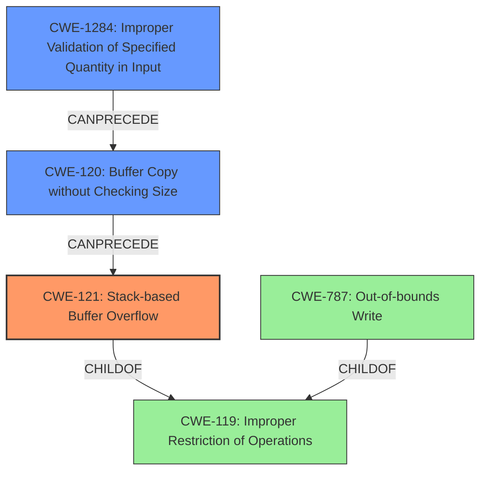

# Final Resolution for CVE-2022-29496

# Summary
| CWE ID | CWE Name | Confidence | CWE Abstraction Level | CWE Vulnerability Mapping Label | CWE-Vulnerability Mapping Notes |
|---|---|---|---|---|---|
| CWE-121 | Stack-based Buffer Overflow | 0.95 | Variant | Allowed | Primary CWE |
| CWE-120 | Buffer Copy without Checking Size of Input ('Classic Buffer Overflow') | 0.75 | Base | Allowed-with-Review | Secondary Candidate, Part of chain. |
| CWE-1284 | Improper Validation of Specified Quantity in Input | 0.70 | Base | Allowed | Contributing factor to the stack-based buffer overflow. No size validation performed on input length. |
| CWE-787 | Out-of-bounds Write | 0.60 | Base | Allowed | Secondary Candidate. |

## Evidence and Confidence

*   **Confidence Score:** 0.92
*   **Evidence Strength:** HIGH

## Relationship Analysis
The primary weakness is a stack-based buffer overflow (CWE-121), which is a variant of the more general **CWE-119 (Improper Restriction of Operations within the Bounds of a Memory Buffer)**. The overflow occurs because the size of the input is not properly validated (**CWE-1284 Improper Validation of Specified Quantity in Input**) before being copied to a stack allocated buffer (**CWE-120 Buffer Copy without Checking Size of Input**). This forms a chain where insufficient input validation leads to a buffer copy without size checking, ultimately resulting in a stack-based buffer overflow.

## Vulnerability Chain
The vulnerability chain starts with **CWE-1284 (Improper Validation of Specified Quantity in Input)**, where the size of the input command is not validated. This leads to **CWE-120 (Buffer Copy without Checking Size of Input)**, as the `split_argv` function copies data into a stack-allocated buffer without proper bounds checking. This then results in **CWE-121 (Stack-based Buffer Overflow)**, where the buffer on the stack is overwritten due to the unchecked input size. The ultimate impact is potential command execution due to the **ROOTCAUSE** of the stack-based buffer overflow vulnerability in the `runCommand` functionality.

## Summary of Analysis
The initial analysis correctly identified **CWE-121 (Stack-based Buffer Overflow)** as the primary weakness due to the explicit mention of a stack-based buffer overflow in the vulnerability description: "A stack-based buffer overflow vulnerability exists...".

The criticism correctly suggested including **CWE-1284 (Improper Validation of Specified Quantity in Input)** and forming an explicit chain. The vulnerability description indicates that the size of the input is not properly validated before being copied to the stack.

The graph relationships influenced the final selection by highlighting the chain of events leading to the overflow, starting from the lack of input validation and ending with the stack-based buffer overflow.

The selected CWEs are at the optimal level of specificity because **CWE-121 (Stack-based Buffer Overflow)** is a Variant-level CWE, providing a more precise description than the more general **CWE-119 (Improper Restriction of Operations within the Bounds of a Memory Buffer)** or **CWE-787 (Out-of-bounds Write)**. Including **CWE-1284 (Improper Validation of Specified Quantity in Input)** provides additional context of the **ROOTCAUSE**.