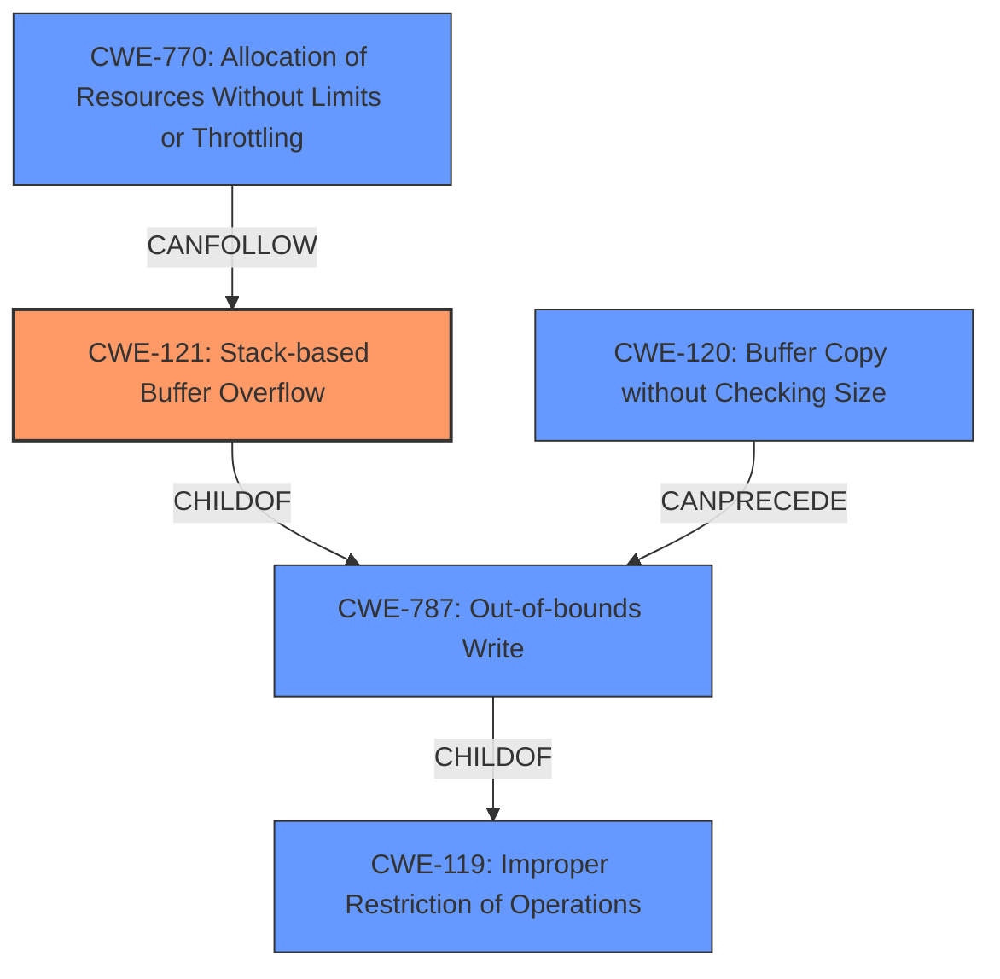

# Final Resolution for CVE-2022-29638

# Summary
| CWE ID  | CWE Name                      | Confidence | CWE Abstraction Level | CWE Vulnerability Mapping Label | CWE-Vulnerability Mapping Notes |
| :------- | :----------------------------- | :--------- | :---------------------- | :------------------------------ | :---------------------------- |
| CWE-121 | Stack-based Buffer Overflow   | 0.95      | Variant               | Allowed                        | Primary CWE. Vulnerability occurs due to unbounded `strcpy` to a stack buffer in the `setIpQosRules` function. Can potentially lead to RCE, although DoS is the stated impact. |

## Evidence and Confidence

*   **Confidence Score:** 0.95
*   **Evidence Strength:** HIGH

## Relationship Analysis
The primary relationship is the parent-child relationship where CWE-121 is a variant of the broader **CWE-119: Improper Restriction of Operations within the Bounds of a Memory Buffer**. The analysis correctly identifies that CWE-121 is more specific due to the stack allocation. Another relevant relationship is that CWE-121 is also a child of **CWE-787: Out-of-bounds Write**. The retriever results suggested other CWEs, such as **CWE-120: Buffer Copy without Checking Size of Input ('Classic Buffer Overflow')**, which is a valid base CWE. However, since the stack location is known, CWE-121 provides greater specificity. **CWE-770: Allocation of Resources Without Limits or Throttling** could be part of a chain, leading to resource exhaustion, but isn't the primary **ROOTCAUSE**.

## Vulnerability Chain
The vulnerability chain starts with the **ROOTCAUSE**, which is the unbounded `strcpy` operation within the `setIpQosRules` function. This leads to **CWE-121: Stack-based Buffer Overflow**. The **WEAKNESS** allows attackers to cause a Denial of Service (DoS) via a crafted POST request. In a more severe scenario, this could potentially lead to Remote Code Execution (RCE) if the overflow overwrites critical data on the stack, such as the return address. If the attacker keeps sending oversized requests, it could lead to **CWE-770: Allocation of Resources Without Limits or Throttling**.

## Summary of Analysis
The initial analysis correctly identified **CWE-121: Stack-based Buffer Overflow** as the primary **WEAKNESS**. The criticism provided helpful suggestions for improvement, such as mentioning the potential consequences of the stack overflow beyond DoS (e.g., RCE) and incorporating relevant mitigation strategies from the CWE specifications (e.g., using `strncpy` instead of `strcpy`, implementing bounds checking). The analysis is based on the evidence that the vulnerability description explicitly states a "stack overflow" via the comment parameter in the `setIpQosRules` function. The CVE reference summary confirms that the root cause is the lack of bounds checking on the "comment" parameter, which leads to a buffer overflow on the stack due to the `strcpy` operation. **CWE-121** is the optimal level of specificity because it identifies the location of the buffer on the stack.