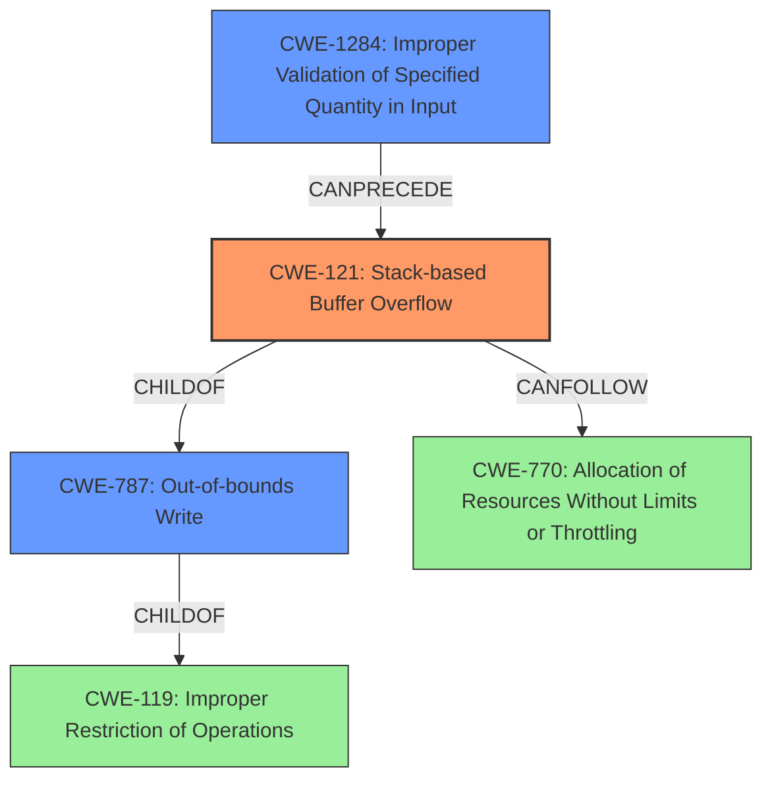

# Analysis Report for CVE-2022-29640

# Vulnerability Analysis Report: CVE-2022-29640

## Description

TOTOLINK A3100R V4.1.2cu.5050_B20200504 and V4.1.2cu.5247_B20211129 were discovered to contain a stack overflow via the comment parameter in the function setPortForwardRules. This vulnerability allows attackers to cause a Denial of Service (DoS) via a crafted POST request.

## Vulnerability Description Key Phrases

**Weakness:** stack overflow
**Impact:** Denial of Service (DoS)
**Vector:** crafted POST request
**Attacker:** attackers
**Product:** TOTOLINK A3100R
**Version:** V4.1.2cu.5050_B20200504 and V4.1.2cu.5247_B20211129
**Component:** setPortForwardRules function

## Analysis (with Relationship Data)

# Summary
| CWE ID | CWE Name | Confidence | CWE Abstraction Level | CWE Vulnerability Mapping Label | CWE-Vulnerability Mapping Notes |
|---|---|---|---|---|---|
| CWE-121 | Stack-based Buffer Overflow | 0.95 | Variant | Primary | The vulnerability is a classic stack buffer overflow due to the use of strcpy without bounds checking. |
| CWE-787 | Out-of-bounds Write | 0.7 | Base | Secondary Candidate | The stack overflow leads to an out-of-bounds write, however, CWE-121 is a more specific variant. |
| CWE-120 | Buffer Copy without Checking Size of Input ('Classic Buffer Overflow') | 0.6 | Base | Secondary Candidate | While related, CWE-121 is more specific to stack-based overflows and therefore a better fit than CWE-120, which is more general. |
| CWE-20 | Improper Input Validation | 0.3 | Class | Secondary Candidate | This is a general weakness that could apply, but the description indicates a more specific cause of a stack buffer overflow. |

## Evidence and Confidence

*   **Confidence Score:** 0.9
*   **Evidence Strength:** HIGH

- **Analysis and Justification:**  
  - *Explanation:* The vulnerability description clearly states a **stack overflow** in the `setPortForwardRules` function due to the `comment` parameter. The CVE Reference Links Content Summary confirms that the **root cause** is a lack of input validation, specifically the use of `strcpy` without checking the length of the input "comment", which is then copied to a stack buffer. This aligns directly with CWE-121 (Stack-based Buffer Overflow), a Variant-level CWE. CWE-787 (Out-of-bounds Write) is a broader category that could also apply, but CWE-121 is more specific and accurately captures the stack-based nature of the overflow. CWE-120 is also a more general "buffer overflow" which is less specific. The **weakness** allows attackers to cause a Denial of Service (DoS) via a crafted POST request, indicating the security impact.
  
  - *Relationship Analysis:* CWE-121 (Stack-based Buffer Overflow) is a variant of CWE-787 (Out-of-bounds Write) and CWE-119 (Improper Restriction of Operations within the Bounds of a Memory Buffer). It is also related to CWE-20 (Improper Input Validation) as the lack of input validation enables the overflow. CWE-121 can lead to CWE-770 (Allocation of Resources Without Limits or Throttling) as a consequence if the overflow is exploited to allocate excessive resources.

- **Confidence Score:**  
  - Confidence: 0.95 (High confidence due to clear vulnerability description, confirmation in the CVE reference, and direct alignment with CWE-121 characteristics)

---

## Criticism of Analysis

Okay, I've reviewed the provided analysis against the full CWE specifications you included. Here's my critique:

**Overall Assessment:**

The analysis is generally good and identifies the core issue as a stack-based buffer overflow. The justification for choosing CWE-121 as the primary CWE is sound. The discussion of related CWEs and confidence levels are also well-reasoned. However, there are a few points where the analysis could be improved, particularly in considering the broader implications of *Improper Input Validation* and potential weaknesses in the *design*.

**Detailed Review:**

| CWE ID  | CWE Name                           | Confidence | CWE Abstraction Level | CWE Vulnerability Mapping Label | CWE-Vulnerability Mapping Notes                                                                                                                                                                                                                                                                                                                                                                                               | Critique |
| :------- | :--------------------------------- | :--------- | :---------------------- | :----------------------------- | :----------------------------------------------------------------------------------------------------------------------------------------------------------------------------------------------------------------------------------------------------------------------------------------------------------------------------------------------------------------------------------------------------------------- | :------- |
| CWE-121  | Stack-based Buffer Overflow          | 0.95       | Variant                 | Primary                         | The vulnerability is a classic stack buffer overflow due to the use of strcpy without bounds checking.                                                                                                                                                                                                                                                                                                           | Justified.  The `strcpy` without bounds checking directly leads to the stack-based nature of the overflow.  The high confidence level is appropriate. |
| CWE-787  | Out-of-bounds Write                  | 0.7        | Base                    | Secondary Candidate           | The stack overflow leads to an out-of-bounds write, however, CWE-121 is a more specific variant.                                                                                                                                                                                                                                                                                                                     | Sound reasoning. CWE-787 is a generalization of CWE-121. Choosing the more specific CWE-121 is correct. It shows an understanding of the CWE hierarchy. |
| CWE-120  | Buffer Copy without Checking Size of Input ('Classic Buffer Overflow') | 0.6        | Base                    | Secondary Candidate           | While related, CWE-121 is more specific to stack-based overflows and therefore a better fit than CWE-120, which is more general.   |Sound reasoning. CWE-120 is a general "buffer overflow" which is less specific.                                 |
| CWE-20   | Improper Input Validation            | 0.3        | Class                   | Secondary Candidate           | This is a general weakness that could apply, but the description indicates a more specific cause of a stack buffer overflow.                                                                                                                                                                                                                                                                                     | **Opportunity for Improvement:** While the description *does* point to a more specific cause, the *lack* of input validation is the fundamental enabler of the vulnerability.  According to CWE mapping guidance, CWE-20 is *discouraged* for this type of analysis. Instead, more specific children should be used, namely **CWE-1284: Improper Validation of Specified Quantity in Input**, because it is the *size* (quantity) of the `comment` parameter that is not validated. This should be a Base-level candidate with higher confidence, perhaps 0.5. This is an area where LangSec could also apply. |

**Specific Feedback and Suggestions:**

1.  **CWE-20 and its Children:** As pointed out, the analysis should consider the *more specific* children of CWE-20.  Since the root cause is the missing check on the *size* of the `comment` parameter,  **CWE-1284 (Improper Validation of Specified Quantity in Input)** is a better fit than the general CWE-20.  The current analysis dismisses CWE-20 a bit too quickly.  While the overflow itself is the direct effect, the *reason* the overflow is possible is the missing quantity check.

2.  **Chains:** The analysis correctly identifies that the lack of Input Validation leads to the Stack Overflow. A basic chain could be represented as: `CWE-1284 -> CWE-121`.

3.  **Mitigations:** The analysis does not explicitly mention mitigations from the perspective of each CWE.
    *   For CWE-121, the mitigations would focus on using compiler/OS features to detect stack overflows (e.g., /GS flag, canaries) and using safer string handling functions that prevent uncontrolled copies.
    *   For CWE-1284, the mitigations would involve implementing proper input validation on the `comment` parameter to ensure that its length does not exceed the buffer size.  This could include rejecting requests with oversized comments or truncating the comment to a safe length.

4. **Retriever Results:** It's interesting to see the retriever results. The top result was CWE-78, OS Command Injection, which is interesting and likely due to the 'command' in the description of the vulnerability. CWE-121 did come in second place. The Retriever results highlight the difficulty of automated analysis.

5.  **Impact:** The analysis correctly identifies DoS as the primary impact. However, it *could* mention the potential for more severe impacts if the stack overflow were exploitable for code execution, although this is less likely in a simple DoS scenario.

6.  **Relationship Analysis:** The Relationship Analysis section is good but could be expanded to discuss how CWE-1284 relates to CWE-121.

7.  **CWE-770 Allocation of Resources Without Limits or Throttling:** The retriever results included this CWE, and it may be a worthwhile secondary consideration. If the attacker can repeatedly send crafted POST requests, they can potentially exhaust system resources beyond just crashing the router, causing wider network issues. The confidence for this would be low, but worth mentioning.

**Revised Summary Table (incorporating suggestions):**

| CWE ID  | CWE Name                           | Confidence | CWE Abstraction Level | CWE Vulnerability Mapping Label | CWE-Vulnerability Mapping Notes                                                                                                                                                                                                                                                                                     |
| :------- | :--------------------------------- | :--------- | :---------------------- | :----------------------------- | :----------------------------------------------------------------------------------------------------------------------------------------------------------------------------------------------------------------------------------------------------------------------------------------------------------------------- |
| CWE-121  | Stack-based Buffer Overflow          | 0.95       | Variant                 | Primary                         | The vulnerability is a classic stack buffer overflow due to the use of `strcpy` without bounds checking.                                                                                                                                                                                                                         |
| CWE-1284 | Improper Validation of Specified Quantity in Input    | 0.5        | Base                   | Secondary Candidate                         | The `comment` parameter's *size* is not properly validated, leading to the overflow. This is a base cause that *enables* the overflow and a more specific form of improper input validation.                                                                                                                                                                                                                         |
| CWE-787  | Out-of-bounds Write                  | 0.7        | Base                    | Secondary Candidate           | The stack overflow leads to an out-of-bounds write, however, CWE-121 is a more specific variant.                                                                                                                                                                                                                       |
| CWE-120  | Buffer Copy without Checking Size of Input ('Classic Buffer Overflow') | 0.6        | Base                    | Secondary Candidate           | While related, CWE-121 is more specific to stack-based overflows and therefore a better fit than CWE-120, which is more general.   |
| CWE-770  | Allocation of Resources Without Limits or Throttling | 0.2        | Base                   | Tertiary Candidate | An attacker could repeatedly send crafted POST requests leading to resource exhaustion and wider network DoS. |

**In conclusion:** The analysis is a good starting point, but could be improved by:

*   Focusing on the root cause of the stack buffer overflow (missing input validation) and using a more specific CWE.
*   Explaining and listing mitigations specific to each CWE identified.
*   Considering potential for weaknesses based on design (like LangSec concepts).

## Final Resolution

# Summary
| CWE ID | CWE Name | Confidence | CWE Abstraction Level | CWE Vulnerability Mapping Label | CWE-Vulnerability Mapping Notes |
|---|---|---|---|---|---|
| CWE-121 | Stack-based Buffer Overflow | 0.95 | Variant | Primary | The vulnerability is a classic **stack overflow** due to the use of `strcpy` without bounds checking. |
| CWE-1284 | Improper Validation of Specified Quantity in Input | 0.7 | Base | Secondary Candidate | The `comment` parameter's size is not properly validated, leading to the overflow. This is a base cause that enables the overflow and is a more specific form of improper input validation. |
| CWE-787 | Out-of-bounds Write | 0.7 | Base | Secondary Candidate | The **stack overflow** leads to an **out-of-bounds write**, however, CWE-121 is a more specific variant. |
| CWE-120 | Buffer Copy without Checking Size of Input ('Classic Buffer Overflow') | 0.6 | Base | Secondary Candidate | While related, CWE-121 is more specific to **stack-based overflows** and therefore a better fit than CWE-120, which is more general. |
| CWE-770 | Allocation of Resources Without Limits or Throttling | 0.2 | Base | Tertiary Candidate | An attacker could repeatedly send crafted POST requests leading to resource exhaustion and wider network DoS. |

## Evidence and Confidence

*   **Confidence Score:** 0.9
*   **Evidence Strength:** HIGH

## Relationship Analysis
The primary **weakness** is a **stack-based buffer overflow (CWE-121)**. This is caused by a missing size check on the input (`comment` parameter), which aligns with **CWE-1284 (Improper Validation of Specified Quantity in Input)**. **CWE-121** is a variant of **CWE-119 (Improper Restriction of Operations within the Bounds of a Memory Buffer)** and a child of **CWE-787 (Out-of-bounds Write)**, representing the actual **out-of-bounds write** that occurs. The improper input validation (**CWE-1284**) can precede the **stack overflow (CWE-121)**. Repeated exploitation could lead to **CWE-770 (Allocation of Resources Without Limits or Throttling)**.

## Vulnerability Chain
The vulnerability chain starts with **CWE-1284 (Improper Validation of Specified Quantity in Input)**, where the size of the `comment` parameter is not validated. This leads to **CWE-121 (Stack-based Buffer Overflow)** when `strcpy` is used without bounds checking. The **stack overflow** then results in **CWE-787 (Out-of-bounds Write)**, potentially causing a Denial of Service. A missing link in the chain, which is not fully evidenced, is **CWE-770 (Allocation of Resources Without Limits or Throttling)**, which could occur if an attacker repeatedly exploits the vulnerability.

## Summary of Analysis
The initial analysis identified **CWE-121 (Stack-based Buffer Overflow)** as the primary **weakness**, which is correct based on the vulnerability description: "TOTOLINK A3100R ... were discovered to contain a **stack overflow** via the comment parameter in the function setPortForwardRules." The criticism correctly pointed out that the **root cause** is the missing input validation on the size of the `comment` parameter, making **CWE-1284 (Improper Validation of Specified Quantity in Input)** a relevant secondary CWE.

The graph relationships support this analysis, showing that **CWE-1284** can precede **CWE-121**, and **CWE-121** is a more specific type of **out-of-bounds write (CWE-787)**. **CWE-121** is chosen as the primary because the vulnerability description explicitly states a **stack overflow**. The addition of **CWE-1284** improves the classification by addressing the **root cause** of the vulnerability.
The confidence score for **CWE-1284** is raised to 0.7, because the vulnerability description indicates that the `comment` parameter's size is not validated, resulting in the **stack overflow**.
**CWE-770** is kept as a tertiary candidate with low confidence, as it is a potential consequence of repeated exploitation, but there is no direct evidence to support it.
The selected CWEs are at the optimal level of specificity because **CWE-121** accurately describes the type of **buffer overflow**, while **CWE-1284** identifies the **root cause** of the vulnerability.

*Report generated on 2025-03-18 12:59:58*
