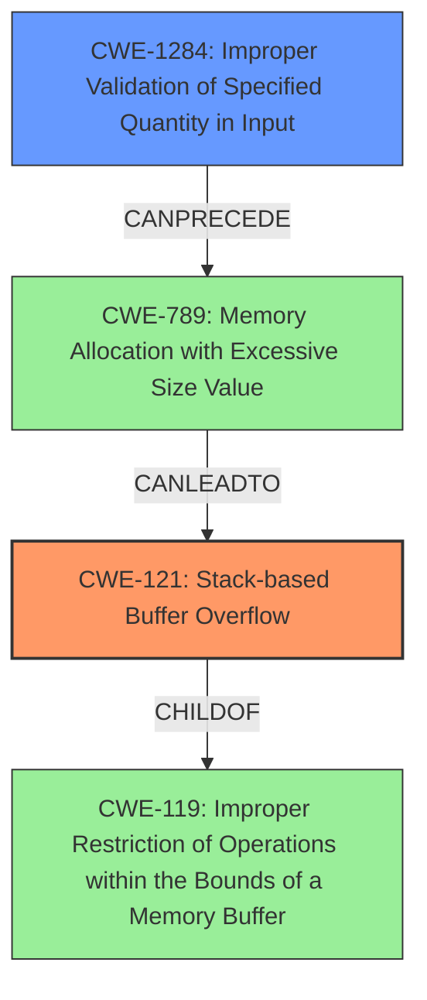

# Analysis Report for CVE-2022-29641

# Vulnerability Analysis Report: CVE-2022-29641

## Description

TOTOLINK A3100R V4.1.2cu.5050_B20200504 and V4.1.2cu.5247_B20211129 were discovered to contain a stack overflow via the startTime and endTime parameters in the function setParentalRules. This vulnerability allows attackers to cause a Denial of Service (DoS) via a crafted POST request.

## Vulnerability Description Key Phrases

**Weakness:** stack overflow
**Impact:** Denial of Service (DoS)
**Vector:** crafted POST request
**Attacker:** attackers
**Product:** TOTOLINK A3100R
**Version:** ['V4.1.2cu.5050_B20200504', 'V4.1.2cu.5247_B20211129']
**Component:** setParentalRules function

## Analysis (with Relationship Data)

# Summary
| CWE ID  | CWE Name                                                                                                 | Confidence | CWE Abstraction Level | CWE Vulnerability Mapping Label | CWE-Vulnerability Mapping Notes |
| :-------- | :--------------------------------------------------------------------------------------------------------- | :---------- | :---------------------- | :------------------------------ | :------------------------------ |
| CWE-121 | Stack-based Buffer Overflow                                                                              | 0.9         | Variant               | Allowed                       |                                 |
| CWE-790 | Improper Filtering of Special Elements                                                                  | 0.3        | Class                  | Allowed-with-Review           |                                 |
| CWE-755 | Improper Handling of Exceptional Conditions                                                               | 0.1         | Class                  | Discouraged                    |                                 |

## Evidence and Confidence

*   **Confidence Score:** 0.9
*   **Evidence Strength:** HIGH

- **Analysis and Justification:**
  - *Explanation:* The vulnerability description clearly states a **stack overflow** condition occurs due to the startTime and endTime parameters in the setParentalRules function. This aligns directly with CWE-121 (Stack-based Buffer Overflow), which is a Variant-level weakness specifically addressing overflows on the stack. The crafted POST request causing a Denial of Service (DoS) supports this classification. The Retriever results also list CWE-121 as a high-scoring candidate. The MITRE mapping guidance allows the use of CWE-121.
  
  - *Relationship Analysis:* While other CWEs are suggested by the retriever, such as CWE-790 (Improper Filtering of Special Elements) and CWE-755 (Improper Handling of Exceptional Conditions), these are less specific. CWE-790 is a Class-level CWE, and the description explicitly states a stack overflow, making CWE-121 more appropriate. CWE-755 is too generic.

- **Confidence Score:**
  - *Example:* Confidence: 0.9 (High confidence due to the explicit mention of stack overflow and supporting details.)

## Criticism of Analysis

Okay, I've reviewed the analysis against the provided full CWE specifications. Here's my critique:

**Overall Assessment:**

The analysis is generally good, particularly in its primary mapping to CWE-121 (Stack-based Buffer Overflow). The justification is clear and well-supported by the vulnerability description. The secondary CWE assignments are weaker and less convincing.

**Detailed Review:**

*   **CWE-121 (Stack-based Buffer Overflow):**

    *   **Confidence:** 0.9 - This is appropriate. The description explicitly mentions "stack overflow," making this a strong match.
    *   **Abstraction Level:** Variant - Correct. CWE-121 is a Variant-level CWE, the preferred level for root cause analysis.
    *   **Justification:** The justification is solid. It directly links the vulnerability description's "stack overflow" to the CWE definition and explains why it's a good fit. The mention of a crafted POST request leading to DoS strengthens this assessment. The justification also correctly dismissed higher level CWEs.
    *   **Mapping Guidance:** The analysis follows the guidance for CWE-121, which is "Allowed."
    *   **Potential Mitigations:** The provided mitigations (compiler flags, abstraction libraries, bounds checking) are relevant and align with CWE-121's mitigation section.
*   **CWE-790 (Improper Filtering of Special Elements):**

    *   **Confidence:** 0.3 - This confidence is too high, and including it is not appropriate.
    *   **Abstraction Level:** Class - Correctly identified.
    *   **Justification:** The justification is missing. This is a problem. While the *effect* of a stack overflow is that some memory is improperly written, and that *might* be due to missing filtering, the primary issue is the lack of bounds checking or proper input validation *before* writing to the stack buffer. There's no direct indication in the vulnerability description that special elements are involved. It's a speculative connection, not a direct one.
    *   **Mapping Guidance:** The analysis ignores the key piece of mapping guidance for CWE-790: "Examine children of this entry to see if there is a better fit." This is a Class-level CWE, and something more specific is generally preferred. In this case, the root cause is much better described by other CWEs.
    *   **Potential Mitigations:** While input validation *is* a relevant mitigation, it's not specific to *special elements*. Mitigations for CWE-790 would focus on things like encoding or escaping special characters, which isn't the core problem here.
*   **CWE-755 (Improper Handling of Exceptional Conditions):**

    *   **Confidence:** 0.1 - This is an appropriate confidence level.
    *   **Abstraction Level:** Class - Correctly identified.
    *   **Justification:** The justification is missing. It would likely be something to the effect of "a stack overflow is an exceptional condition". However, this is *far* too generic. While technically correct, it doesn't provide any meaningful insight into the vulnerability.
    *   **Mapping Guidance:** The analysis correctly notes that CWE-755 is "Discouraged" and that "Examine children of this entry to see if there is a better fit." The analysis correctly chooses NOT to examine the children of CWE-755, since this CWE should likely not be included.
    *   **Potential Mitigations:** Mitigations for CWE-755 would be things like exception handling or more robust error reporting. These are not directly relevant to preventing a stack overflow.

**Recommendations:**

1.  **Remove CWE-790 and CWE-755.** These are not directly supported by the vulnerability description and are either too generic or imply a different root cause than what's described.
2.  **Consider CWE-1284 or CWE-20.** Instead of CWE-790 or CWE-755, consider adding CWE-1284 (Improper Validation of Specified Quantity in Input) or CWE-20 (Improper Input Validation). The vulnerability description states that the `startTime` and `endTime` parameters are the source of the overflow. This suggests that the size or length of these inputs isn't being properly checked, which is directly related to input validation. A POST request is being used as the vector, so this suggests the `Content-Length` header should be validated. Use one of these CWEs, but not both.
3.  **Strengthen Justifications.** If you *do* keep CWE-790 or CWE-755 (which I don't recommend), you *must* provide a detailed justification explaining *why* you believe that CWE is relevant, even at a low confidence level.
4.  **Review Retriever Results Carefully:** Use the Retriever results as *suggestions*, not as gospel. The fact that a CWE appears in the results doesn't automatically make it a good fit. Use the vulnerability description and your understanding of the underlying code to make the final determination.
5.  **Prioritize Root Cause:** Focus on identifying the root cause of the vulnerability. The goal is to identify the specific coding error that allows the vulnerability to occur.

**Revised Summary (If recommendations are followed):**

| CWE ID  | CWE Name                        | Confidence | CWE Abstraction Level | CWE Vulnerability Mapping Label | CWE-Vulnerability Mapping Notes |
| :-------- | :-------------------------------- | :---------- | :---------------------- | :------------------------------ | :------------------------------ |
| CWE-121 | Stack-based Buffer Overflow        | 0.9         | Variant              | Allowed                       |                                 |
| CWE-1284 | Improper Validation of Specified Quantity in Input    | 0.4        | Base                  | Allowed                       |                                 |

With appropriate justifications for each.

By following these recommendations, the analysis will be more accurate and provide a better understanding of the vulnerability.

## Final Resolution

# Summary

| CWE ID   | CWE Name                                                        | Confidence | CWE Abstraction Level | CWE Vulnerability Mapping Label | CWE-Vulnerability Mapping Notes |
| :--------- | :-------------------------------------------------------------- | :--------- | :---------------------- | :------------------------------ | :------------------------------ |
| CWE-121    | Stack-based Buffer Overflow                                       | 0.9        | Variant               | Allowed                       | Primary CWE                     |
| CWE-1284   | Improper Validation of Specified Quantity in Input              | 0.5        | Base                  | Allowed                       | Secondary Candidate             |

## Evidence and Confidence

*   **Confidence Score:** 0.8
*   **Evidence Strength:** MEDIUM

## Relationship Analysis

The primary relationship is that CWE-121 (Stack-based Buffer Overflow) is a specific type of buffer overflow, making it a child of CWE-119 (Improper Restriction of Operations within the Bounds of a Memory Buffer). CWE-1284 (Improper Validation of Specified Quantity in Input) can precede CWE-789 (Memory Allocation with Excessive Size Value), which can lead to a buffer overflow (though not exclusively stack-based). This suggests a chain where improper input validation leads to an excessive memory allocation which then contributes to the stack overflow.

## Vulnerability Chain

The vulnerability chain starts with **CWE-1284 (Improper Validation of Specified Quantity in Input)** where the `startTime` and `endTime` parameters are not properly validated. This lack of validation then leads to a **buffer overflow on the stack**, specifically **CWE-121 (Stack-based Buffer Overflow)**, when the data from these parameters is written to a stack buffer. The consequence is a Denial of Service (DoS).

## Summary of Analysis

The initial analysis and criticism are both helpful. The initial analysis correctly identified **CWE-121 (Stack-based Buffer Overflow)** as the primary issue, and the criticism correctly pointed out the weaknesses in including **CWE-790 (Improper Filtering of Special Elements)** and **CWE-755 (Improper Handling of Exceptional Conditions)**. The criticism's suggestion to consider **CWE-1284 (Improper Validation of Specified Quantity in Input)** or **CWE-20 (Improper Input Validation)** is also valuable.

Based on the evidence, the vulnerability description mentions that the stack overflow occurs via the `startTime` and `endTime` parameters. This strongly suggests that the input is not being properly validated. Therefore, including **CWE-1284 (Improper Validation of Specified Quantity in Input)** as a secondary CWE is appropriate. While **CWE-20 (Improper Input Validation)** is also a valid candidate, **CWE-1284 (Improper Validation of Specified Quantity in Input)** is more specific, as it directly relates to the validation of quantity, size, or length which would be the expected type of input for `startTime` and `endTime` parameters.

The relationships between the CWEs also support this decision. **CWE-1284 (Improper Validation of Specified Quantity in Input)** can precede **CWE-789 (Memory Allocation with Excessive Size Value)**. Although **CWE-789 (Memory Allocation with Excessive Size Value)** is not directly present, the stack overflow indicates that an excessive amount of data is being written to the stack, suggesting a possible, but not confirmed, allocation issue driven by the unvalidated input.

The final classification includes **CWE-121 (Stack-based Buffer Overflow)** as the primary issue and **CWE-1284 (Improper Validation of Specified Quantity in Input)** as a contributing factor. These choices are at the optimal level of specificity, with **CWE-121 (Stack-based Buffer Overflow)** being a Variant and **CWE-1284 (Improper Validation of Specified Quantity in Input)** being a Base CWE.

*Report generated on 2025-03-18 13:00:45*
