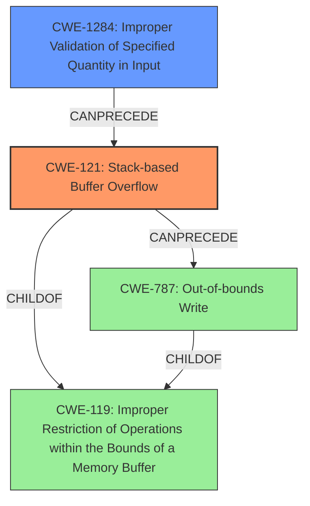

# Final Resolution for CVE-2022-29642

# Summary
| CWE ID | CWE Name | Confidence | CWE Abstraction Level | CWE Vulnerability Mapping Label | CWE-Vulnerability Mapping Notes |
|---|---|---|---|---|---|
| CWE-121 | Stack-based Buffer Overflow | 0.95 | Variant | Allowed | Primary CWE |
| CWE-1284 | Improper Validation of Specified Quantity in Input | 0.85 | Base | Allowed | Secondary Candidate |

## Evidence and Confidence

*   **Confidence Score:** 0.93
*   **Evidence Strength:** HIGH

## Relationship Analysis
The analysis is centered around **CWE-121 (Stack-based Buffer Overflow)**, a variant of **CWE-119 (Improper Restriction of Operations within the Bounds of a Memory Buffer)**. **CWE-787 (Out-of-bounds Write)** is a parent of **CWE-121**, being a more general case. The criticism highlights the missing input validation aspect, which leads to the consideration of **CWE-1284 (Improper Validation of Specified Quantity in Input)**, as a Base level CWE. We selected CWE-1284 as a secondary candidate because it directly addresses the lack of proper validation of the input size. The original analysis also considered **CWE-20 (Improper Input Validation)**, but CWE-1284 is more specific because it relates directly to the improper handling of size or length of an input, which is key in this case. This level of specificity is preferable, making it a stronger fit than **CWE-20**, which is a broader, more general weakness.

## Vulnerability Chain
The vulnerability chain begins with **CWE-1284 (Improper Validation of Specified Quantity in Input)**. The `url` parameter's size isn't checked. This lack of validation **CanPrecede** a **CWE-121 (Stack-based Buffer Overflow)** when the `strcpy` function is used to copy the oversized `url` into a fixed-size stack buffer. The result is a Denial of Service (DoS), as specified in the vulnerability description. The intermediate step of **CWE-787 (Out-of-bounds Write)** is implied as part of the overflow, but **CWE-121** is more specific to the stack, so it is the better choice.

## Summary of Analysis
The initial analysis correctly identified **CWE-121 (Stack-based Buffer Overflow)** as the primary weakness. The addition of **CWE-1284 (Improper Validation of Specified Quantity in Input)** provides more context to the root cause by highlighting the missing input validation that leads to the overflow.

The evidence from the vulnerability description states, "TOTOLINK A3100R V4.1.2cu.5050_B20200504 and V4.1.2cu.5247_B20211129 were discovered to contain a **stack overflow** via the url parameter in the function setUrlFilterRules". This, combined with the CVE summary describing the use of `strcpy` without bounds checking, provides strong evidence for **CWE-121**. The criticism rightly pointed out the missing input validation piece, which is why **CWE-1284** was added.

The graph relationships show how the lack of input validation **CanPrecede** the buffer overflow. The selected CWEs are at the optimal level of specificity because **CWE-121** is a Variant that directly describes the stack-based nature of the overflow, and **CWE-1284** is a Base CWE that specifically describes the lack of input validation on the size or length of the input.

The final decision is based on a combination of direct evidence from the vulnerability description, relationship analysis showing how the weaknesses chain together, and consideration of mapping guidance to ensure appropriate CWE selection.