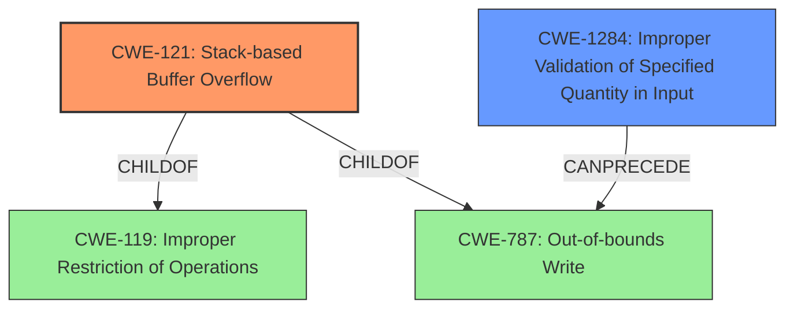

# Final Resolution for CVE-2022-29643

# Summary
| CWE ID | CWE Name | Confidence | CWE Abstraction Level | CWE Vulnerability Mapping Label | CWE-Vulnerability Mapping Notes |
|---|---|---|---|---|---|
| CWE-121 | CWE-121: Stack-based Buffer Overflow | 0.95 | Variant | Primary | The primary **weakness** is a **stack-based buffer overflow** due to insufficient input validation, aligning with the description and CVE details. |
| CWE-1284 | CWE-1284: Improper Validation of Specified Quantity in Input | 0.75 | Base | Secondary | The **root cause** is the lack of proper validation of the macAddress parameter length, which is a quantity, before using it in strcpy/strcat. |

## Evidence and Confidence

*   **Confidence Score:** 0.90
*   **Evidence Strength:** HIGH

## Relationship Analysis
The primary relationship that impacted the decision was the parent-child relationship between CWE-119 (Improper Restriction of Operations within the Bounds of a Memory Buffer) and CWE-121 (Stack-based Buffer Overflow). CWE-121 is a variant of CWE-119 and is more specific because the overflow occurs on the stack. CWE-1284 (Improper Validation of Specified Quantity in Input) can precede CWE-787 (Out-of-bounds Write), which is a parent of CWE-121, indicating that the lack of validation can lead to writing beyond the buffer's boundaries. The abstraction levels also influenced the selection, with CWE-121 being a Variant and CWE-1284 being a Base, both preferred levels.

## Vulnerability Chain
The chain of **root cause** and **weaknesses** for the Vulnerability Description is as follows:
  1. The initial flaw is **CWE-1284 (Improper Validation of Specified Quantity in Input)**. The `macAddress` parameter's length isn't validated.
  2. This leads to **CWE-121 (Stack-based Buffer Overflow)**, where copying the `macAddress` data without checking its size causes a buffer overflow on the stack.
  3. The consequence is a Denial of Service (DoS) due to the overflow corrupting program memory.

## Summary of Analysis
The analysis is based on the provided evidence, particularly the vulnerability description and CVE details, which explicitly mention a **stack overflow** via the `macAddress` parameter. The initial analysis correctly identifies **CWE-121 (Stack-based Buffer Overflow)** as the primary **weakness** and **CWE-1284 (Improper Validation of Specified Quantity in Input)** as a contributing factor.

The graph relationships influenced the final selection by confirming that **CWE-121** is a more specific variant of **CWE-119** and **CWE-787**, making it the most appropriate choice. The 'CanPrecede' relationship between **CWE-1284** and **CWE-787** reinforces the understanding of the vulnerability chain.

The selected CWEs are at the optimal level of specificity because **CWE-121** directly describes the stack-based nature of the overflow, while **CWE-1284** captures the **root cause** of the missing input validation.