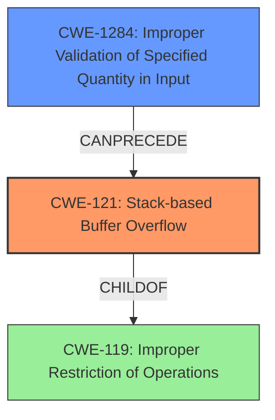

# Final Resolution for CVE-2022-2972

# Summary
| CWE ID | CWE Name | Confidence | CWE Abstraction Level | CWE Vulnerability Mapping Label | CWE-Vulnerability Mapping Notes |
|---|---|---|---|---|---|
| CWE-121 | Stack-based Buffer Overflow | 1.0 | Variant | Allowed | Primary CWE |
| CWE-1284 | Improper Validation of Specified Quantity in Input | 0.6 | Base | Allowed | Secondary Candidate |

## Evidence and Confidence

*   **Confidence Score:** 0.8
*   **Evidence Strength:** MEDIUM

## Relationship Analysis
The primary relationship considered was the parent-child relationship between CWE-119 (Improper Restriction of Operations within the Bounds of a Memory Buffer) and CWE-121 (Stack-based Buffer Overflow). CWE-121 is a variant of CWE-119, providing a more specific classification for stack-based overflows. Additionally, a chain relationship was considered, where CWE-1284 (Improper Validation of Specified Quantity in Input) could precede CWE-121, if the size of the input is not validated before being used in a buffer copy operation. The abstraction levels influenced the decision to choose CWE-121 (Variant) over CWE-119 (Base) due to its higher specificity.

## Vulnerability Chain
The vulnerability chain begins with a lack of input validation (potentially CWE-20), which leads to **CWE-1284 (Improper Validation of Specified Quantity in Input)** if the size of the input is not validated. This then results in **CWE-121 (Stack-based Buffer Overflow)** when the program attempts to copy the oversized input into a stack-allocated buffer. The consequence is a device crash or remote code execution.

## Summary of Analysis
The initial analysis correctly identified **CWE-121 (Stack-based Buffer Overflow)** as the primary **WEAKNESS**. The vulnerability description explicitly states "stack-based buffer overflow," which directly corresponds to **CWE-121**. The CVE Reference Links Content Summary also confirms this, stating "**Stack-based buffer overflow (CWE-121)**: The software is vulnerable to a stack-based buffer overflow." This evidence is strong and supports the classification with high confidence.

The criticism suggested considering other CWEs, particularly those related to input validation and size calculation. While **CWE-121** remains the most direct and specific match, **CWE-1284 (Improper Validation of Specified Quantity in Input)** was added as a secondary **WEAKNESS** candidate because, as the size of the buffer is not validated, this could contribute to the vulnerability chain.

The graph relationships influenced the decision by highlighting the parent-child relationship between **CWE-119** and **CWE-121**, reinforcing the choice of the more specific **CWE-121**. The potential chain relationship with **CWE-1284** was also considered.

The selected CWEs are at the optimal level of specificity. **CWE-121** is a Variant-level CWE that precisely describes the stack-based nature of the buffer overflow. **CWE-1284** is a Base-level CWE that describes the lack of validation of the input size.