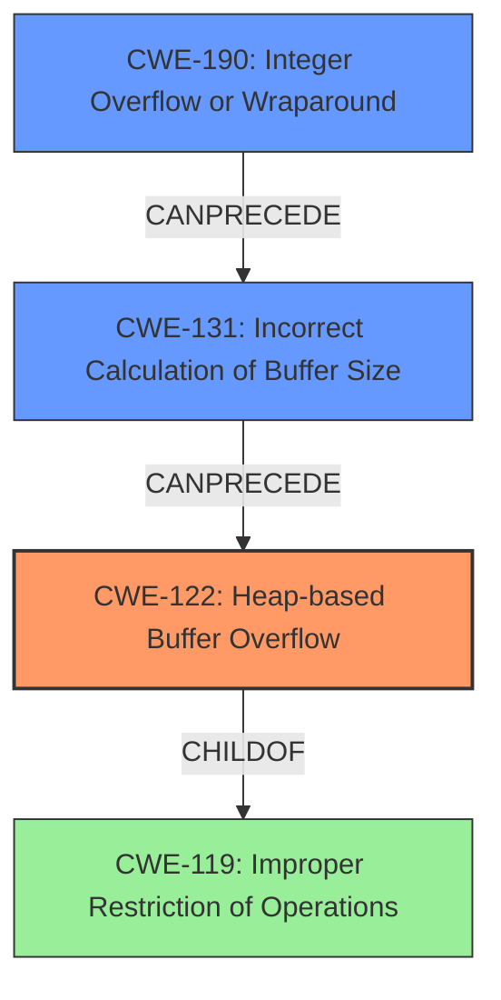

# Final Resolution for CVE-2022-29777

# Summary
| CWE ID | CWE Name | Confidence | CWE Abstraction Level | CWE Vulnerability Mapping Label | CWE-Vulnerability Mapping Notes |
|---|---|---|---|---|---|
| CWE-122 | Heap-based Buffer Overflow | 0.75 | Variant | Allowed | Rationale: This CWE entry is at the Variant level of abstraction, which is a preferred level of abstraction for mapping to the root causes of vulnerabilities. |
| CWE-131 | Incorrect Calculation of Buffer Size | 0.3 | Base | Allowed | Rationale: This CWE entry is at the Base level of abstraction, which is a preferred level of abstraction for mapping to the root causes of vulnerabilities. |
| CWE-190 | Integer Overflow or Wraparound | 0.3 | Base | Allowed | Rationale: This CWE entry is at the Base level of abstraction, which is a preferred level of abstraction for mapping to the root causes of vulnerabilities. |

## Evidence and Confidence

*   **Confidence Score:** 0.7
*   **Evidence Strength:** MEDIUM

## Relationship Analysis
The primary weakness is **CWE-122 (Heap-based Buffer Overflow)**, a variant of **CWE-119 (Improper Restriction of Operations within the Bounds of a Memory Buffer)**. The analysis considers **CWE-190 (Integer Overflow or Wraparound)** and **CWE-131 (Incorrect Calculation of Buffer Size)** as potential contributing factors. These CWEs could precede **CWE-122** in a vulnerability chain. The abstraction levels influenced the selection by prioritizing the most specific CWE (**CWE-122**) while acknowledging the potential for contributing base-level CWEs (**CWE-190** and **CWE-131**).

## Vulnerability Chain
The vulnerability chain starts with a potential **CWE-190 (Integer Overflow or Wraparound)**. This could lead to **CWE-131 (Incorrect Calculation of Buffer Size)**, resulting in a smaller buffer being allocated than required. Finally, this leads to **CWE-122 (Heap-based Buffer Overflow)** when data is written beyond the allocated buffer size on the heap. The chain maps from an initial flaw in calculation to the final impact of a **heap overflow**. The vulnerability description explicitly identifies the **heap overflow**, but the integer overflow and incorrect size calculation are inferred as potential contributing factors.

## Summary of Analysis
The analysis is based on the vulnerability description, which explicitly states a **heap overflow**. The inclusion of **CWE-190 (Integer Overflow or Wraparound)** and **CWE-131 (Incorrect Calculation of Buffer Size)** is based on the possibility of an integer overflow or an incorrect calculation of the buffer size, but is not explicitly described in the original vulnerability. The confidence levels for these are reduced to 0.3 because there is no direct evidence in the vulnerability description and are inferred.

The graph relationships influenced the final selection by identifying the hierarchical relationships between **CWE-122** and **CWE-119**, as well as the potential chain relationships with **CWE-190** and **CWE-131**.

The selected CWEs are at the optimal level of specificity because **CWE-122** directly addresses the **heap overflow** described in the vulnerability, while **CWE-190** and **CWE-131** are included as possible root causes based on common vulnerability patterns. The changes in the confidence reflects the need for further validation.