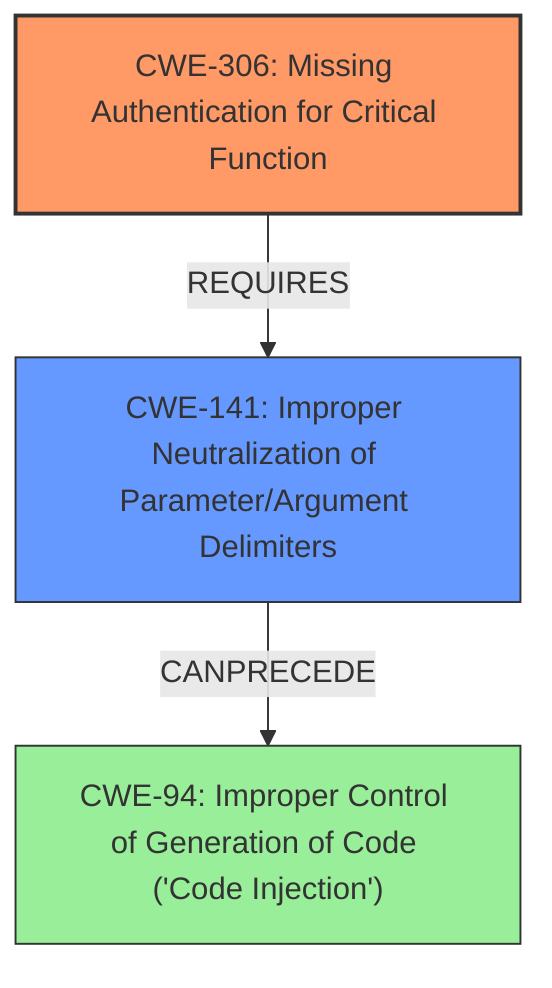

# Final Resolution for CVE-2022-29872

# Summary
| CWE ID  | CWE Name                                                            | Confidence | CWE Abstraction Level | CWE Vulnerability Mapping Label | CWE-Vulnerability Mapping Notes |
|---------|---------------------------------------------------------------------|------------|-----------------------|---------------------------------|-------------------------------|
| CWE-306 | Missing Authentication for Critical Function                        | 0.95       | Base                  | Allowed                         | Primary CWE: The vulnerability stems from a lack of authentication checks on critical functions accessible via POST requests, enabling unauthorized actions. |
| CWE-141 | Improper Neutralization of Parameter/Argument Delimiters | 0.85       | Variant                 | Allowed                     | Secondary Candidate: Improper parameter validation allows an authenticated attacker to insert malicious parameter delimiters, leading to code execution or denial of service. This is due to a lack of proper checks and neutralization on POST parameters. |
| CWE-94  | Improper Control of Generation of Code ('Code Injection')            | 0.60       | Base                  | Allowed-with-Review             | Secondary Candidate: While the vulnerability can lead to arbitrary code execution, code injection is a *potential* consequence, not the root cause. Included due to the *possibility* of code execution. |

## Evidence and Confidence

*   **Confidence Score:** 0.90
*   **Evidence Strength:** HIGH

## Relationship Analysis
The primary CWE is CWE-306 **Missing Authentication for Critical Function**, which is a base-level CWE. The secondary CWE is CWE-141 **Improper Neutralization of Parameter/Argument Delimiters**, which is more specific than CWE-20. CWE-94 **Improper Control of Generation of Code ('Code Injection')** remains as a potential consequence, but it's less directly tied to the **root cause** than the other two. The hierarchical relationships guided the selection towards more specific base/variant level CWEs.

## Vulnerability Chain
The vulnerability chain starts with CWE-306 **Missing Authentication for Critical Function**. This allows an authenticated (but unauthorized) attacker to send POST requests with malicious parameters. The parameters are not properly neutralized (CWE-141 **Improper Neutralization of Parameter/Argument Delimiters**), which can lead to arbitrary code execution (CWE-94 **Improper Control of Generation of Code ('Code Injection')**) or a denial-of-service condition.

## Summary of Analysis
The initial analysis and the criticism both converged on CWE-306 **Missing Authentication for Critical Function** as the primary issue, and this remains the primary CWE. The selection of CWE-141 **Improper Neutralization of Parameter/Argument Delimiters** as a more specific secondary CWE strengthens the analysis by highlighting the type of **improper validation**. The vulnerability description states that "Affected devices do not properly validate parameters of POST requests. This could allow an authenticated attacker to set the device to a denial of service state or to control the program counter and, thus, execute arbitrary code on the device.". Based on this, the lack of authentication and subsequent **improper neutralization** of parameters, which is a more specific problem than the general **improper input validation**, makes the updated analysis more accurate and actionable.

The graph relationships support the selection by showing how CWE-306 **Missing Authentication for Critical Function** enables CWE-141 **Improper Neutralization of Parameter/Argument Delimiters**, which then allows CWE-94 **Improper Control of Generation of Code ('Code Injection')**. The selected CWEs are at an optimal level of specificity, with CWE-306 representing the **root cause** and CWE-141 detailing the **improper validation** issue.