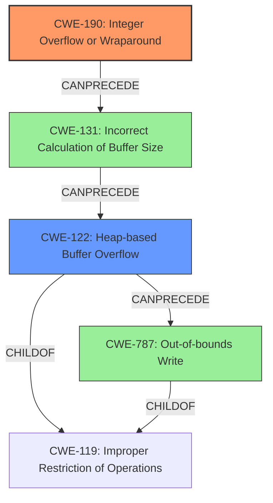

# Analysis Report for CVE-2022-29886

# Vulnerability Analysis Report: CVE-2022-29886

## Description

An integer overflow vulnerability exists in the way ESTsoft Alyac 2.5.8.544 parses OLE files. A specially-crafted OLE file can lead to a heap buffer overflow, which can result in arbitrary code execution. An attacker can provide a malicious file to trigger this vulnerability.

## Vulnerability Description Key Phrases

**Rootcause:** integer overflow
**Weakness:** heap buffer overflow
**Impact:** arbitrary code execution
**Vector:** specially-crafted OLE file
**Product:** ESTsoft Alyac
**Version:** 2.5.8.544

## Analysis (with Relationship Data)

# Summary
| CWE ID | CWE Name | Confidence | CWE Abstraction Level | CWE Vulnerability Mapping Label | CWE-Vulnerability Mapping Notes |
|---|---|---|---|---|---|
| CWE-190 | Integer Overflow or Wraparound | 0.95 | Base | Allowed | Primary CWE |
| CWE-122 | Heap-based Buffer Overflow | 0.85 | Variant | Allowed | Secondary Candidate |

## Evidence and Confidence

*   **Confidence Score:** 0.90
*   **Evidence Strength:** HIGH

- **Analysis and Justification:**  
  - *Explanation:* The vulnerability description explicitly mentions an **integer overflow** that leads to a **heap buffer overflow**. The "CVE Reference Links Content Summary" further elaborates that the **root cause** is an integer overflow during the calculation of the buffer size for Mini FAT sectors in an OLE file. The multiplication of "Number of Mini FAT sectors" and "sector size" using 32-bit integers can overflow, resulting in an undersized buffer allocation. Subsequent data copying into this buffer causes a heap buffer overflow. This aligns directly with CWE-190 (Integer Overflow or Wraparound) as the primary weakness. The resulting **heap buffer overflow** is then classified as CWE-122, which is a variant of buffer overflow that occurs in the heap. The retriever results also support CWE-190 as the top candidate.
  
  - *Relationship Analysis:* CWE-190 is a Base level CWE. While it doesn't have direct parent-child relationships in the provided data, it's a common cause for buffer overflows. CWE-122 (Heap-based Buffer Overflow) is a child of CWE-119 (Improper Restriction of Operations within the Bounds of a Memory Buffer), indicating a hierarchical relationship where the integer overflow leads to the buffer overflow.

- **Confidence Score:**  
  - *Example:* Confidence: 0.95 (High confidence due to explicit mention of integer overflow and heap buffer overflow in the vulnerability description and CVE summary, along with strong support from retriever results and MITRE guidance.)

---

- **Analysis and Justification:**  
  - *Explanation:* Given that the integer overflow leads directly to a heap buffer overflow, CWE-122 (Heap-based Buffer Overflow) is a relevant secondary weakness. The description specifically states that a "specially-crafted OLE file can lead to a **heap buffer overflow**". This aligns with the definition of CWE-122, which is a buffer overflow where the buffer is allocated in the heap.
  
  - *Relationship Analysis:* CWE-122 is a Variant of CWE-119 (Improper Restriction of Operations within the Bounds of a Memory Buffer). This means that the heap buffer overflow is a specific type of buffer overflow.

- **Confidence Score:**  
  - *Example:* Confidence: 0.85 (High confidence because the vulnerability description explicitly mentions a heap buffer overflow, and it's a direct consequence of the integer overflow.)

## Criticism of Analysis

Okay, I've reviewed the analysis and the provided CWE specifications. Here's my critique:

**Overall Assessment:**

The analysis is generally good and the primary CWE mapping to CWE-190 is accurate and well-supported.  The inclusion of CWE-122 as a secondary candidate is also justified. The confidence scores are appropriate given the information provided.  The reasoning for the mappings is clear and based on evidence from the vulnerability description and CVE summary.

**Specific Comments and Suggestions:**

*   **CWE-190: Integer Overflow or Wraparound:**
    *   The choice of CWE-190 as the primary weakness is correct. The description explicitly states that an integer overflow leads to a heap buffer overflow. The analysis accurately identifies that the root cause is the integer overflow occurring during the buffer size calculation.
    *   The explanation of how the overflow occurs (multiplication exceeding the 32-bit integer limit) is also accurate.
    *   The confidence score of 0.95 is appropriate given the direct mention of "integer overflow" in the vulnerability description.
    *   The relationship to CWE-119 is correctly identified, and the note "*Integer overflows can be primary to buffer overflows when they cause less memory to be allocated than expected.*" from CWE-190 specifications, helps bolster this assessment.

*   **CWE-122: Heap-based Buffer Overflow:**
    *   The inclusion of CWE-122 as a secondary candidate is also well-justified. Since the integer overflow directly results in a heap buffer overflow, it is important to capture this aspect of the vulnerability.
    *   The confidence score of 0.85 is appropriate because the heap buffer overflow is a *consequence* of the integer overflow, not the root cause.
    *   The relationship to CWE-119 as a "ChildOf" is correctly noted.

*   **Retriever Results:**
    * It's important to note the other CWEs identified by the retriever results. While CWE-190 and CWE-122 are the best fits, some of the others (especially CWE-131 Incorrect Calculation of Buffer Size and CWE-787 Out-of-bounds Write) highlight other nuances. CWE-131 is very close in concept, and it could be argued it's a more precise description of *how* the integer overflow manifests.

*   **Potential Improvements & Considerations:**

    *   **CWE-131: Incorrect Calculation of Buffer Size:** While CWE-190 is the root cause, consider mentioning CWE-131 in the discussion even if it's not assigned as a primary or secondary CWE. The integer overflow directly leads to an *incorrect calculation of the buffer size*. The description of CWE-131 is highly relevant: "*The product does not correctly calculate the size to be used when allocating a buffer, which could lead to a buffer overflow.*" This adds more context to the integer overflow. A sentence mentioning this and its relevance to the chain would enhance the analysis.
    *   **CWE-787: Out-of-bounds Write:** While CWE-122 is the *type* of buffer overflow, CWE-787 (Out-of-bounds Write) describes the *action* that causes the vulnerability. It might be worthwhile to briefly mention CWE-787 as well, to provide a more complete picture of what's happening. "*The product writes data past the end, or before the beginning, of the intended buffer.*" The heap buffer overflow is ultimately an out-of-bounds write.
    *   **Chaining Consideration:** The relationship between these CWEs could be more formally expressed as a chain. The chain would be:  `CWE-190 -> CWE-131 -> CWE-122 (or CWE-787)`.
    *   **Mitigation Strategies:** Briefly relate the mitigations suggested by CWE-190 and CWE-122 to the specific vulnerability. For example, for CWE-190, using a language with automatic bounds checking or a safe integer library (like SafeInt) would directly address the root cause. For CWE-122, memory safety mechanisms or compiler flags could help detect the buffer overflow.
    *   **CWE-681: Incorrect Conversion between Numeric Types:** Given the CVE-2021-43537 example chains provided in the CWE specifications, one *could* explore if an "incorrect conversion between numeric types" (CWE-681) precedes the integer overflow (CWE-190). However, without more detail about the specific code in Alyac, this would be speculative and is *not* necessary for this analysis.

**Revised Summary Table (Optional):**

| CWE ID   | CWE Name                           | Confidence | CWE Abstraction Level | CWE Vulnerability Mapping Label | CWE-Vulnerability Mapping Notes                                                                                                                            |
| -------- | ---------------------------------- | ---------- | --------------------- | -------------------------------- | ---------------------------------------------------------------------------------------------------------------------------------------------------------- |
| CWE-190   | Integer Overflow or Wraparound    | 0.95       | Base                  | Allowed                         | Primary CWE, root cause of the vulnerability.                                                                                                                |
| CWE-122   | Heap-based Buffer Overflow         | 0.85       | Variant               | Allowed                         | Secondary CWE, direct consequence of the integer overflow. The buffer is heap allocated.                                                                |
| CWE-131   | Incorrect Calculation of Buffer Size | 0.70       | Base                  | Allowed                         | (Optional) Contributes to the chain of events; the integer overflow results in the incorrect calculation of the buffer size.                               |
| CWE-787   | Out-of-bounds Write           | 0.60       | Base               | Allowed                         | (Optional) Contributes to the chain of events; the heap buffer overflow manifests as an out-of-bounds write.                                                                |

**In summary:** The analysis is well-done. Adding a few sentences discussing CWE-131 and the chaining relationship would make it even more comprehensive, but is not strictly necessary. The provided CWE mappings are correct.

## Final Resolution

# Summary
| CWE ID | CWE Name | Confidence | CWE Abstraction Level | CWE Vulnerability Mapping Label | CWE-Vulnerability Mapping Notes |
|---|---|---|---|---|---|
| CWE-190 | Integer Overflow or Wraparound | 0.95 | Base | Allowed | Primary CWE |
| CWE-122 | Heap-based Buffer Overflow | 0.85 | Variant | Allowed | Secondary Candidate |

## Evidence and Confidence

*   **Confidence Score:** 0.93
*   **Evidence Strength:** HIGH

## Relationship Analysis
The primary weakness is **CWE-190 (Integer Overflow or Wraparound)**, a Base level CWE. It does not have explicit parent-child relationships in the provided data but serves as a common cause for buffer overflows. The integer overflow leads to an incorrect buffer size calculation, which is a prerequisite for **CWE-122 (Heap-based Buffer Overflow)**. **CWE-122** is a Variant of **CWE-119 (Improper Restriction of Operations within the Bounds of a Memory Buffer)**, indicating a hierarchical relationship. The chain relationship shows that the **integer overflow** leads to the **heap buffer overflow**.

## Vulnerability Chain
The vulnerability chain begins with **CWE-190 (Integer Overflow or Wraparound)** during the calculation of the buffer size. This leads to **CWE-131 (Incorrect Calculation of Buffer Size)**. The undersized buffer is then allocated on the heap, and subsequent copying of data into this buffer results in **CWE-122 (Heap-based Buffer Overflow)**. The out-of-bounds write during the heap buffer overflow can also be viewed as **CWE-787 (Out-of-bounds Write)**. The root cause is the integer overflow, and the impact is the heap buffer overflow leading to potential arbitrary code execution.

## Summary of Analysis
The initial analysis and criticism were both accurate and well-justified. The vulnerability description explicitly mentions an integer overflow leading to a heap buffer overflow. The "CVE Reference Links Content Summary" further clarifies that the **root cause** is an integer overflow during the calculation of the buffer size for Mini FAT sectors in an OLE file. The multiplication of "Number of Mini FAT sectors" and "sector size" using 32-bit integers can overflow, resulting in an undersized buffer allocation. Subsequent data copying into this buffer causes a heap buffer overflow.

The selection of **CWE-190 (Integer Overflow or Wraparound)** as the primary weakness is correct because the vulnerability description explicitly mentions the integer overflow. The description of **CWE-190** aligns with the observed behavior: "The product performs a calculation that can produce an integer overflow or wraparound...". The inclusion of **CWE-122 (Heap-based Buffer Overflow)** is also justified, as the integer overflow directly leads to a heap buffer overflow.

The analysis considered the relationships between CWEs. **CWE-122** is a variant of **CWE-119 (Improper Restriction of Operations within the Bounds of a Memory Buffer)**, indicating that the heap buffer overflow is a specific type of buffer overflow. **CWE-131 (Incorrect Calculation of Buffer Size)** describes *how* the integer overflow manifests. Finally, **CWE-787 (Out-of-bounds Write)** describes the *action* that causes the vulnerability.

The selected CWEs are at the optimal level of specificity. **CWE-190** captures the **root cause**, while **CWE-122** captures the **specific type of buffer overflow**.

Based on the evidence and the relationship analysis, the final determination is to classify the vulnerability as **CWE-190 (Integer Overflow or Wraparound)** as the primary weakness and **CWE-122 (Heap-based Buffer Overflow)** as a secondary weakness.

*Report generated on 2025-03-18 13:05:33*
