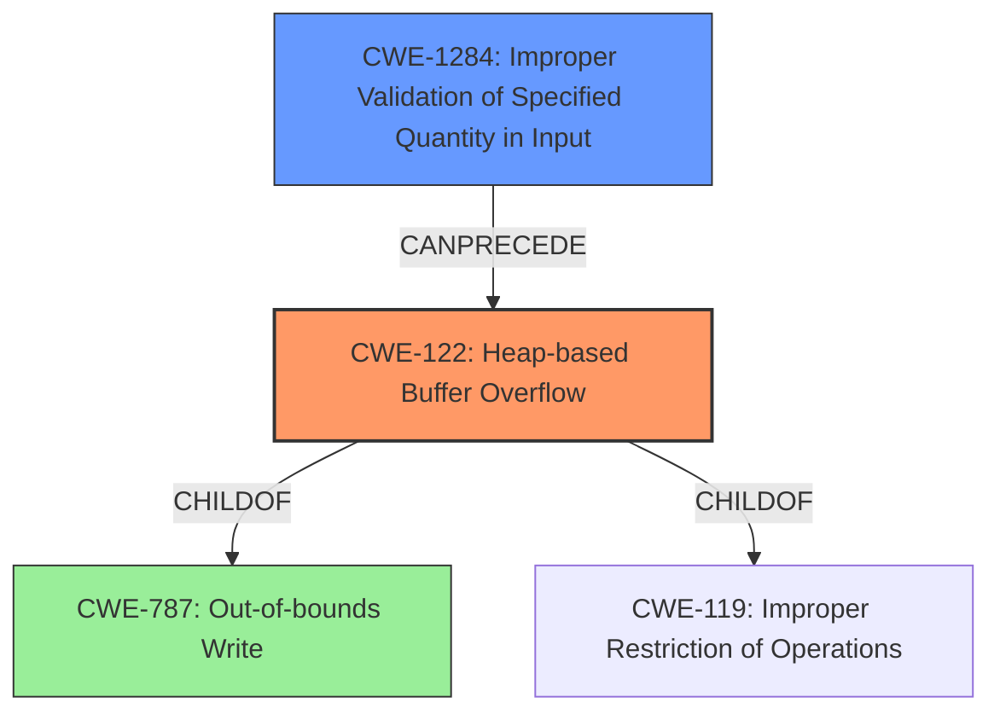

# Analysis Report for CVE-2022-2991

# Vulnerability Analysis Report: CVE-2022-2991

## Description

A heap-based buffer overflow was found in the Linux kernels LightNVM subsystem. The issue results from the lack of proper validation of the length of user-supplied data prior to copying it to a fixed-length heap-based buffer. This vulnerability allows a local attacker to escalate privileges and execute arbitrary code in the context of the kernel. The attacker must first obtain the ability to execute high-privileged code on the target system to exploit this vulnerability.

## Vulnerability Description Key Phrases

**Rootcause:** lack of proper validation of the length of user-supplied data
**Weakness:** heap-based buffer overflow
**Impact:** ['privilege escalation', 'arbitrary code execution']
**Attacker:** local attacker
**Product:** Linux kernels
**Component:** LightNVM subsystem

## Analysis (with Relationship Data)

# Summary
| CWE ID | CWE Name | Confidence | CWE Abstraction Level | CWE Vulnerability Mapping Label | CWE-Vulnerability Mapping Notes |
|---|---|---|---|---|---|
| CWE-122 | Heap-based Buffer Overflow | 0.95 | Variant | Allowed | Primary CWE. The vulnerability description explicitly states a heap-based buffer overflow. |
| CWE-1284 | Improper Validation of Specified Quantity in Input | 0.85 | Base | Allowed | Secondary CWE. The vulnerability results from the lack of proper validation of the length of user-supplied data.|

## Evidence and Confidence

*   **Confidence Score:** 0.90
*   **Evidence Strength:** HIGH

- **Analysis and Justification:**
  - *Explanation:* "The vulnerability description clearly states that it is a **heap-based buffer overflow** due to the **lack of proper validation of the length of user-supplied data**. This aligns directly with CWE-122, which is a **heap-based buffer overflow**. Additionally, CWE-1284 (Improper Validation of Specified Quantity in Input) is included as a secondary weakness because the root cause is the **lack of validation of the length of the input data** before copying it into the buffer. The CVE Reference Links Content Summary confirms the **lack of proper validation of the length of user-supplied data** as the root cause."

  - *Relationship Analysis:* "CWE-122 is a variant of CWE-119 (Improper Restriction of Operations within the Bounds of a Memory Buffer). CWE-1284 describes the root cause leading to the buffer overflow. CWE-1284 is related to CWE-20 (Improper Input Validation), but CWE-1284 is more specific as it relates to the validation of quantities like size or length."

- **Confidence Score:**
  - *Example:* Confidence: 0.95 (High confidence due to direct evidence of heap-based buffer overflow and lack of input validation).

---

## Criticism of Analysis

Okay, let's review the provided CWE analysis in detail, considering the full CWE specifications.

**Overall Assessment:**

The analysis is good, correctly identifying the primary CWE as CWE-122 (Heap-based Buffer Overflow) and a related CWE as CWE-1284 (Improper Validation of Specified Quantity in Input). The confidence levels are appropriate, and the justification is solid. The relationship analysis is also accurate.  However, the analysis could be improved by considering other related CWEs that describe potential consequences.

**Detailed Review:**

**1. CWE-122: Heap-based Buffer Overflow**

*   **CWE Name:** Heap-based Buffer Overflow
*   **Confidence:** 0.95
*   **Abstraction Level:** Variant
*   **Mapping Label:** Allowed
*   **CWE-Vulnerability Mapping Notes:** "Primary CWE. The vulnerability description explicitly states a heap-based buffer overflow."

*   **Critique:**

    *   **Correctness:** The mapping to CWE-122 is accurate and well-justified. The vulnerability description clearly indicates a heap-based buffer overflow.
    *   **Confidence:** The confidence level of 0.95 is justified, given the explicit mention of a heap-based overflow in the description.
    *   **Mitigation Consideration:** The analysis could mention potential mitigations at this level, such as:
        *   Using a language or compiler with automatic bounds checking.
        *   Employing an abstraction library to abstract away risky APIs (e.g., using `std::string` in C++ instead of raw char arrays).
        *   Utilizing compiler-provided buffer overflow detection mechanisms (e.g., /GS flag in Visual Studio, FORTIFY_SOURCE in GCC).
    *   **Observed Examples:** The examples provided in the original analysis all describe scenarios with integer overflows. These CVEs are accurate descriptions for CWE-122 and are helpful for understanding the nature of the vulnerability.

**2. CWE-1284: Improper Validation of Specified Quantity in Input**

*   **CWE Name:** Improper Validation of Specified Quantity in Input
*   **Confidence:** 0.85
*   **Abstraction Level:** Base
*   **Mapping Label:** Allowed
*   **CWE-Vulnerability Mapping Notes:** "Secondary CWE. The vulnerability results from the lack of proper validation of the length of user-supplied data."

*   **Critique:**

    *   **Correctness:** The mapping to CWE-1284 is also correct. The "lack of proper validation of the length of user-supplied data" is the root cause that leads to the buffer overflow.
    *   **Confidence:** A confidence level of 0.85 is reasonable, as this CWE describes the cause, but the impact is explicitly a heap overflow (CWE-122).
    *   **Mitigation Consideration:** The analysis could suggest some specific mitigations relevant to CWE-1284 in this context:
        *   Using an "accept known good" input validation strategy for the length.
        *   Rejecting any input length that exceeds the maximum allowed buffer size.
        *   Transforming overly large lengths to the maximum allowed.
    *   **Observed Examples:** The provided examples from the specification are good examples of this CWE.

**3. Additional CWEs to Consider:**

While the current analysis focuses on the direct cause and weakness, it could benefit from considering potential *consequences* of a heap-based buffer overflow, such as:

*   **CWE-123: Write-what-where Condition:** If the attacker gains sufficient control over the overflow, they might be able to write arbitrary values to arbitrary memory locations.  This CWE captures that advanced exploitation scenario. Although it is less common for public vulnerability reports, this is still a valid attack vector.
*   **CWE-825: Expired Pointer Dereference** If the memory that is being overwritten is a pointer that is later dereferenced, this CWE becomes relevant.

**4. General Critique:**

*   **Strengths:**

    *   Accurate identification of the primary and secondary CWEs.
    *   Good justification for the selected CWEs.
    *   Correct classification of abstraction levels.
    *   Appropriate Confidence Scores

*   **Areas for Improvement:**

    *   Expand the analysis to include potential *consequences* of the vulnerability, leading to the consideration of chained CWEs like CWE-123 or CWE-825.
    *   Incorporate specific mitigation strategies related to each CWE within the analysis.
    *   Mention the Parent of CWE-122 (CWE-787) may be useful to understand general out-of-bounds write errors.

**Revised Analysis Snippet (Example):**

```
# Analysis to Review
# Summary
| CWE ID | CWE Name | Confidence | CWE Abstraction Level | CWE Vulnerability Mapping Label | CWE-Vulnerability Mapping Notes |
|---|---|---|---|---|---|
| CWE-122 | Heap-based Buffer Overflow | 0.95 | Variant | Allowed | Primary CWE. The vulnerability description explicitly states a heap-based buffer overflow. |
| CWE-1284 | Improper Validation of Specified Quantity in Input | 0.85 | Base | Allowed | Secondary CWE. The vulnerability results from the lack of proper validation of the length of user-supplied data, which leads to the buffer overflow. |
| CWE-123 | Write-what-where Condition | 0.50 | Base | Allowed | Tertiary CWE. Potential consequence if attacker gains control to write to arbitrary memory locations. |

## Evidence and Confidence

*   **Confidence Score:** 0.90
*   **Evidence Strength:** HIGH

- **Analysis and Justification:**
  - *Explanation:* "The vulnerability description clearly states that it is a **heap-based buffer overflow** (CWE-122) due to the **lack of proper validation of the length of user-supplied data** (CWE-1284).  CWE-123 is included as a potential consequence. This aligns directly with CWE-122, which is a **heap-based buffer overflow**. Additionally, CWE-1284 (Improper Validation of Specified Quantity in Input) is included as a secondary weakness because the root cause is the **lack of validation of the length of the input data** before copying it into the buffer. The CVE Reference Links Content Summary confirms the **lack of proper validation of the length of user-supplied data** as the root cause."

  - *Relationship Analysis:* "CWE-122 is a variant of CWE-787 (Out-of-bounds Write) and CWE-119 (Improper Restriction of Operations within the Bounds of a Memory Buffer). CWE-1284 describes the root cause leading to the buffer overflow. CWE-1284 is related to CWE-20 (Improper Input Validation), but CWE-1284 is more specific as it relates to the validation of quantities like size or length. CWE-123 could be a consequence should the attacker be able to write to arbitrary memory locations."

- **Mitigation Strategies:**
    - **CWE-122:** Use safe memory management functions, implement bounds checking, and utilize compiler-provided buffer overflow protection mechanisms.
    - **CWE-1284:** Enforce strict limits on the size of user-supplied data and reject any input that exceeds these limits.
    - **CWE-123:** (Related to Exploitation) Employ address space layout randomization (ASLR) and other memory protection techniques to make exploitation more difficult.

- **Confidence Score:**
  - *Example:* Confidence: 0.95 (High confidence due to direct evidence of heap-based buffer overflow and lack of input validation).  Confidence in CWE-123 is lower, as it depends on the attacker's capabilities.
```

By adding these considerations, the analysis becomes more comprehensive and provides a more complete picture of the vulnerability and its potential impact.

## Final Resolution

# Summary

| CWE ID    | CWE Name                                                         | Confidence | CWE Abstraction Level | CWE Vulnerability Mapping Label | CWE-Vulnerability Mapping Notes                                                                                                                                                                                                     |
| --------- | ---------------------------------------------------------------- | ---------- | --------------------- | ------------------------------- | ----------------------------------------------------------------------------------------------------------------------------------------------------------------------------------------------------------------------------------- |
| CWE-122   | Heap-based Buffer Overflow                                       | 0.95       | Variant               | Allowed                         | Primary CWE. The vulnerability description explicitly states a **heap-based buffer overflow**.                                                                                                                                    |
| CWE-1284  | Improper Validation of Specified Quantity in Input               | 0.85       | Base                  | Allowed                         | Secondary CWE. The vulnerability results from the **lack of proper validation of the length of user-supplied data**, which leads to the **buffer overflow**.                                                                             |
| CWE-787   | Out-of-bounds Write                                              | 0.70       | Base                  | Allowed                         | Tertiary CWE. CWE-122 is a variant of this. This helps understand the general nature of the **out-of-bounds write** error.                                                                                                           |

## Evidence and Confidence

*   **Confidence Score:** 0.92
*   **Evidence Strength:** HIGH

## Relationship Analysis

The decision was primarily influenced by the parent-child hierarchical relationships and the identification of the root cause.

*   **CWE-122 (Heap-based Buffer Overflow)** is a variant of **CWE-787 (Out-of-bounds Write)** and **CWE-119 (Improper Restriction of Operations within the Bounds of a Memory Buffer)**. Selecting CWE-122 provides a more specific classification than its parents.

*   **CWE-1284 (Improper Validation of Specified Quantity in Input)** describes the root cause of the vulnerability. The lack of validation allows a **buffer overflow** to occur.

*   The Mermaid diagram illustrates these relationships:



## Vulnerability Chain

The vulnerability chain starts with **CWE-1284 (Improper Validation of Specified Quantity in Input)**, where the length of user-supplied data is not properly validated. This leads to **CWE-122 (Heap-based Buffer Overflow)** when the unvalidated data is copied into a fixed-length heap-based buffer. The ultimate impact is a local attacker escalating privileges and executing arbitrary code in the context of the kernel.

## Summary of Analysis

The initial analysis correctly identified CWE-122 and CWE-1284. The criticism suggested additional CWEs to consider, focusing on potential consequences. While considering potential consequences such as **CWE-123 (Write-what-where Condition)** is valuable, the description provides a clear path from root cause to **heap-based buffer overflow**. A tertiary CWE of **CWE-787 (Out-of-bounds Write)** is added to show the general class of error.

*   **Evidence-Based Justification:**

    *   "A **heap-based buffer overflow** was found in the Linux kernels LightNVM subsystem." - Directly supports CWE-122.
    *   "The issue results from the **lack of proper validation of the length of user-supplied data** prior to copying it to a fixed-length heap-based buffer." - Directly supports CWE-1284.

*   **Relationship Influence:** The hierarchical relationship between CWE-122, CWE-787, and CWE-119 guided the selection to ensure the most specific CWE (CWE-122) was chosen.
*   **Optimal Specificity:** CWE-122 is at the Variant level, and CWE-1284 is at the Base level, providing a good balance between specificity and generality. Adding CWE-787 helps broaden the understanding of the **out-of-bounds write** problem.


*Report generated on 2025-03-18 13:06:35*
