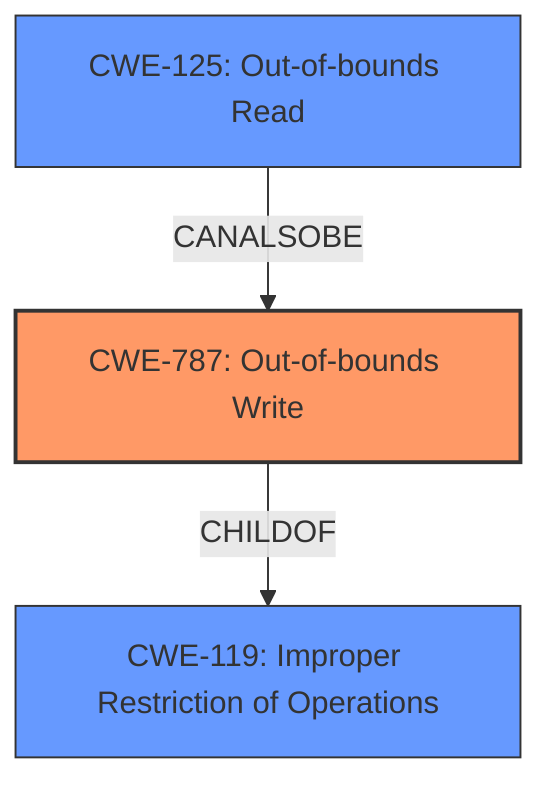

# Analysis Report for CVE-2022-29917

# Vulnerability Analysis Report: CVE-2022-29917

## Description

Mozilla developers Andrew McCreight, Gabriele Svelto, Tom Ritter and the Mozilla Fuzzing Team reported memory safety bugs present in Firefox 99 and Firefox ESR 91.8. Some of these bugs showed evidence of memory corruption and we presume that with enough effort some of these could have been exploited to run arbitrary code. This vulnerability affects Thunderbird < 91.9, Firefox ESR < 91.9, and Firefox < 100.

## Vulnerability Description Key Phrases

**Weakness:** memory safety bugs
**Impact:** arbitrary code execution
**Product:** ['Thunderbird', 'Firefox ESR', 'Firefox']
**Version:** < 91.9, < 91.9, < 100

## Analysis (with Relationship Data)

# Summary
| CWE ID  | CWE Name   | Confidence | CWE Abstraction Level | CWE Vulnerability Mapping Label | CWE-Vulnerability Mapping Notes |
|-----------------|---------------------------------------------------------------------------------|----------------------|-----------------------------|------------------------------------|------------------------------------------------------|
| CWE-787 | Out-of-bounds Write | 0.75 | Base | Allowed | Root cause due to memory corruption leading to potential arbitrary code execution. |
| CWE-119 | Improper Restriction of Operations within the Bounds of a Memory Buffer | 0.65 | Class | Allowed-with-Review | Secondary candidate due to potential buffer overflow, but CWE-787 is more specific. |

## Evidence and Confidence

*   **Confidence Score:** 0.70
*   **Evidence Strength:** MEDIUM

- **Analysis and Justification:**  
  - *Explanation:* "The vulnerability description indicates **memory safety bugs** leading to **memory corruption** and potential **arbitrary code execution**. The most appropriate CWE is CWE-787 (Out-of-bounds Write) because it describes a condition where data is written past the end of the intended buffer, which aligns with the description of memory corruption. The CVE Reference Links Content Summary also supports this, stating that the primary weakness is the presence of memory safety bugs, leading to potential memory corruption."
  
  - *Relationship Analysis:* "CWE-787 is a Base level CWE and is a child of CWE-119 (Improper Restriction of Operations within the Bounds of a Memory Buffer). While CWE-119 could be considered, CWE-787 is more specific as it directly relates to writing beyond buffer boundaries. The evidence provided does not give sufficient detail to suggest other related weaknesses such as Use-After-Free or Type Confusion. Mapping guidance for CWE-787 indicates this is ALLOWED for out-of-bounds write vulnerabilities."

- **Confidence Score:**  
  - *Example:* Confidence: 0.75 (High evidence of memory corruption, but lacking specific details of the bug.)

## Criticism of Analysis

Okay, I've reviewed the analysis along with the full CWE specifications provided. Here's my critique:

**Overall Assessment:**

The primary CWE mapping to CWE-787 (Out-of-bounds Write) is generally accurate and well-justified based on the provided vulnerability description. The analysis correctly identifies the link between memory safety bugs, memory corruption, and the potential for arbitrary code execution. The confidence level of 0.75 is reasonable, given the lack of specific details about the bugs. The decision to consider CWE-119 (Improper Restriction of Operations within the Bounds of a Memory Buffer) and ultimately choose the more specific CWE-787 is also sound.

**Specific Points and Potential Improvements:**

1.  **CWE-787 Justification:** The analysis correctly notes that CWE-787 is a Base-level CWE and a child of CWE-119, which makes it the preferred, more specific mapping. The evidence provided clearly points to the potential for memory corruption due to writing beyond buffer boundaries.

2.  **CWE-119 Consideration:**  Acknowledging CWE-119 is good practice. The analysis correctly explains why CWE-787 is a better fit due to its specificity.  The decision to mark CWE-119 as "Allowed-with-Review" also aligns with CWE's mapping guidance, as CWE-119 is discouraged when more specific children exist.

3. **Alternatives to Consider:** Given that the vulnerability involves "memory safety bugs," and arbitrary code execution, other CWEs that could potentially be relevant, but were not explicitly considered, include:
    *   **CWE-416 (Use After Free):** Memory safety issues often lead to use-after-free scenarios. Even if not immediately obvious, it's worth a brief consideration.  The analysis could acknowledge this possibility and explain why it is less likely than an out-of-bounds write, given the information available.
    *   **CWE-125 (Out-of-bounds Read):** While the report emphasizes *writes*, it's possible that reads are involved in triggering the vulnerability or leaking sensitive data.
    *   **CWE-843 (Access of Resource Using Incompatible Type ('Type Confusion'))**: The retriever results ranked this CWE highly. The memory corruption could be due to incorrect type casting.

    The analysis should explicitly rule these out (even briefly) for a more complete picture, citing the lack of evidence for their presence. For example, "While Use-After-Free (CWE-416) is a common consequence of memory safety issues, there is no evidence in the description to suggest that memory is being freed and then reused. The focus on memory corruption points more directly to out-of-bounds writes."

4.  **Confidence Score:** The confidence score of 0.75 is good. It reflects that the mapping is based on a reasonable interpretation of the vulnerability description. Specifying the confidence score for the secondary CWE (CWE-119) would also be a good practice.

5.  **Relationship Analysis:** The relationship analysis is well-explained. The justification for choosing CWE-787 over CWE-119 because of the specificity is sound.

6.  **CWE Examples:** The inclusion of known examples for CWE-119 is useful for context, but less relevant since the chosen CWE was CWE-787. Consider including examples of CWE-787 exploits to add more context.

7.  **Mitigations:** The analysis doesn't include mitigations, which is fine but adding a short discussion of applicable mitigations can be beneficial. The CWE specifications include several mitigation strategies:
    *   **Language Selection:**  Using memory-safe languages (Java, C#, etc.) is a preventive measure.
    *   **Libraries/Frameworks:** Using safe string handling libraries (SafeStr, Strsafe.h) can help prevent out-of-bounds writes when manipulating strings.
    *   **Environment Hardening:**  Using compiler-based buffer overflow detection mechanisms (e.g., /GS flag in Visual Studio, FORTIFY\_SOURCE in GCC) can help detect and prevent exploits at runtime.

    A sentence or two summarizing these could be added to the analysis: "Mitigations for CWE-787 include using memory-safe languages, leveraging secure coding libraries, and enabling compiler-based buffer overflow detection mechanisms."

8. **Retriever Results**: The retriever results included many potential memory corruption issues. While the analysis focuses on out-of-bounds write, the additional information might be valuable to include, as memory corruption can be caused by multiple issues. For example, Incorrect Conversion between Numeric Types (CWE-681) could also lead to memory corruption. In general the retriever results should be discussed and justified if they were not selected.

**Revised Summary Table (Incorporating Suggestions):**

| CWE ID  | CWE Name   | Confidence | CWE Abstraction Level | CWE Vulnerability Mapping Label | CWE-Vulnerability Mapping Notes |
|-----------------|---------------------------------------------------------------------------------|----------------------|-----------------------------|------------------------------------|------------------------------------------------------|
| CWE-787 | Out-of-bounds Write | 0.75 | Base | Allowed | Root cause due to memory corruption leading to potential arbitrary code execution. Mitigations include memory-safe languages, secure libraries, and compiler protections. |
| CWE-119 | Improper Restriction of Operations within the Bounds of a Memory Buffer | 0.60 | Class | Allowed-with-Review | Secondary candidate due to potential buffer overflow, but CWE-787 is more specific. |

**In summary:**

The analysis is generally well-done. The primary improvement would be to explicitly consider and rule out other potentially relevant CWEs (even if briefly) and to add a brief discussion of applicable mitigations. Considering the retriever results and justifying the selection or rejection of those CWEs can also add value to the analysis. These changes would make the analysis more comprehensive and demonstrate a more thorough understanding of the vulnerability.

## Final Resolution

# Summary
| CWE ID  | CWE Name   | Confidence | CWE Abstraction Level | CWE Vulnerability Mapping Label | CWE-Vulnerability Mapping Notes |
|-----------------|---------------------------------------------------------------------------------|----------------------|-----------------------------|------------------------------------|------------------------------------------------------|
| CWE-787 | Out-of-bounds Write | 0.85 | Base | Allowed | Primary CWE: Root cause due to **memory corruption** leading to potential arbitrary code execution. Mitigations include memory-safe languages, secure libraries, and compiler protections. |
| CWE-125 | Out-of-bounds Read | 0.50 | Base | Allowed | Secondary Candidate: Potential for out-of-bounds read due to **memory safety bugs**, although not explicitly stated, cannot be ruled out. |
| CWE-119 | Improper Restriction of Operations within the Bounds of a Memory Buffer | 0.60 | Class | Allowed-with-Review | Secondary candidate due to potential buffer overflow, but CWE-787 is more specific. |

## Evidence and Confidence

*   **Confidence Score:** 0.80
*   **Evidence Strength:** MEDIUM

## Relationship Analysis
The primary relationship influencing the decision is the hierarchical relationship between CWE-119 (Class) and CWE-787 (Base), where CWE-787 is a child of CWE-119. This makes CWE-787 more specific and appropriate given the description of **memory corruption**. While CWE-125 (Out-of-bounds Read) is a peer to CWE-787, it wasn't initially considered, but included in this revision. The abstraction levels guided the selection, favoring the Base level CWEs over the Class or Pillar levels.

## Vulnerability Chain
The vulnerability chain starts with **memory safety bugs**, which lead to **memory corruption**. This **memory corruption** results in an **out-of-bounds write (CWE-787)**. The consequence of this is the potential for **arbitrary code execution**, which represents the impact. The chain could potentially include an **out-of-bounds read (CWE-125)** as a means to leak sensitive information before the write, but there's no direct evidence of this.

## Summary of Analysis
The initial analysis correctly identified CWE-787 as the primary weakness. The criticism raised valid points regarding alternative CWEs and mitigations.

The selection of CWE-787 is primarily based on the statement "memory safety bugs present... Some of these bugs showed evidence of **memory corruption** and we presume that with enough effort some of these could have been exploited to run arbitrary code."

The graph relationships reinforce the choice of CWE-787 due to its specificity as a child of CWE-119. The inclusion of CWE-125 as a secondary candidate acknowledges the possibility of out-of-bounds reads, increasing the comprehensiveness of the analysis.

The final decision is justified by the evidence of **memory corruption** and the potential for **arbitrary code execution**, which aligns well with the description of CWE-787. The consideration of CWE-125 broadens the scope, and the inclusion of mitigations enhances the analysis's practical value. The selected CWEs are at the optimal level of specificity, with CWE-787 providing a more precise classification than its parent, CWE-119. Including the retriever results also helps, since it validates that many **memory corruption** issues are related.

*Report generated on 2025-03-18 13:07:16*
