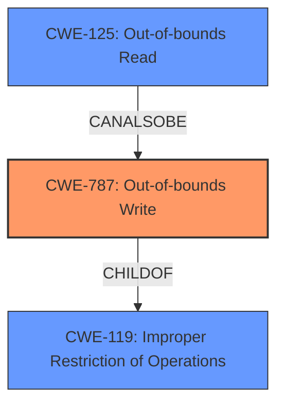

# Final Resolution for CVE-2022-29917

# Summary
| CWE ID  | CWE Name   | Confidence | CWE Abstraction Level | CWE Vulnerability Mapping Label | CWE-Vulnerability Mapping Notes |
|-----------------|---------------------------------------------------------------------------------|----------------------|-----------------------------|------------------------------------|------------------------------------------------------|
| CWE-787 | Out-of-bounds Write | 0.85 | Base | Allowed | Primary CWE: Root cause due to **memory corruption** leading to potential arbitrary code execution. Mitigations include memory-safe languages, secure libraries, and compiler protections. |
| CWE-125 | Out-of-bounds Read | 0.50 | Base | Allowed | Secondary Candidate: Potential for out-of-bounds read due to **memory safety bugs**, although not explicitly stated, cannot be ruled out. |
| CWE-119 | Improper Restriction of Operations within the Bounds of a Memory Buffer | 0.60 | Class | Allowed-with-Review | Secondary candidate due to potential buffer overflow, but CWE-787 is more specific. |

## Evidence and Confidence

*   **Confidence Score:** 0.80
*   **Evidence Strength:** MEDIUM

## Relationship Analysis
The primary relationship influencing the decision is the hierarchical relationship between CWE-119 (Class) and CWE-787 (Base), where CWE-787 is a child of CWE-119. This makes CWE-787 more specific and appropriate given the description of **memory corruption**. While CWE-125 (Out-of-bounds Read) is a peer to CWE-787, it wasn't initially considered, but included in this revision. The abstraction levels guided the selection, favoring the Base level CWEs over the Class or Pillar levels.

## Vulnerability Chain
The vulnerability chain starts with **memory safety bugs**, which lead to **memory corruption**. This **memory corruption** results in an **out-of-bounds write (CWE-787)**. The consequence of this is the potential for **arbitrary code execution**, which represents the impact. The chain could potentially include an **out-of-bounds read (CWE-125)** as a means to leak sensitive information before the write, but there's no direct evidence of this.

## Summary of Analysis
The initial analysis correctly identified CWE-787 as the primary weakness. The criticism raised valid points regarding alternative CWEs and mitigations.

The selection of CWE-787 is primarily based on the statement "memory safety bugs present... Some of these bugs showed evidence of **memory corruption** and we presume that with enough effort some of these could have been exploited to run arbitrary code."

The graph relationships reinforce the choice of CWE-787 due to its specificity as a child of CWE-119. The inclusion of CWE-125 as a secondary candidate acknowledges the possibility of out-of-bounds reads, increasing the comprehensiveness of the analysis.

The final decision is justified by the evidence of **memory corruption** and the potential for **arbitrary code execution**, which aligns well with the description of CWE-787. The consideration of CWE-125 broadens the scope, and the inclusion of mitigations enhances the analysis's practical value. The selected CWEs are at the optimal level of specificity, with CWE-787 providing a more precise classification than its parent, CWE-119. Including the retriever results also helps, since it validates that many **memory corruption** issues are related.