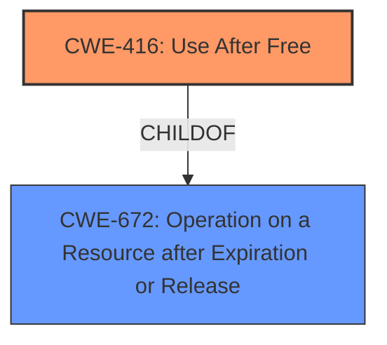

# Final Resolution for CVE-2022-2998

# Summary
| CWE ID  | CWE Name                                                                | Confidence | CWE Abstraction Level | CWE Vulnerability Mapping Label | CWE-Vulnerability Mapping Notes |
| :-------- | :---------------------------------------------------------------------- | :--------- | :-------------------- | :------------------------------ | :------------------------------ |
| CWE-416 | Use After Free                                                        | 0.95       | Variant               | Allowed                         | Acceptable-Use, Primary CWE                |

## Evidence and Confidence

*   **Confidence Score:** 0.95
*   **Evidence Strength:** HIGH

## Relationship Analysis
The analysis correctly identifies CWE-416 as the primary weakness. The vulnerability description explicitly states "use after free," which aligns perfectly with the CWE's definition. The Variant level abstraction is appropriate. The relationship analysis with CWE-672 (Operation on a Resource after Expiration or Release) is also correct, where CWE-416 is a child of CWE-672.

## Vulnerability Chain
The vulnerability chain starts with the **improper memory management** that leads to a **use-after-free** condition, resulting in potential **heap corruption** and arbitrary code execution.

## Summary of Analysis
The initial analysis and the criticism both converge on CWE-416 as the most appropriate classification. The explicit mention of "use after free" in the vulnerability description and CVE summary provides strong evidence for this classification. The relationship analysis further supports this decision, as CWE-416 is a variant of CWE-672, representing a specific type of operation after resource expiration. The classification reflects the optimal level of specificity, as CWE-416 directly addresses the root cause described in the vulnerability.