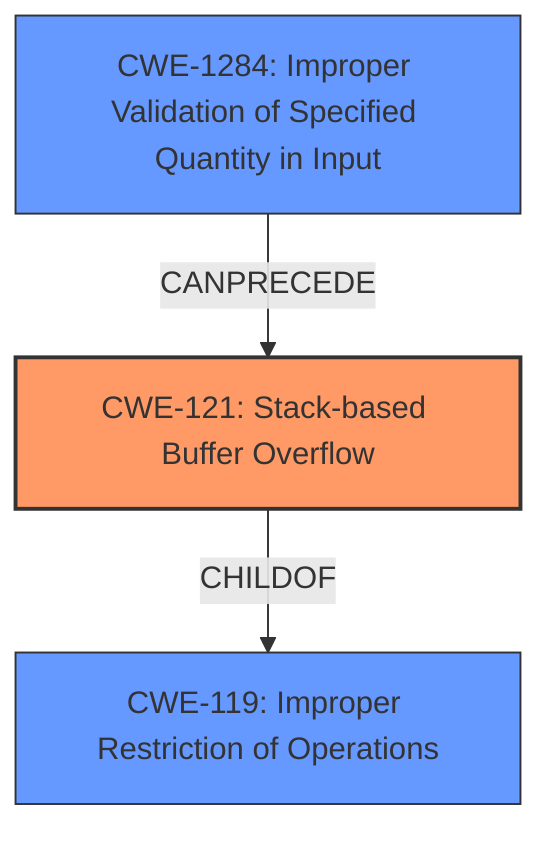

# Final Resolution for CVE-2022-30040

# Summary

| CWE ID | CWE Name | Confidence | CWE Abstraction Level | CWE Vulnerability Mapping Label | CWE-Vulnerability Mapping Notes |
|---|---|---|---|---|---|
| CWE-121 | Stack-based Buffer Overflow | 1.0 | Variant | Allowed | Primary CWE: The vulnerability is a classic **stack-based buffer overflow**. |
| CWE-1284 | Improper Validation of Specified Quantity in Input | 0.6 | Base | Allowed | Secondary Candidate: The size of the `ntpserver` parameter wasn't validated. |

## Evidence and Confidence

*   **Confidence Score:** 0.9
*   **Evidence Strength:** HIGH

## Relationship Analysis
The primary CWE is CWE-121 (Stack-based Buffer Overflow), a variant of CWE-119 (Improper Restriction of Operations within the Bounds of a Memory Buffer). CWE-121 is more specific than CWE-119 because the overflow occurs on the stack. CWE-1284 (Improper Validation of Specified Quantity in Input) can precede CWE-121, as a lack of input validation on the size of the `ntpserver` parameter contributes to the overflow. The abstraction levels influenced the selection by prioritizing the most specific CWE (Variant) while considering contributing factors (Base).

## Vulnerability Chain
The chain starts with CWE-1284 (**Improper Validation of Specified Quantity in Input**), where the size of the `ntpserver` parameter is not validated. This leads to CWE-121 (**Stack-based Buffer Overflow**) when the `strcpy` function copies the unvalidated input into a fixed-size buffer on the stack, causing a buffer overflow. The impact is a router denial of service.

## Summary of Analysis
The initial analysis correctly identified CWE-121 (**Stack-based Buffer Overflow**) as the primary **weakness**. The vulnerability description explicitly states a **stack buffer overflow** occurs due to the `strcpy` function, copying the `ntpserver` parameter without bounds checking. The criticism also agreed with this assessment, however, it also mentioned CWE-1284 (**Improper Validation of Specified Quantity in Input**) as a potential secondary issue.

The relationship analysis shows that CWE-121 is a variant of CWE-119, but CWE-121 is more specific and appropriate. CWE-1284 can precede CWE-121 because the lack of input validation contributes to the overflow.

The final decision is to assign CWE-121 as the primary CWE and CWE-1284 as a secondary CWE. This reflects the optimal level of specificity and captures the contributing factor of missing input validation.
I agree with assigning CWE-121 (**Stack-based Buffer Overflow**) as the primary **rootcause** due to the evidence: "attackers can access http//ip/goform/SetSysTimeCfg, and by setting the ntpserve parameter, the stack buffer overflow can be caused to achieve the effect of router denial of service."
I agree with assigning CWE-1284 (**Improper Validation of Specified Quantity in Input**) as a secondary candidate, with a slightly lower confidence, to show that the size of the `ntpserver` parameter wasn't validated.