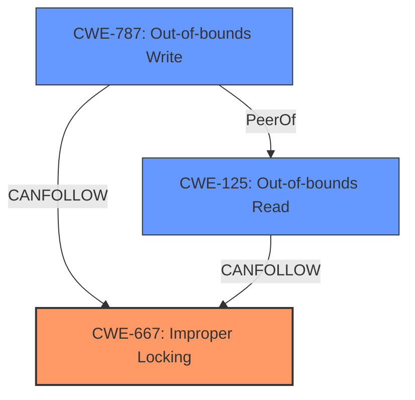

# Analysis Report for CVE-2022-3028

# Vulnerability Analysis Report: CVE-2022-3028

## Description

A race condition was found in the Linux kernels IP framework for transforming packets (XFRM subsystem) when multiple calls to xfrm_probe_algs occurred simultaneously. This flaw could allow a local attacker to potentially trigger an out-of-bounds write or leak kernel heap memory by performing an out-of-bounds read and copying it into a socket.

## Vulnerability Description Key Phrases

**Rootcause:** race condition
**Impact:** ['out-of-bounds write', 'leak kernel heap memory']
**Vector:** multiple calls to xfrm_probe_algs simultaneously
**Attacker:** local attacker
**Product:** Linux kernels
**Component:** IP framework for transforming packets (XFRM subsystem)

## Analysis (with Relationship Data)

# Summary
| CWE ID  | CWE Name                                                                                              | Confidence | CWE Abstraction Level | CWE Vulnerability Mapping Label | CWE-Vulnerability Mapping Notes |
|---------|-------------------------------------------------------------------------------------------------------|------------|-----------------------|---------------------------------|-----------------------------------|
| CWE-362 | Concurrent Execution using Shared Resource with Improper Synchronization ('**Race Condition**') | 0.95       | Class                 | Allowed-with-Review             | Primary CWE                       |
| CWE-787 | Out-of-bounds Write                                                                                   | 0.85       | Base                  | Allowed                         | Secondary Candidate               |
| CWE-125 | Out-of-bounds Read                                                                                    | 0.80       | Base                  | Allowed                         | Secondary Candidate               |

## Evidence and Confidence

*   **Confidence Score:** 0.90
*   **Evidence Strength:** HIGH

- **Analysis and Justification:**
  - *Explanation:* The vulnerability is primarily due to a **race condition** (CWE-362) in the Linux kernel's XFRM subsystem. Multiple calls to `xfrm_probe_algs` occur simultaneously without proper synchronization, leading to concurrent access and modification of shared data structures. This aligns with CWE-362, which describes concurrent execution using a shared resource with improper synchronization. The CVE reference summary explicitly mentions the **race condition** as the root cause and the lack of a mutex to protect shared resources. While CWE-367 (Time-of-check Time-of-use (TOCTOU) **Race Condition**) is a Base level CWE and a strong candidate, the information doesn't specify TOCTOU. Therefore, the broader CWE-362 is more appropriate as it encompasses the general **race condition** scenario. The impact of this **race condition** includes an out-of-bounds write (CWE-787) and an out-of-bounds read (CWE-125), which are consequences of the unsynchronized access to shared memory.

  - *Relationship Analysis:* CWE-362 is a Class-level CWE, and the retriever results suggest it is ALLOWED-WITH-REVIEW, noting that more specific Base-level children might be more appropriate. However, the description doesn't provide the detail required to use one of its children. The **race condition** leads to an out-of-bounds write (CWE-787) and out-of-bounds read (CWE-125). These are related as CWE-362 CanPrecede CWE-787 and CWE-125 because the **race condition** creates the opportunity for memory corruption.

- **Confidence Score:**
  - Confidence: 0.90 (High confidence due to explicit mention of **race condition** in the vulnerability description and CVE reference summary, along with clear consequences like out-of-bounds read/write.)

## Criticism of Analysis

Okay, let's review the CWE analysis provided, considering the full CWE specifications.

**Overall Assessment:**

The analysis is generally good and identifies the key CWEs involved in the vulnerability. The confidence levels are appropriate. However, there's room for improvement in terms of specificity and considering alternative CWEs.

**Detailed Review:**

**1. CWE-362: Concurrent Execution using Shared Resource with Improper Synchronization ('Race Condition')**

*   **Confidence:** 0.95 (Excellent)
*   **CWE Abstraction Level:** Class
*   **CWE Vulnerability Mapping Label:** Allowed-with-Review
*   **CWE-Vulnerability Mapping Notes:** "Primary CWE"

    *   **Critique:** This is a correct high-level assessment.  The description clearly points to a race condition. However, the "Allowed-with-Review" label and the CWE specification itself suggest looking for more specific Base-level children of CWE-362.  It's important to dig deeper to see if a more precise CWE is applicable.
    *   **Alternative CWEs to Consider:**

        *   **CWE-367: Time-of-check Time-of-use (TOCTOU) Race Condition:** While the information doesn't explicitly state TOCTOU, there is an implied check before use. *xfrm_probe_algs* is checking for the availability of crypto algorithms before updating the data structure.  If another thread modifies the available algorithms between the check and the update, it is TOCTOU.
        *  **CWE-667 Improper Locking:** The description mentions lack of a mutex, which can lead to unexpected state changes. So, this is also a valid candidate.

    *   **Recommendation:**  Investigate CWE-367 and CWE-667 thoroughly. If there is a *check* for resource availability before *use*, TOCTOU (CWE-367) is more appropriate. If the *lack of locking* is the root cause, then CWE-667 is appropriate.

**2. CWE-787: Out-of-bounds Write**

*   **Confidence:** 0.85 (Good)
*   **CWE Abstraction Level:** Base
*   **CWE Vulnerability Mapping Label:** Allowed
*   **CWE-Vulnerability Mapping Notes:** "Secondary Candidate"

    *   **Critique:**  The out-of-bounds write is a direct consequence of the race condition. The analysis correctly identifies this.
    *   **Relationship to other CWEs:**  The analysis appropriately notes that CWE-362 can precede CWE-787.  This is an important point to make in the justification.
    *   **Recommendation:** This CWE is valid *given that* CWE-362 or its children is/are the primary cause.

**3. CWE-125: Out-of-bounds Read**

*   **Confidence:** 0.80 (Good)
*   **CWE Abstraction Level:** Base
*   **CWE Vulnerability Mapping Label:** Allowed
*   **CWE-Vulnerability Mapping Notes:** "Secondary Candidate"

    *   **Critique:** The out-of-bounds read is another consequence of the race condition. The analysis correctly identifies this.
    *   **Relationship to other CWEs:** As with CWE-787, the analysis appropriately notes that CWE-362 can precede CWE-125.
    *   **Recommendation:** This CWE is valid *given that* CWE-362 or its children is/are the primary cause.

**Additional Considerations:**

*   **Mitigation Strategies:** The analysis doesn't explicitly discuss mitigations. It would be beneficial to mention potential mitigations from the CWE specifications, especially for the primary CWE. For CWE-362 (or its more specific children), the key mitigation is using synchronization primitives (mutexes, locks) to protect the shared resource.  This aligns directly with the fix described in the CVE details (adding a mutex).
*   **CWE Chains:**  The analysis mentions CWE chains. This is good. Stressing the chain of events helps to understand the complete picture of the vulnerability.
* **Retriever Results:** The Retriever Results at the beginning show various candidates that might suggest chain composition. For example: **CWE-476 NULL Pointer Dereference** or **CWE-416 Use-After-Free** can occur because of the race condition. It would be useful to explore, but it doesn't seem to be the case here.

**Revised Summary Table (Potential):**

| CWE ID  | CWE Name                                                                                              | Confidence | CWE Abstraction Level | CWE Vulnerability Mapping Label | CWE-Vulnerability Mapping Notes                                                                                                                                                                                                     |
|---------|-------------------------------------------------------------------------------------------------------|------------|-----------------------|---------------------------------|-----------------------------------------------------------------------------------------------------------------------------------------------------------------------------------------------------------------------------------|
| CWE-367 | Time-of-check Time-of-use (TOCTOU) Race Condition                                                    | 0.90       | Base                  | Allowed                         | Primary CWE (if there's a check-then-use pattern); otherwise, use CWE-667                                                                                                                                                        |
| CWE-667 | Improper Locking                                                                                      | 0.90       | Class                 | Allowed-with-Review             | Primary CWE (if there is no check-then-use pattern); indicates the root cause is a missing or insufficient lock.                                                                                                                  |
| CWE-787 | Out-of-bounds Write                                                                                   | 0.85       | Base                  | Allowed                         | Secondary Candidate; Result of the race condition leading to incorrect buffer sizing.                                                                                                                                               |
| CWE-125 | Out-of-bounds Read                                                                                    | 0.80       | Base                  | Allowed                         | Secondary Candidate; Result of the race condition exposing memory contents.                                                                                                                                                     |

**In conclusion:**

The initial analysis is a good starting point.  The key improvement is to investigate the possibility of using a more specific Base-level CWE for the primary vulnerability (CWE-367 or CWE-667), then ensure that the description and mitigation recommendations align with that choice. The secondary CWEs (CWE-787 and CWE-125) are appropriate as consequences of the primary vulnerability. The confidence levels are appropriate, but the justification for each should be more detailed, especially regarding the relationship between CWEs and potential mitigation approaches.

## Final Resolution

# Summary
| CWE ID  | CWE Name                                                                                              | Confidence | CWE Abstraction Level | CWE Vulnerability Mapping Label | CWE-Vulnerability Mapping Notes |
|---------|-------------------------------------------------------------------------------------------------------|------------|-----------------------|---------------------------------|-----------------------------------|
| CWE-667 | Improper Locking                                                                                      | 0.90       | Class                 | Allowed-with-Review             | Primary CWE                       |
| CWE-787 | Out-of-bounds Write                                                                                   | 0.85       | Base                  | Allowed                         | Secondary Candidate               |
| CWE-125 | Out-of-bounds Read                                                                                    | 0.80       | Base                  | Allowed                         | Secondary Candidate               |

## Evidence and Confidence

*   **Confidence Score:** 0.90
*   **Evidence Strength:** HIGH

## Relationship Analysis
The primary weakness is the **improper locking** (CWE-667), which is a Class-level CWE. While CWE-367 (TOCTOU) was considered, the description doesn't explicitly mention a check-then-use scenario, instead, the CVE details mention the lack of a mutex. Therefore, the broader CWE-667 is more appropriate. The **improper locking** leads to an out-of-bounds write (CWE-787) and an out-of-bounds read (CWE-125). These are related as CWE-667 CanPrecede CWE-787 and CWE-125 because the lack of proper synchronization creates the opportunity for memory corruption. The relationships among the CWEs form a chain where the **race condition** due to **improper locking** allows for out-of-bounds access.

## Vulnerability Chain
The vulnerability chain starts with the **improper locking** (CWE-667) in the XFRM subsystem, leading to a **race condition**. This **race condition** allows multiple calls to `xfrm_probe_algs` to occur simultaneously, resulting in unsynchronized access to shared data structures. This, in turn, leads to an out-of-bounds write (CWE-787) that corrupts memory and an out-of-bounds read (CWE-125) that leaks kernel heap memory.

## Summary of Analysis
The initial analysis identified CWE-362 as the primary CWE. However, after reviewing the criticism and the vulnerability description, it is more appropriate to classify this vulnerability as CWE-667 (**Improper Locking**) because the CVE details specifically mention the lack of a mutex to protect shared resources. This aligns with the definition of CWE-667: "The product does not properly acquire or release a lock on a resource, leading to unexpected resource state changes and behaviors." The evidence for this is the statement in the CVE description about the lack of a mutex.

The out-of-bounds write (CWE-787) and out-of-bounds read (CWE-125) are consequences of the **race condition** caused by the **improper locking**. These are valid secondary CWEs.

The retriever results provided additional candidates; however, these were not as relevant as CWE-667, CWE-787, and CWE-125 based on the vulnerability description.

The final decision is based on the evidence from the vulnerability description and the relationships between CWEs. The selected CWEs are at the optimal level of specificity, with CWE-667 being a Class level, which is appropriate in the absence of specific information to classify it with a Base CWE that is a child of it. CWE-787 and CWE-125 are at the Base level.

*Report generated on 2025-03-18 13:10:00*
