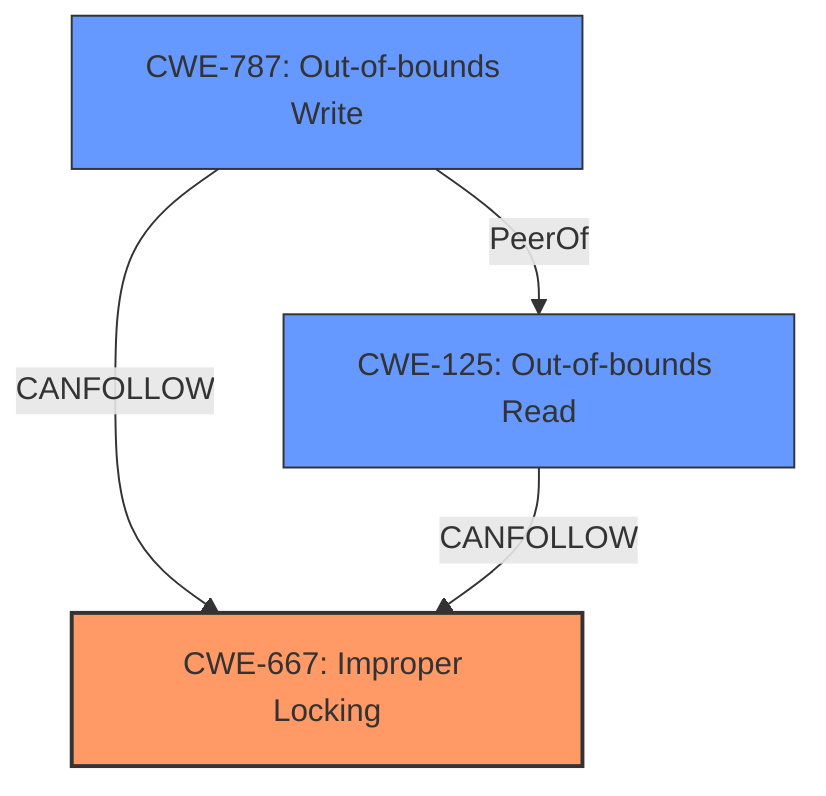

# Final Resolution for CVE-2022-3028

# Summary
| CWE ID  | CWE Name                                                                                              | Confidence | CWE Abstraction Level | CWE Vulnerability Mapping Label | CWE-Vulnerability Mapping Notes |
|---------|-------------------------------------------------------------------------------------------------------|------------|-----------------------|---------------------------------|-----------------------------------|
| CWE-667 | Improper Locking                                                                                      | 0.90       | Class                 | Allowed-with-Review             | Primary CWE                       |
| CWE-787 | Out-of-bounds Write                                                                                   | 0.85       | Base                  | Allowed                         | Secondary Candidate               |
| CWE-125 | Out-of-bounds Read                                                                                    | 0.80       | Base                  | Allowed                         | Secondary Candidate               |

## Evidence and Confidence

*   **Confidence Score:** 0.90
*   **Evidence Strength:** HIGH

## Relationship Analysis
The primary weakness is the **improper locking** (CWE-667), which is a Class-level CWE. While CWE-367 (TOCTOU) was considered, the description doesn't explicitly mention a check-then-use scenario, instead, the CVE details mention the lack of a mutex. Therefore, the broader CWE-667 is more appropriate. The **improper locking** leads to an out-of-bounds write (CWE-787) and an out-of-bounds read (CWE-125). These are related as CWE-667 CanPrecede CWE-787 and CWE-125 because the lack of proper synchronization creates the opportunity for memory corruption. The relationships among the CWEs form a chain where the **race condition** due to **improper locking** allows for out-of-bounds access.

## Vulnerability Chain
The vulnerability chain starts with the **improper locking** (CWE-667) in the XFRM subsystem, leading to a **race condition**. This **race condition** allows multiple calls to `xfrm_probe_algs` to occur simultaneously, resulting in unsynchronized access to shared data structures. This, in turn, leads to an out-of-bounds write (CWE-787) that corrupts memory and an out-of-bounds read (CWE-125) that leaks kernel heap memory.

## Summary of Analysis
The initial analysis identified CWE-362 as the primary CWE. However, after reviewing the criticism and the vulnerability description, it is more appropriate to classify this vulnerability as CWE-667 (**Improper Locking**) because the CVE details specifically mention the lack of a mutex to protect shared resources. This aligns with the definition of CWE-667: "The product does not properly acquire or release a lock on a resource, leading to unexpected resource state changes and behaviors." The evidence for this is the statement in the CVE description about the lack of a mutex.

The out-of-bounds write (CWE-787) and out-of-bounds read (CWE-125) are consequences of the **race condition** caused by the **improper locking**. These are valid secondary CWEs.

The retriever results provided additional candidates; however, these were not as relevant as CWE-667, CWE-787, and CWE-125 based on the vulnerability description.

The final decision is based on the evidence from the vulnerability description and the relationships between CWEs. The selected CWEs are at the optimal level of specificity, with CWE-667 being a Class level, which is appropriate in the absence of specific information to classify it with a Base CWE that is a child of it. CWE-787 and CWE-125 are at the Base level.