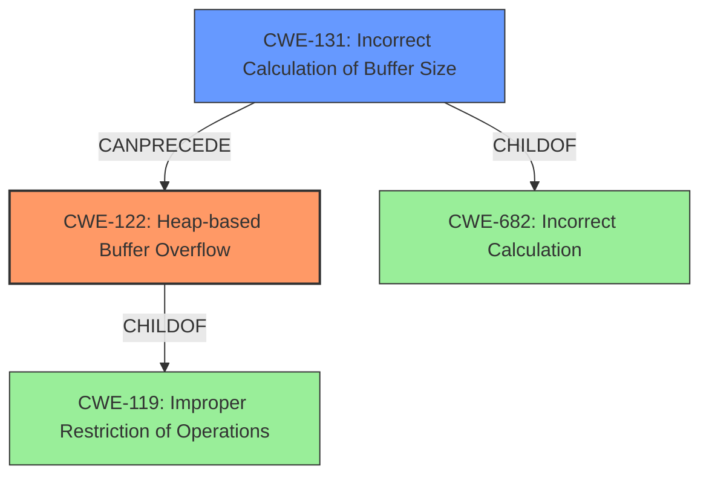

# Final Resolution for CVE-2022-30292

# Summary
| CWE ID | CWE Name | Confidence | CWE Abstraction Level | CWE Vulnerability Mapping Label | CWE-Vulnerability Mapping Notes |
|---|---|---|---|---|---|
| CWE-122 | Heap-based Buffer Overflow | 0.95 | Variant | Allowed | Primary CWE. The vulnerability is explicitly described as a heap-based buffer overflow. |
| CWE-131 | Incorrect Calculation of Buffer Size | 0.75 | Base | Allowed | Secondary CWE. The missing `sq_reservestack` call leads to an incorrect buffer size calculation. |

## Evidence and Confidence

*   **Confidence Score:** 0.90
*   **Evidence Strength:** HIGH

## Relationship Analysis
The primary relationship is that **CWE-131** (**Incorrect Calculation of Buffer Size**) *causes* **CWE-122** (**Heap-based Buffer Overflow**). **CWE-131** is a child of **CWE-682** (**Incorrect Calculation**), but **CWE-131** is more specific. **CWE-122** is a variant of **CWE-119** (**Improper Restriction of Operations within the Bounds of a Memory Buffer**). The abstraction levels influenced the selection by prioritizing the most specific CWE available, while still remaining accurate.

## Vulnerability Chain
The vulnerability chain starts with the **ROOTCAUSE** of a missing `sq_reservestack` call, leading to **CWE-131** (**Incorrect Calculation of Buffer Size**). This then leads to **CWE-122** (**Heap-based Buffer Overflow**), resulting in a denial of service and potential arbitrary code execution.

## Summary of Analysis
The initial analysis and criticism both correctly identify **CWE-122** (**Heap-based Buffer Overflow**) as the primary weakness due to the explicit description of the vulnerability. They also correctly identify **CWE-131** (**Incorrect Calculation of Buffer Size**) as a contributing factor.

The graph relationships reinforce this by showing that **CWE-131** can precede **CWE-122**, with **CWE-131** representing the root cause. The selection of these CWEs is at the optimal level of specificity, as they accurately describe the vulnerability and its cause, while avoiding overly broad classifications like **CWE-119** or higher-level abstractions like **CWE-682**.

The evidence supporting this decision comes directly from the vulnerability description, which states that the heap-based buffer overflow is due to the lack of a `sq_reservestack` call. This directly implies an incorrect calculation of the buffer size.