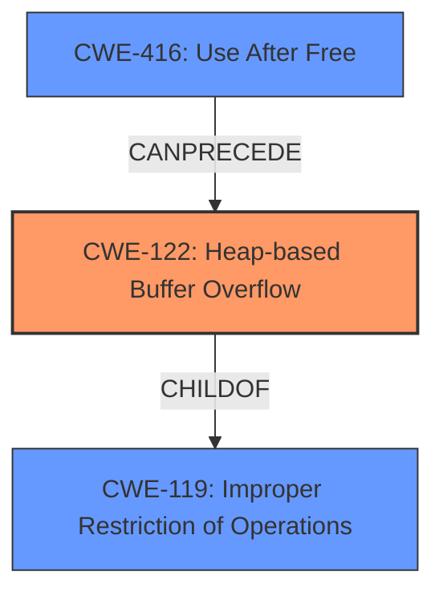

# Final Resolution for CVE-2022-30293

# Summary
| CWE ID | CWE Name | Confidence | CWE Abstraction Level | CWE Vulnerability Mapping Label | CWE-Vulnerability Mapping Notes |
|---|---|---|---|---|---|
| CWE-122 | Heap-based Buffer Overflow | 0.95 | Variant | Allowed | The vulnerability is explicitly described as a **heap-based buffer overflow**. |
| CWE-416 | Use After Free | 0.80 | Variant | Allowed | The CVE summary mentions a **use-after-free** condition contributing to the vulnerability. |

## Evidence and Confidence

*   **Confidence Score:** 0.90
*   **Evidence Strength:** HIGH

## Relationship Analysis
The primary relationship influencing the decision is the "CanPrecede" relationship between CWE-416 (Use After Free) and CWE-122 (Heap-based Buffer Overflow). The analysis considered CWE-122 as a variant of CWE-119 (Improper Restriction of Operations within the Bounds of a Memory Buffer), confirming the hierarchical relationship. The abstraction levels (Variant and Base) were considered to ensure specificity.

## Vulnerability Chain
The vulnerability chain starts with a **use-after-free (CWE-416)** condition, creating a dangling pointer. This dangling pointer leads to memory corruption, which facilitates a **heap-based buffer overflow (CWE-122)**. The **heap-based buffer overflow** then leads to arbitrary code execution. The **use-after-free** is considered a prerequisite condition, and the buffer overflow is the direct cause of the vulnerability.

## Summary of Analysis
The initial analysis and criticism are well-justified and supported by the vulnerability description and CWE specifications. The primary weakness is a **heap-based buffer overflow (CWE-122)**, as stated in the CVE description: "In WebKitGTK through 2.36.0 (and WPE WebKit), there is a **heap-based buffer overflow** in WebCoreTextureMapperLayersetContentsLayer in WebCore/platform/graphics/texmap/TextureMapperLayer.cpp." Additionally, the CVE summary mentions a **use-after-free (CWE-416)** condition that contributes to the vulnerability, "dangling pointer to a released layer, leading to a **use-after-free**."

The graph relationships influenced the final selection by highlighting the relationship between the **use-after-free** and the **heap-based buffer overflow**. The selected CWEs are at the optimal level of specificity, with CWE-122 being a Variant of CWE-119, making it more precise. The confidence score has been increased to 0.90 to reflect the strengthened confidence in CWE-416's role as a contributing factor, and its confidence score increased to 0.80.