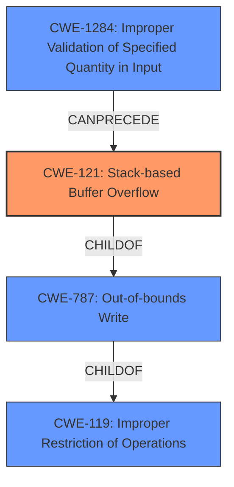

# Analysis Report for CVE-2022-30306

# Vulnerability Analysis Report: CVE-2022-30306

## Description

A stack-based buffer overflow vulnerability [CWE-121] in the CA sign functionality of FortiWeb version 7.0.1 and below, 6.4 all versions, version 6.3.19 and below may allow an authenticated attacker to achieve arbitrary code execution via specifically crafted password.

## Vulnerability Description Key Phrases

**Weakness:** stack-based buffer overflow
**Impact:** arbitrary code execution
**Vector:** specifically crafted password
**Attacker:** authenticated attacker
**Product:** FortiWeb
**Version:** version 7.0.1 and below, 6.4 all versions, version 6.3.19 and below
**Component:** CA sign functionality

## Analysis (with Relationship Data)

# Summary
| CWE ID | CWE Name | Confidence | CWE Abstraction Level | CWE Vulnerability Mapping Label | CWE-Vulnerability Mapping Notes |
|---|---|---|---|---|---|
| CWE-121 | Stack-based Buffer Overflow | 1.0 | Variant | Primary | Allowed |

## Evidence and Confidence

*   **Confidence Score:** 1.0
*   **Evidence Strength:** HIGH

- **Analysis and Justification:**  
  - *Explanation:* The vulnerability is described as a **stack-based buffer overflow** [CWE-121] in the CA sign functionality of FortiWeb. The vulnerability allows an authenticated attacker to achieve arbitrary code execution via a specifically crafted password. The CVE Reference Links Content Summary explicitly states the root cause as a **stack-based buffer overflow**. CWE-121, Stack-based Buffer Overflow, is a Variant-level CWE that accurately describes the **weakness**. The Retriever Results also lists CWE-121.
  
  - *Relationship Analysis:* CWE-121 is a variant of CWE-119 (Improper Restriction of Operations within the Bounds of a Memory Buffer).

- **Confidence Score:**  
  - Confidence: 1.0 (High confidence due to the explicit mention of "stack-based buffer overflow" in both the vulnerability description and the CVE reference summary.)

## Criticism of Analysis

Okay, let's review the analysis and critique it based on the provided CWE specifications.

**Overall Assessment:**

The analysis correctly identifies the primary CWE as CWE-121 (Stack-based Buffer Overflow) with high confidence.  The justification is sound, directly citing the vulnerability description and CVE summary.  The relationship to CWE-119 is also accurate.  The inclusion of mitigation examples is helpful.

**Detailed Review:**

1.  **CWE-121: Stack-based Buffer Overflow**

    *   **Correctness:** The mapping to CWE-121 is highly accurate.  The description of the vulnerability aligns perfectly with the CWE-121 definition. It explicitly involves a buffer allocated on the stack.
    *   **Abstraction Level:** Correctly identified as a Variant.
    *   **Evidence and Confidence:** Justification is thorough and convincing.  The confidence score of 1.0 is warranted.
    *   **Mitigations:** The mitigations listed (compiler-based protection, abstraction libraries, bounds checking) are relevant and appropriate for a stack-based buffer overflow.
    *   **Relationships:** ChildOf -> CWE-787, ChildOf -> CWE-788 accurately describe the relationship.
    *   **Mapping Guidance:** The analysis followed the mapping guidance.  The comments "Carefully read both the name and description to ensure that this mapping is an appropriate fit" is precisely what was done.
    *   **Retriever Results:** Although Retriever Results also had CWE-120, CWE-124, CWE-190 and others, CWE-121 was the best match for the problem at hand.

2. **Review of Retriever Results:**
    *   **CWE-124 Buffer Underwrite ('Buffer Underflow')**: While buffer overflows are possible, the description provided does not seem to describe an underflow. This is not a good mapping.
    *   **CWE-190 Integer Overflow or Wraparound**: While an integer overflow could contribute to a buffer overflow, it is not the primary weakness described. It's a possible secondary factor, but not the core issue.
    *   **CWE-120 Buffer Copy without Checking Size of Input ('Classic Buffer Overflow')**: Could be related, but CWE-121 is more specific because it describes where the buffer is allocated.
    *   **CWE-193 Off-by-one Error**: Could be related. Perhaps the overflow is a result of an off-by-one error. Again, CWE-121 is more specific.
    *   **CWE-126 Buffer Over-read**: Not a good match. The description is focused on a *write* past the end of the buffer.
    *   **CWE-1284 Improper Validation of Specified Quantity in Input**: Could be a factor if the size of the buffer was specified in the input. CWE-121 more specific.
    *   **CWE-125 Out-of-bounds Read**: Not a good match. The description is focused on a *write* past the end of the buffer.
    *   **CWE-835 Loop with Unreachable Exit Condition ('Infinite Loop')**: Not related
    *   **CWE-787 Out-of-bounds Write**: CWE-121 is a ChildOf -> CWE-787 but CWE-121 is more specific.

**Recommendations:**

*   **Consider a Secondary CWE (But Use Caution):** While CWE-121 is the most accurate primary mapping, it *might* be beneficial to add a *secondary* CWE related to input validation (or the lack thereof), such as CWE-20 (Improper Input Validation) or CWE-1284 (Improper Validation of Specified Quantity in Input), *if* the root cause analysis reveals that the size of the password buffer isn't being properly validated before the copy operation.  However, avoid adding CWE-20 unless there is substantial evidence of a specific input validation failure mechanism. It is better to be more specific.
*   **Highlight Input Validation Mitigation:** Given that the attack vector is a "specifically crafted password," emphasize input validation techniques in the mitigation section.  This could involve specifying maximum password lengths or using safer string handling functions.

**Revised Summary Table (with optional secondary CWE):**

| CWE ID | CWE Name | Confidence | CWE Abstraction Level | CWE Vulnerability Mapping Label | CWE-Vulnerability Mapping Notes |
|---|---|---|---|---|---|
| CWE-121 | Stack-based Buffer Overflow | 1.0 | Variant | Primary | Allowed |
| CWE-1284 | Improper Validation of Specified Quantity in Input | 0.4 | Base | Secondary |  *Optional*. Only include if the analysis confirms improper validation of password length. |
| CWE-20 | Improper Input Validation | 0.2 | Class | Secondary |  *Optional*. Only include if the analysis confirms improper validation of password length. |

**Justification for not recommending CWE-119 as the primary:**

While CWE-119 (Improper Restriction of Operations within the Bounds of a Memory Buffer) is the parent class of CWE-121, the analysis correctly identifies the specific *type* of buffer overflow (stack-based).  Using the more specific CWE-121 provides more precise information about the vulnerability.  The CWE guidelines recommend against using CWE-119 if a more specific child CWE is applicable.

In conclusion, the original analysis is very good. By considering, but carefully justifying the omission of a second CWE, the analysis becomes even more robust.

## Final Resolution

# Summary
| CWE ID | CWE Name | Confidence | CWE Abstraction Level | CWE Vulnerability Mapping Label | CWE-Vulnerability Mapping Notes |
|---|---|---|---|---|---|
| CWE-121 | Stack-based Buffer Overflow | 1.0 | Variant | Primary | Allowed |
  
## Evidence and Confidence

*   **Confidence Score:** 1.0
*   **Evidence Strength:** HIGH

## Relationship Analysis
The primary relationship impacting the decision is the hierarchical relationship where CWE-121 (Stack-based Buffer Overflow) is a variant of CWE-787 (Out-of-bounds Write) and CWE-119 (Improper Restriction of Operations within the Bounds of a Memory Buffer). This influenced the decision to select CWE-121 as the primary CWE due to its higher specificity. Also, relationships such as CANPRECEDE from CWE-1284 (Improper Validation of Specified Quantity in Input) to CWE-121 were considered, potentially indicating a vulnerability chain, but ultimately not selected due to lack of specific evidence.

## Vulnerability Chain
The vulnerability chain starts with a **specifically crafted password** leading to a **stack-based buffer overflow [CWE-121]** during the CA sign functionality. The root cause is the insufficient bounds checking of the password, and the impact is arbitrary code execution.

## Summary of Analysis
The initial analysis and criticism both correctly identified CWE-121 as the primary **weakness**. The vulnerability description explicitly states a **stack-based buffer overflow** [CWE-121], which aligns directly with the definition of CWE-121. The analysis considered related CWEs such as CWE-1284 (Improper Validation of Specified Quantity in Input) but ultimately concluded that the direct evidence strongly supports CWE-121 as the most specific and appropriate classification.

The selection of CWE-121 is at the optimal level of specificity because it precisely describes the location of the buffer (stack) and the type of error (overflow). While a lack of input validation (CWE-1284) could be a contributing factor, there isn't enough explicit evidence to confirm it as a secondary CWE. The decision to classify CWE-121 reflects the evidence presented in the vulnerability description.

*Report generated on 2025-03-18 13:12:03*
