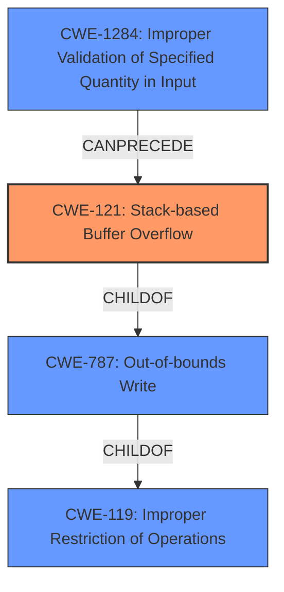

# Final Resolution for CVE-2022-30306

# Summary
| CWE ID | CWE Name | Confidence | CWE Abstraction Level | CWE Vulnerability Mapping Label | CWE-Vulnerability Mapping Notes |
|---|---|---|---|---|---|
| CWE-121 | Stack-based Buffer Overflow | 1.0 | Variant | Primary | Allowed |
  
## Evidence and Confidence

*   **Confidence Score:** 1.0
*   **Evidence Strength:** HIGH

## Relationship Analysis
The primary relationship impacting the decision is the hierarchical relationship where CWE-121 (Stack-based Buffer Overflow) is a variant of CWE-787 (Out-of-bounds Write) and CWE-119 (Improper Restriction of Operations within the Bounds of a Memory Buffer). This influenced the decision to select CWE-121 as the primary CWE due to its higher specificity. Also, relationships such as CANPRECEDE from CWE-1284 (Improper Validation of Specified Quantity in Input) to CWE-121 were considered, potentially indicating a vulnerability chain, but ultimately not selected due to lack of specific evidence.

## Vulnerability Chain
The vulnerability chain starts with a **specifically crafted password** leading to a **stack-based buffer overflow [CWE-121]** during the CA sign functionality. The root cause is the insufficient bounds checking of the password, and the impact is arbitrary code execution.

## Summary of Analysis
The initial analysis and criticism both correctly identified CWE-121 as the primary **weakness**. The vulnerability description explicitly states a **stack-based buffer overflow** [CWE-121], which aligns directly with the definition of CWE-121. The analysis considered related CWEs such as CWE-1284 (Improper Validation of Specified Quantity in Input) but ultimately concluded that the direct evidence strongly supports CWE-121 as the most specific and appropriate classification.

The selection of CWE-121 is at the optimal level of specificity because it precisely describes the location of the buffer (stack) and the type of error (overflow). While a lack of input validation (CWE-1284) could be a contributing factor, there isn't enough explicit evidence to confirm it as a secondary CWE. The decision to classify CWE-121 reflects the evidence presented in the vulnerability description.