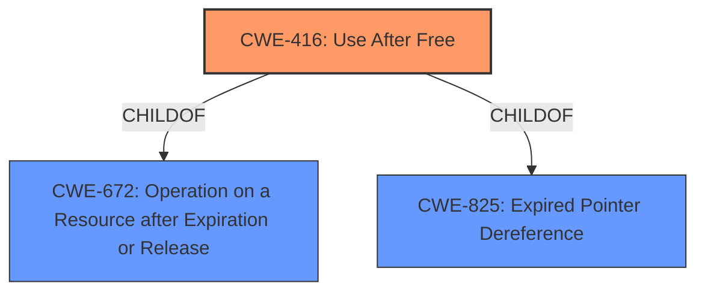

# Final Resolution for CVE-2022-3039

# Summary
| CWE ID | CWE Name | Confidence | CWE Abstraction Level | CWE Vulnerability Mapping Label | CWE-Vulnerability Mapping Notes |
|---|---|---|---|---|---|
| CWE-416 | Use After Free | 0.95 | Variant | Primary | Allowed |
| CWE-672 | Operation on a Resource after Expiration or Release | 0.30 | Class | Secondary | Parent of CWE-416 |
| CWE-825 | Expired Pointer Dereference | 0.30 | Base | Secondary | Parent of CWE-416 |

## Evidence and Confidence

*   **Confidence Score:** 0.95
*   **Evidence Strength:** HIGH

## Relationship Analysis
The primary relationship impacting the decision is the parent-child relationship between CWE-416 (**Use After Free**) and its parents, CWE-672 (**Operation on a Resource after Expiration or Release**) and CWE-825 (**Expired Pointer Dereference**). While CWE-416 is the most specific and direct classification based on the vulnerability description, acknowledging the parent relationships provides a broader context for understanding the nature of the **weakness**. The variant level of CWE-416 makes it the ideal primary choice, while the class and base levels of CWE-672 and CWE-825 respectively, offer a broader, less specific understanding of the vulnerability.

## Vulnerability Chain
The vulnerability chain starts with a coding error leading to improper memory management.
  - The root cause is the **failure** to properly manage the lifecycle of an object in WebSQL, specifically failing to prevent access to the object after it has been freed, leading to **CWE-416 (Use After Free)**.
  - The consequence of this **weakness** is the potential for **heap corruption**, as stated in the vulnerability description.
  - A remote attacker can trigger this **weakness** by crafting a malicious HTML page that exploits the flawed memory management in WebSQL.
  - Successful exploitation could lead to arbitrary code execution or denial of service.

## Summary of Analysis
The analysis accurately identifies **CWE-416 (Use After Free)** as the primary **weakness**, with strong justification based on the explicit mention of "use after free" in the vulnerability description. The abstraction level (Variant) is appropriate for a root cause analysis.

The criticism provided valuable insights, particularly regarding the inclusion of parent CWEs to provide broader context. The suggestion to strengthen the explanation of how crafted HTML leads to UAF and to consider adding a potential consequences section are valid points for improving the analysis.

The decision to include CWE-672 (**Operation on a Resource after Expiration or Release**) and CWE-825 (**Expired Pointer Dereference**) as secondary CWEs is based on their hierarchical relationship to CWE-416. While CWE-416 is the most specific representation of the **rootcause**, understanding its parent CWEs provides a more complete picture of the vulnerability's nature.

The selection of CWE-416 is at the optimal level of specificity because it directly reflects the **root cause** described in the vulnerability, namely the use of memory after it has been freed. The inclusion of its parents, CWE-672 and CWE-825, provide valuable context without overshadowing the primary **weakness**.