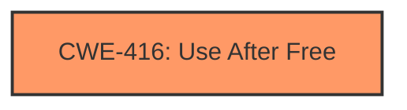

# Analysis Report for CVE-2022-3040

# Vulnerability Analysis Report: CVE-2022-3040

## Description

Use after free in Layout in Google Chrome prior to 105.0.5195.52 allowed a remote attacker to potentially exploit heap corruption via a crafted HTML page.

## Vulnerability Description Key Phrases

**Rootcause:** use after free
**Weakness:** heap corruption
**Vector:** crafted HTML page
**Attacker:** remote attacker
**Product:** Google Chrome
**Version:** prior to 105.0.5195.52
**Component:** Layout

## Analysis (with Relationship Data)

# Summary
| CWE ID | CWE Name | Confidence | CWE Abstraction Level | CWE Vulnerability Mapping Label | CWE-Vulnerability Mapping Notes |
|---|---|---|---|---|---|
| CWE-416 | Use After Free | 1.0 | Variant | Allowed | Primary CWE |

## Evidence and Confidence

*   **Confidence Score:** 1.0
*   **Evidence Strength:** HIGH

- **Analysis and Justification:**  
  - *Explanation:* The vulnerability description explicitly states "**use after free**" in "Layout" of Google Chrome. The "CVE Reference Links Content Summary" confirms the **root cause** is a **Use-After-Free (UAF)** error. CWE-416 (Use After Free) is a Variant level CWE, which is a preferred level of abstraction. The MITRE mapping guidance for CWE-416 indicates this is ALLOWED. All provided information strongly aligns with CWE-416.

  - *Relationship Analysis:* No direct relationships found.

- **Confidence Score:**  
  - *Example:* Confidence: 1.0 (Explicit vulnerability description and confirmation in CVE reference materials.)

## Criticism of Analysis

Okay, let's review the provided analysis for the vulnerability in Google Chrome (CVE-2022-3040) with the full CWE specifications in mind.

**Overall Assessment:**

The primary CWE mapping to CWE-416 (Use After Free) appears to be correct and well-justified. The analysis correctly identifies the vulnerability as a Use-After-Free based on the vulnerability description and CVE reference. The confidence score of 1.0 is appropriate. The selection of a Variant-level CWE is also good.

**Detailed Critique:**

1.  **CWE-416: Use After Free (Primary Mapping)**

    *   **Strengths:** The analysis clearly and accurately explains why CWE-416 is the appropriate mapping. The justification is strong, referencing the explicit "use after free" statement in the vulnerability description. The analysis also correctly identifies CWE-416 as a Variant-level CWE, which is the preferred level of abstraction according to CWE's mapping guidance. The mapping guidance is explicitly cited.
    *   **Weaknesses:** None.
    *   **Suggestions:** While the analysis is already strong, it might be valuable to briefly mention *why* a UAF leads to heap corruption (as the original description states). This could simply be a sentence stating that after memory is freed, it can be reallocated, and subsequent writes can corrupt the newly allocated data.

2.  **Alternative CWE Considerations and Retriever Results:**

    *   The retriever results returned other CWEs, some with relatively high scores. Let's examine the top ones and consider if they are relevant or not.
    *   **CWE-366: Race Condition within a Thread:** The retriever flagged this because UAF can sometimes be caused by a race condition. However, the primary description of the CVE does not mention threads or any concurrency issue. If the UAF was caused *by* a race condition, then we might consider this as *part* of a vulnerability chain.  Without more information on the root cause, it's best to leave this unmapped. The relationship between CWE-362 (the parent of CWE-366) and CWE-416 is mentioned in the CWE specifications, stating that CWE-362 can precede CWE-416, so it is a valid concern to think about.
    *   **CWE-843: Access of Resource Using Incompatible Type ('Type Confusion'):** While UAF can sometimes *lead* to type confusion exploitation, it is not the root cause in this case. The primary cause is the freed memory being accessed again.
    *   **CWE-415: Double Free:** Double free is a different type of memory safety vulnerability. It is not directly relevant based on the description.
    *   **CWE-787: Out-of-bounds Write:**  A UAF can lead to arbitrary code execution where the attacker *writes* arbitrary data to a location they shouldn't be able to. If we have more information that the heap corruption *specifically* involved an out-of-bounds write, we could *add* CWE-787 to the chain as a *consequence* of the UAF. However, since it is not mentioned, it is best to keep it unmapped. Also note that the retriever results for CWE-787 mention "Chain: insufficient input validation (CWE-20) in browser allows heap corruption (CWE-787), as exploited in the wild per CISA KEV.", so it is a common association. The CWE specifications state that CWE-787 can follow CWE-416, so it is a valid concern.
    *   **CWE-122: Heap-based Buffer Overflow:** Similar to CWE-787, this is a *possible* consequence if the UAF is exploited to overwrite heap data.
    *   **CWE-356: Product UI does not Warn User of Unsafe Actions:** This is irrelevant.
    *   **CWE-190: Integer Overflow or Wraparound:** This is irrelevant.
    *   **CWE-451: User Interface (UI) Misrepresentation of Critical Information:** Irrelevant.
    *   **CWE-665: Improper Initialization:** Irrelevant.
    *   **CWE-911: Improper Update of Reference Count:** Irrelevant.

3.  **CWE Specification Details:**

    *   The analysis correctly uses the "Mapping Guidance" section of CWE-416 to justify the choice of a Variant-level CWE.
    *   **Potential Mitigations:** The analysis could be slightly improved by mentioning potential mitigations, drawing from the CWE-416 specifications. For example:
        *   "Mitigation for this type of vulnerability often involves using languages with automatic memory management or implementing careful pointer management practices, such as setting pointers to NULL after freeing them."

4.  **CWE Examples:**

    *   The analysis provides observed examples of CWE-416 from the CVE database, which is beneficial for understanding the context of the CWE.

**Revised Summary Table (with minor additions):**

| CWE ID | CWE Name | Confidence | CWE Abstraction Level | CWE Vulnerability Mapping Label | CWE-Vulnerability Mapping Notes |
|---|---|---|---|---|---|
| CWE-416 | Use After Free | 1.0 | Variant | Allowed | Primary CWE. Mitigation involves automatic memory management or setting pointers to NULL after free(). |

**Conclusion:**

The analysis is very good and accurately maps the vulnerability to CWE-416. The confidence is well-justified, and the reasoning is sound. The suggestions above are minor improvements to make the analysis even more comprehensive by linking the vulnerability to potential causes and ways to prevent future instances.

## Final Resolution

# Summary
| CWE ID | CWE Name | Confidence | CWE Abstraction Level | CWE Vulnerability Mapping Label | CWE-Vulnerability Mapping Notes |
|---|---|---|---|---|---|
| CWE-416 | Use After Free | 1.0 | Variant | Allowed | Primary CWE. Mitigation involves automatic memory management or setting pointers to NULL after free(). |

## Evidence and Confidence

*   **Confidence Score:** 1.0
*   **Evidence Strength:** HIGH

## Relationship Analysis
The primary relationship considered was the potential for **CWE-416 (Use After Free)** to lead to other issues like **CWE-787 (Out-of-bounds Write)**, but without explicit evidence of the latter, it was deemed more accurate to stick with the primary **WEAKNESS**, **CWE-416 (Use After Free)**. The abstraction level (Variant) of **CWE-416 (Use After Free)** is appropriate as it's a specific type of memory safety issue.

## Vulnerability Chain
The chain begins with a **ROOTCAUSE** where memory is freed but still referenced. This leads to **CWE-416 (Use After Free)**, where the freed memory is accessed again. The impact is heap corruption, as stated in the vulnerability description.

## Summary of Analysis
The initial analysis correctly identified **CWE-416 (Use After Free)** as the primary **WEAKNESS**. The vulnerability description explicitly states "Use after free," which aligns perfectly with the definition of **CWE-416 (Use After Free)**. The confidence score of 1.0 is justified based on this direct evidence.

The criticism considered potential related CWEs, such as **CWE-787 (Out-of-bounds Write)**, but correctly concluded that without specific evidence of an out-of-bounds write, it's best to stick with the primary **WEAKNESS**, **CWE-416 (Use After Free)**.

The selection of **CWE-416 (Use After Free)** at the Variant level of abstraction is appropriate because it provides a specific description of the memory safety issue. The evidence, the relationships considered, and the abstraction level all support the final determination.

*Report generated on 2025-03-18 13:14:03*
