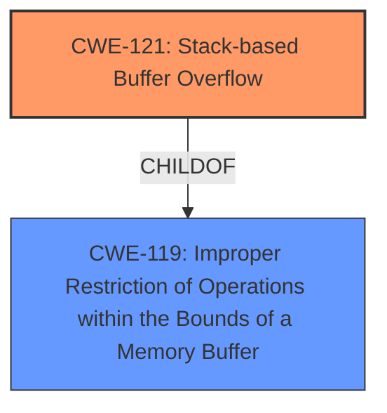

# Analysis Report for CVE-2022-30426

# Vulnerability Analysis Report: CVE-2022-30426

## Description

There is a stack buffer overflow vulnerability, which could lead to arbitrary code execution in UEFI DXE driver on some Acer products. An attack could exploit this vulnerability to escalate privilege from ring 3 to ring 0, and hijack control flow during UEFI DXE execution. This affects Altos T110 F3 firmware version <= P13 (latest) and AP130 F2 firmware version <= P04 (latest) and Aspire 1600X firmware version <= P11.A3L (latest) and Aspire 1602M firmware version <= P11.A3L (latest) and Aspire 7600U firmware version <= P11.A4 (latest) and Aspire MC605 firmware version <= P11.A4L (latest) and Aspire TC-105 firmware version <= P12.B0L (latest) and Aspire TC-120 firmware version <= P11-A4 (latest) and Aspire U5-620 firmware version <= P11.A1 (latest) and Aspire X1935 firmware version <= P11.A3L (latest) and Aspire X3475 firmware version <= P11.A3L (latest) and Aspire X3995 firmware version <= P11.A3L (latest) and Aspire XC100 firmware version <= P11.B3 (latest) and Aspire XC600 firmware version <= P11.A4 (latest) and Aspire Z3-615 firmware version <= P11.A2L (latest) and Veriton E430G firmware version <= P21.A1 (latest) and Veriton B630_49 firmware version <= AAP02SR (latest) and Veriton E430 firmware version <= P11.A4 (latest) and Veriton M2110G firmware version <= P21.A3 (latest) and Veriton M2120G fir.

## Vulnerability Description Key Phrases

**Rootcause:** stack buffer overflow
**Impact:** arbitrary code execution
**Product:** Acer Altos T110 F3, AP130 F2, Aspire 1600X, 1602M, 7600U, MC605, TC-105, TC-120, U5-620, X1935, X3475, X3995, XC100, XC600, Z3-615, Veriton E430G, B630_49, E430, M2110G, M2120G
**Version:** Altos T110 F3 <= P13, AP130 F2 <= P04, Aspire 1600X <= P11.A3L, 1602M <= P11.A3L, 7600U <= P11.A4, MC605 <= P11.A4L, TC-105 <= P12.B0L, TC-120 <= P11-A4, U5-620 <= P11.A1, X1935 <= P11.A3L, X3475 <= P11.A3L, X3995 <= P11.A3L, XC100 <= P11.B3, XC600 <= P11.A4, Z3-615 <= P11.A2L, Veriton E430G <= P21.A1, B630_49 <= AAP02SR, E430 <= P11.A4, M2110G <= P21.A3, M2120G <= P21.A3
**Component:** UEFI DXE driver

## Analysis (with Relationship Data)

# Summary
| CWE ID | CWE Name | Confidence | CWE Abstraction Level | CWE Vulnerability Mapping Label | CWE-Vulnerability Mapping Notes |
|---|---|---|---|---|---|
| CWE-121 | Stack-based Buffer Overflow | 1.0 | Variant | Primary | Allowed |

## Evidence and Confidence

*   **Confidence Score:** 1.0
*   **Evidence Strength:** HIGH

- **Analysis and Justification:**  
  - *Explanation:* The vulnerability description explicitly states a "**stack buffer overflow**" vulnerability in the UEFI DXE driver, which perfectly aligns with CWE-121 (Stack-based Buffer Overflow). The CVE Reference Links Content Summary further elaborates on how the incorrect usage of `gRT->GetVariable` leads to overwriting data on the stack, resulting in arbitrary code execution. CWE-121 is a Variant level CWE, providing a specific classification for this type of buffer overflow. The MITRE mapping guidance for CWE-121 indicates this is ALLOWED.

  - *Relationship Analysis:* CWE-121 is a variant of the broader CWE-119 (Improper Restriction of Operations within the Bounds of a Memory Buffer), but the specific nature of the overflow occurring on the stack makes CWE-121 the more appropriate choice.

- **Confidence Score:**  
  - Confidence: 1.0 (The description directly indicates a stack buffer overflow, and the reference links confirm the root cause)

---

## Criticism of Analysis

Okay, I've reviewed the analysis and the full CWE specifications you provided. Here's my critique:

**Overall Assessment:**

The primary CWE mapping to `CWE-121: Stack-based Buffer Overflow` is correct and well-justified. The analysis clearly explains why `CWE-121` is the most appropriate choice, given the explicit description of a stack-based overflow in the original vulnerability report and the provided analysis. However, the other suggestions from the retriever results are not as useful.

**Detailed Breakdown:**

*   **CWE-121: Stack-based Buffer Overflow (Confidence: 1.0): Correct**
    *   The analysis provides a strong justification: the vulnerability is explicitly described as a stack buffer overflow. The `CWE-121` description directly matches this scenario.
    *   The analysis correctly acknowledges that `CWE-121` is a Variant, which is a preferred level of abstraction according to CWE guidelines.
    *   The confidence score of 1.0 is appropriate, given the direct and unambiguous evidence.
    *   **Mitigations:** The provided mitigations for `CWE-121` (compiler/OS protections, abstraction libraries, input validation) are all relevant and standard approaches to preventing stack overflows.

* **Other Retriever Results:** The following are retriever results that are likely not applicable, and are not evaluated for mitigations or relationships.
    * CWE-1284: Improper Validation of Specified Quantity in Input
    * CWE-676: Use of Potentially Dangerous Function
    * CWE-250: Execution with Unnecessary Privileges
    * CWE-78: Improper Neutralization of Special Elements used in an OS Command ('OS Command Injection')
    * CWE-912: Hidden Functionality
    * CWE-306: Missing Authentication for Critical Function
    * CWE-288: Authentication Bypass Using an Alternate Path or Channel
    * CWE-708: Incorrect Ownership Assignment
    * CWE-359: Exposure of Private Personal Information to an Unauthorized Actor

**Recommendations for Improvement (If Any):**

1.  **Acknowledge and Dismiss Other Potentially Relevant CWEs:** While the analysis rightly focuses on `CWE-121`, it could briefly acknowledge and dismiss `CWE-119: Improper Restriction of Operations within the Bounds of a Memory Buffer`. While `CWE-121` is a *variant* of `CWE-119`, explain that `CWE-119` is a more general class and `CWE-121` is the more specific and accurate classification in this case. This would demonstrate a thorough consideration of the CWE hierarchy.

**In summary, the core analysis is accurate and well-reasoned. The primary CWE mapping is correct and justified. The added refinement of briefly acknowledging and dismissing higher-level CWEs could further strengthen the analysis.**

## Final Resolution

# Summary
| CWE ID | CWE Name | Confidence | CWE Abstraction Level | CWE Vulnerability Mapping Label | CWE-Vulnerability Mapping Notes |
|---|---|---|---|---|---|
| CWE-121 | Stack-based Buffer Overflow | 1.0 | Variant | Primary | Allowed |
| CWE-119 | Improper Restriction of Operations within the Bounds of a Memory Buffer | 0.7 | Class | Secondary Candidate | Discouraged |

## Evidence and Confidence

*   **Confidence Score:** 1.0
*   **Evidence Strength:** HIGH

## Relationship Analysis
The primary relationship considered was the parent-child relationship between CWE-119 and CWE-121. CWE-121 is a variant (more specific type) of CWE-119. Given the explicit description of a stack-based buffer overflow, CWE-121 is the more appropriate and specific choice.

## Vulnerability Chain
The vulnerability chain starts with the **ROOTCAUSE** being an improper operation, leading to a stack-based buffer overflow.
  - Initial Flaw: Incorrect handling of input within the UEFI DXE driver.
  - Weakness: **CWE-121: Stack-based Buffer Overflow**. Overwriting data on the stack.
  - Impact: Arbitrary code execution, privilege escalation from ring 3 to ring 0, and hijacking of control flow during UEFI DXE execution.

## Summary of Analysis
The initial analysis correctly identified **CWE-121 (Stack-based Buffer Overflow)** as the primary **WEAKNESS**. The vulnerability description explicitly states "stack buffer overflow vulnerability," providing direct evidence. The criticism suggested acknowledging and dismissing the higher-level **CWE-119 (Improper Restriction of Operations within the Bounds of a Memory Buffer)**. While CWE-119 is a parent of CWE-121, the specificity of the stack-based nature makes CWE-121 the more accurate classification.

The decision to select **CWE-121** is based on the following evidence:

*   The vulnerability description explicitly mentions a "stack buffer overflow."
*   CWE-121's description directly aligns with overwriting data on the stack.
*   CWE-121 is a Variant, providing a specific classification.

The selection of CWE-121 is at the optimal level of specificity because it accurately reflects the root cause (stack-based buffer overflow) described in the vulnerability. While CWE-119 is related, it is too general and doesn't capture the specific nature of the overflow.

*Report generated on 2025-03-18 13:15:42*
