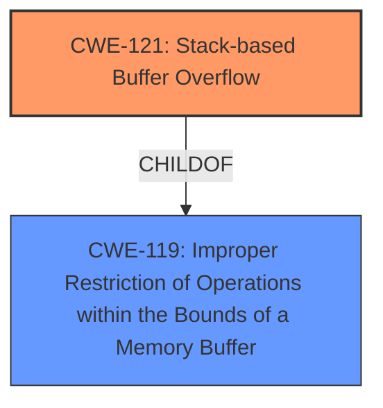

# Final Resolution for CVE-2022-30426

# Summary
| CWE ID | CWE Name | Confidence | CWE Abstraction Level | CWE Vulnerability Mapping Label | CWE-Vulnerability Mapping Notes |
|---|---|---|---|---|---|
| CWE-121 | Stack-based Buffer Overflow | 1.0 | Variant | Primary | Allowed |
| CWE-119 | Improper Restriction of Operations within the Bounds of a Memory Buffer | 0.7 | Class | Secondary Candidate | Discouraged |

## Evidence and Confidence

*   **Confidence Score:** 1.0
*   **Evidence Strength:** HIGH

## Relationship Analysis
The primary relationship considered was the parent-child relationship between CWE-119 and CWE-121. CWE-121 is a variant (more specific type) of CWE-119. Given the explicit description of a stack-based buffer overflow, CWE-121 is the more appropriate and specific choice.

## Vulnerability Chain
The vulnerability chain starts with the **ROOTCAUSE** being an improper operation, leading to a stack-based buffer overflow.
  - Initial Flaw: Incorrect handling of input within the UEFI DXE driver.
  - Weakness: **CWE-121: Stack-based Buffer Overflow**. Overwriting data on the stack.
  - Impact: Arbitrary code execution, privilege escalation from ring 3 to ring 0, and hijacking of control flow during UEFI DXE execution.

## Summary of Analysis
The initial analysis correctly identified **CWE-121 (Stack-based Buffer Overflow)** as the primary **WEAKNESS**. The vulnerability description explicitly states "stack buffer overflow vulnerability," providing direct evidence. The criticism suggested acknowledging and dismissing the higher-level **CWE-119 (Improper Restriction of Operations within the Bounds of a Memory Buffer)**. While CWE-119 is a parent of CWE-121, the specificity of the stack-based nature makes CWE-121 the more accurate classification.

The decision to select **CWE-121** is based on the following evidence:

*   The vulnerability description explicitly mentions a "stack buffer overflow."
*   CWE-121's description directly aligns with overwriting data on the stack.
*   CWE-121 is a Variant, providing a specific classification.

The selection of CWE-121 is at the optimal level of specificity because it accurately reflects the root cause (stack-based buffer overflow) described in the vulnerability. While CWE-119 is related, it is too general and doesn't capture the specific nature of the overflow.