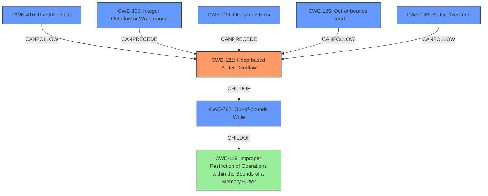

# Analysis Report for CVE-2022-3043

# Vulnerability Analysis Report: CVE-2022-3043

## Description

Heap buffer overflow in Screen Capture in Google Chrome on Chrome OS prior to 105.0.5195.52 allowed a remote attacker who convinced a user to engage in specific UI interactions to potentially exploit heap corruption via a crafted HTML page.

## Vulnerability Description Key Phrases

**Rootcause:** buffer overflow
**Weakness:** heap corruption
**Vector:** crafted HTML page
**Attacker:** remote attacker
**Product:** Google Chrome on Chrome OS
**Version:** prior to 105.0.5195.52
**Component:** Screen Capture

## Analysis (with Relationship Data)

# Summary
| CWE ID | CWE Name | Confidence | CWE Abstraction Level | CWE Vulnerability Mapping Label | CWE-Vulnerability Mapping Notes |
|---|---|---|---|---|---|
| CWE-122 | Heap-based Buffer Overflow | 0.9 | Variant | Allowed | Primary CWE: The vulnerability is a heap buffer overflow, which aligns directly with the CWE description. |
| CWE-787 | Out-of-bounds Write | 0.7 | Base | Allowed | Secondary CWE: A heap buffer overflow is a specific type of out-of-bounds write. |
| CWE-416 | Use After Free | 0.6 | Variant | Allowed | Secondary CWE: While a heap buffer overflow is the primary issue, **heap corruption** *could* potentially lead to use-after-free conditions if the overflow overwrites critical data structures managing memory. |

## Evidence and Confidence

*   **Confidence Score:** 0.8
*   **Evidence Strength:** HIGH

- **Analysis and Justification:**  
  - *Explanation:* The vulnerability description explicitly states a "**heap buffer overflow**" in the Screen Capture component of Google Chrome on Chrome OS. This maps directly to CWE-122 (Heap-based Buffer Overflow). The CVE Reference Links Content Summary confirms this root cause. CWE-787 (Out-of-bounds Write) is also considered because a heap buffer overflow is a specific instance of writing beyond the allocated buffer. The description also mentions "**heap corruption**," which could potentially be a consequence of the overflow, suggesting a possible CWE-416 (Use After Free) scenario if the overflow damages memory management structures, but this is a secondary consideration.
  
  - *Relationship Analysis:* CWE-122 is a variant of CWE-119 (Improper Restriction of Operations within the Bounds of a Memory Buffer), which is a broader class. CWE-787 (Out-of-bounds Write) is closely related, as a heap overflow involves writing beyond the intended boundaries. CWE-416 (Use After Free) is related as a potential consequence of memory corruption caused by the heap overflow.

- **Confidence Score:**  
  - Confidence: 0.9 (High confidence due to explicit mention of "heap buffer overflow" and confirmation from CVE details)

---

## Criticism of Analysis

Okay, I've reviewed the provided analysis and the complete CWE specifications for each of the proposed CWE mappings. Here's my critique:

**Overall Assessment:**

The analysis is generally sound, particularly the primary mapping to CWE-122 (Heap-based Buffer Overflow). The confidence score is appropriately high. The inclusion of CWE-787 is also reasonable. However, the confidence in CWE-416 is lower and warrants further scrutiny.

**Detailed Review:**

| CWE ID | CWE Name | Confidence | CWE Abstraction Level | CWE Vulnerability Mapping Label | Critique |
|---|---|---|---|---|---|
| **CWE-122** | **Heap-based Buffer Overflow** | 0.9 | Variant | Allowed | **Strong Mapping:** This is the most accurate and direct mapping. The vulnerability description explicitly states "heap buffer overflow." The provided details align perfectly with the CWE-122 description. The justification is well-supported. The confidence level is appropriate.|
| **CWE-787** | **Out-of-bounds Write** | 0.7 | Base | Allowed | **Acceptable Supporting Mapping:**  A heap buffer overflow *is* an instance of an out-of-bounds write. Therefore, including CWE-787 as a secondary CWE is valid. Confidence score is appropriately lower. |
| **CWE-416** | **Use After Free** | 0.6 | Variant | Allowed | **Questionable Mapping:** This is the weakest link in the analysis. The connection to CWE-416 is *potential* and based on the phrase "heap corruption" in the original description.  While a heap buffer overflow can *lead* to heap corruption that *might* then *lead* to a use-after-free condition, this is a less direct and more speculative relationship. The confidence should be significantly lower. The problem with this mapping is that heap corruption is just a generic statement, and it could lead to a lot of different issues; it is not necessarily Use-After-Free. It is better to say memory corruption is an impact of heap overflow and leave it like that.|

**Specific Suggestions for Improvement:**

1.  **CWE-416 Justification:**
    *   Re-evaluate the justification for including CWE-416. The current explanation uses terms like "could potentially" and relies on a chain of events that aren't explicitly stated in the provided vulnerability description. If there's *no* concrete evidence (from the description or CVE details) that a use-after-free is *likely* to result, the CWE-416 mapping should be removed or significantly downgraded in confidence. The note "While a heap buffer overflow is the primary issue, **heap corruption** *could* potentially lead to use-after-free conditions if the overflow overwrites critical data structures managing memory." is too weak of an argument.

2.  **CWE-119 Avoidance:**
    *   The analysis correctly avoids CWE-119 (Improper Restriction of Operations within the Bounds of a Memory Buffer).  The analysis uses the children of CWE-119 instead, which is the correct practice.

3.  **Consider CWE-131: Incorrect Calculation of Buffer Size (if applicable):**
    * While not explicitly stated in the description, if there's more information available (e.g., in the patch analysis or more detailed vulnerability write-up) that the heap buffer overflow stemmed from an incorrect calculation of the buffer size when allocating memory on the heap, then CWE-131 could be a relevant CWE in the chain.

**Addressing the Top Combined Retriever Results:**

The Retriever Results give several other CWEs. Here's an evaluation if those CWEs would be applicable in this context:

*   **CWE-416 Use After Free:**  Already discussed.
*   **CWE-366 Race Condition within a Thread:** There's no indication of concurrency or multiple threads in the vulnerability description. This CWE is unlikely to be applicable without further information.
*   **CWE-843 Access of Resource Using Incompatible Type ('Type Confusion'):** There's no indication in the initial vulnerability description that type confusion is involved.  This would require deeper analysis to determine if the heap overflow was facilitated by type confusion.
*   **CWE-122 Heap-based Buffer Overflow:** Already correctly mapped.
*   **CWE-190 Integer Overflow or Wraparound:** Integer overflows are often precursors to buffer overflows. If the size of the allocation or the offset into the buffer involves an integer calculation and that calculation is subject to overflow then CWE-190 would be applicable. Needs further investigation.
*   **CWE-125 Out-of-bounds Read:** The primary vulnerability is a write, not a read. However, if the overflow leads to subsequent reads of the corrupted heap, then CWE-125 could be a secondary effect.
*   **CWE-1021 Improper Restriction of Rendered UI Layers or Frames:** This is completely unrelated to the stated vulnerability and is a false positive.
*   **CWE-787 Out-of-bounds Write:** Already correctly mapped.
*   **CWE-193 Off-by-one Error:** An off-by-one error could be the cause of the heap buffer overflow. Needs further investigation.
*   **CWE-126 Buffer Over-read:** As with CWE-125, If the overflow leads to subsequent reads of the corrupted heap, then CWE-126 could be a secondary effect.

**Revised Summary Table (Incorporating Feedback):**

| CWE ID | CWE Name | Confidence | CWE Abstraction Level | CWE Vulnerability Mapping Label | CWE-Vulnerability Mapping Notes |
|---|---|---|---|---|---|
| CWE-122 | Heap-based Buffer Overflow | 0.9 | Variant | Allowed | Primary CWE: The vulnerability is a heap buffer overflow, which aligns directly with the CWE description. |
| CWE-787 | Out-of-bounds Write | 0.7 | Base | Allowed | Secondary CWE: A heap buffer overflow is a specific type of out-of-bounds write. |
| CWE-416 | Use After Free | 0.3 | Variant | Allowed | Secondary CWE: While a heap buffer overflow is the primary issue, heap corruption is a generic statement and it could lead to a lot of different issues; it is not necessarily Use-After-Free. |
| CWE-190 | Integer Overflow or Wraparound | 0.4 | Base | Allowed | May be applicable if the size of the allocation or the offset into the buffer involves an integer calculation and that calculation is subject to overflow. Needs further investigation. |
| CWE-193 | Off-by-one Error | 0.4 | Base | Allowed |  An off-by-one error could be the cause of the heap buffer overflow. Needs further investigation. |
| CWE-125 | Out-of-bounds Read | 0.3 | Base | Allowed | If the overflow leads to subsequent reads of the corrupted heap, then CWE-125 could be a secondary effect. |
| CWE-126 | Buffer Over-read | 0.3 | Variant | Allowed | If the overflow leads to subsequent reads of the corrupted heap, then CWE-126 could be a secondary effect. |

By addressing these points, the analysis can be made more precise and robust.

## Final Resolution

# Summary

| CWE ID | CWE Name | Confidence | CWE Abstraction Level | CWE Vulnerability Mapping Label | CWE-Vulnerability Mapping Notes |
|---|---|---|---|---|---|
| CWE-122 | Heap-based Buffer Overflow | 0.9 | Variant | Allowed | Primary CWE: The vulnerability is a heap buffer overflow, which aligns directly with the CVE description. |
| CWE-787 | Out-of-bounds Write | 0.7 | Base | Allowed | Secondary CWE: A heap buffer overflow is a specific type of out-of-bounds write. |
| CWE-416 | Use After Free | 0.3 | Variant | Allowed | Secondary CWE: While a heap buffer overflow is the primary issue, heap corruption is a generic statement and it could lead to a lot of different issues; it is not necessarily Use-After-Free. |
| CWE-190 | Integer Overflow or Wraparound | 0.4 | Base | Allowed | May be applicable if the size of the allocation or the offset into the buffer involves an integer calculation and that calculation is subject to overflow. Needs further investigation. |
| CWE-193 | Off-by-one Error | 0.4 | Base | Allowed |  An off-by-one error could be the cause of the heap buffer overflow. Needs further investigation. |
| CWE-125 | Out-of-bounds Read | 0.3 | Base | Allowed | If the overflow leads to subsequent reads of the corrupted heap, then CWE-125 could be a secondary effect. |
| CWE-126 | Buffer Over-read | 0.3 | Variant | Allowed | If the overflow leads to subsequent reads of the corrupted heap, then CWE-126 could be a secondary effect. |

## Evidence and Confidence

*   **Confidence Score:** 0.85
*   **Evidence Strength:** MEDIUM

## Relationship Analysis

The primary relationship influencing the decision is the parent-child relationship between CWE-119 (Improper Restriction of Operations within the Bounds of a Memory Buffer), CWE-787 (**Out-of-bounds Write**), and CWE-122 (**Heap-based Buffer Overflow**). CWE-122 is a variant of CWE-119 and a specific type of CWE-787, making it the most specific and appropriate choice given the vulnerability description. The potential for CWE-416 (**Use After Free**) stems from the **heap corruption** mentioned, representing a potential consequence. Other candidates like CWE-190 (**Integer Overflow or Wraparound**) and CWE-193 (**Off-by-one Error**) could *potentially* be root causes that preceded the overflow, but this requires further investigation and isn't directly supported by the description.

## Vulnerability Chain

The vulnerability chain, based on the available information, starts with a potential **ROOTCAUSE** such as an incorrect calculation of buffer size (hypothetically CWE-131, but not confirmed) or an integer overflow (CWE-190) or an off-by-one error (CWE-193). This leads to a CWE-122 (**Heap-based Buffer Overflow**) when a crafted HTML page convinces the user to engage in specific UI interactions. The **heap corruption** caused by the overflow (mentioned in the description) *could* then *potentially* lead to a CWE-416 (**Use After Free**), if critical memory management structures were overwritten. The overflow also may result in out-of-bounds reads CWE-125 or CWE-126 in corrupted heap.

Root Cause (Potential: CWE-131, CWE-190, CWE-193) -> CWE-122 (**Heap-based Buffer Overflow**) -> **Heap Corruption** -> Potential: CWE-416 (**Use After Free**) -> Potential: CWE-125, CWE-126

## Summary of Analysis

The analysis is based heavily on the explicit statement in the vulnerability description: "**Heap buffer overflow**". This directly corresponds to CWE-122 (**Heap-based Buffer Overflow**), justifying the high confidence. The inclusion of CWE-787 (**Out-of-bounds Write**) is supported by the fact that a heap overflow is an instance of an out-of-bounds write. The decision to lower the confidence on CWE-416 (**Use After Free**) is due to the lack of concrete evidence, relying only on the generic term "**heap corruption**," which could lead to various other issues, not necessarily a use-after-free. The analysis includes potential root causes like CWE-190 and CWE-193 and consequences like CWE-125 and CWE-126 to the heap overflow, but due to the lack of evidence they are classified as having low confidence.

The graph relationships reinforce the selection of CWE-122 as the primary CWE due to its specificity within the broader categories of memory corruption vulnerabilities. The abstraction levels were considered, favoring the Variant level (CWE-122) for its precision over the more general Base level (CWE-787).

*Report generated on 2025-03-18 13:16:31*
