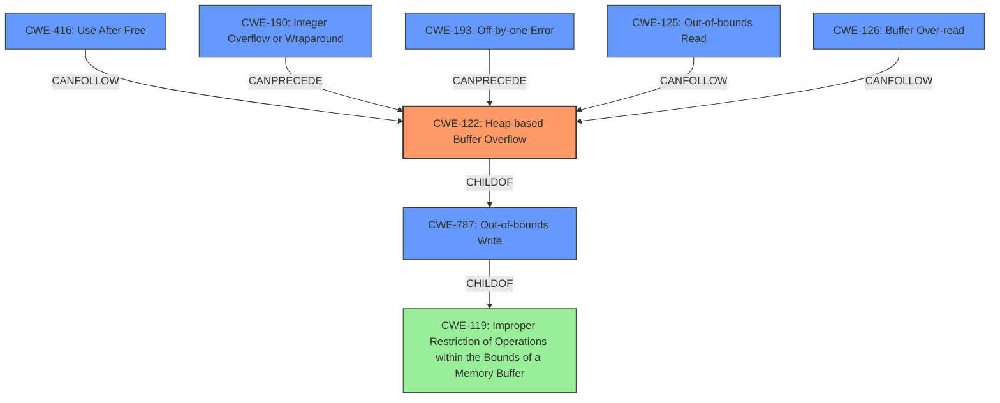

# Final Resolution for CVE-2022-3043

# Summary

| CWE ID | CWE Name | Confidence | CWE Abstraction Level | CWE Vulnerability Mapping Label | CWE-Vulnerability Mapping Notes |
|---|---|---|---|---|---|
| CWE-122 | Heap-based Buffer Overflow | 0.9 | Variant | Allowed | Primary CWE: The vulnerability is a heap buffer overflow, which aligns directly with the CVE description. |
| CWE-787 | Out-of-bounds Write | 0.7 | Base | Allowed | Secondary CWE: A heap buffer overflow is a specific type of out-of-bounds write. |
| CWE-416 | Use After Free | 0.3 | Variant | Allowed | Secondary CWE: While a heap buffer overflow is the primary issue, heap corruption is a generic statement and it could lead to a lot of different issues; it is not necessarily Use-After-Free. |
| CWE-190 | Integer Overflow or Wraparound | 0.4 | Base | Allowed | May be applicable if the size of the allocation or the offset into the buffer involves an integer calculation and that calculation is subject to overflow. Needs further investigation. |
| CWE-193 | Off-by-one Error | 0.4 | Base | Allowed |  An off-by-one error could be the cause of the heap buffer overflow. Needs further investigation. |
| CWE-125 | Out-of-bounds Read | 0.3 | Base | Allowed | If the overflow leads to subsequent reads of the corrupted heap, then CWE-125 could be a secondary effect. |
| CWE-126 | Buffer Over-read | 0.3 | Variant | Allowed | If the overflow leads to subsequent reads of the corrupted heap, then CWE-126 could be a secondary effect. |

## Evidence and Confidence

*   **Confidence Score:** 0.85
*   **Evidence Strength:** MEDIUM

## Relationship Analysis

The primary relationship influencing the decision is the parent-child relationship between CWE-119 (Improper Restriction of Operations within the Bounds of a Memory Buffer), CWE-787 (**Out-of-bounds Write**), and CWE-122 (**Heap-based Buffer Overflow**). CWE-122 is a variant of CWE-119 and a specific type of CWE-787, making it the most specific and appropriate choice given the vulnerability description. The potential for CWE-416 (**Use After Free**) stems from the **heap corruption** mentioned, representing a potential consequence. Other candidates like CWE-190 (**Integer Overflow or Wraparound**) and CWE-193 (**Off-by-one Error**) could *potentially* be root causes that preceded the overflow, but this requires further investigation and isn't directly supported by the description.

## Vulnerability Chain

The vulnerability chain, based on the available information, starts with a potential **ROOTCAUSE** such as an incorrect calculation of buffer size (hypothetically CWE-131, but not confirmed) or an integer overflow (CWE-190) or an off-by-one error (CWE-193). This leads to a CWE-122 (**Heap-based Buffer Overflow**) when a crafted HTML page convinces the user to engage in specific UI interactions. The **heap corruption** caused by the overflow (mentioned in the description) *could* then *potentially* lead to a CWE-416 (**Use After Free**), if critical memory management structures were overwritten. The overflow also may result in out-of-bounds reads CWE-125 or CWE-126 in corrupted heap.

Root Cause (Potential: CWE-131, CWE-190, CWE-193) -> CWE-122 (**Heap-based Buffer Overflow**) -> **Heap Corruption** -> Potential: CWE-416 (**Use After Free**) -> Potential: CWE-125, CWE-126

## Summary of Analysis

The analysis is based heavily on the explicit statement in the vulnerability description: "**Heap buffer overflow**". This directly corresponds to CWE-122 (**Heap-based Buffer Overflow**), justifying the high confidence. The inclusion of CWE-787 (**Out-of-bounds Write**) is supported by the fact that a heap overflow is an instance of an out-of-bounds write. The decision to lower the confidence on CWE-416 (**Use After Free**) is due to the lack of concrete evidence, relying only on the generic term "**heap corruption**," which could lead to various other issues, not necessarily a use-after-free. The analysis includes potential root causes like CWE-190 and CWE-193 and consequences like CWE-125 and CWE-126 to the heap overflow, but due to the lack of evidence they are classified as having low confidence.

The graph relationships reinforce the selection of CWE-122 as the primary CWE due to its specificity within the broader categories of memory corruption vulnerabilities. The abstraction levels were considered, favoring the Variant level (CWE-122) for its precision over the more general Base level (CWE-787).