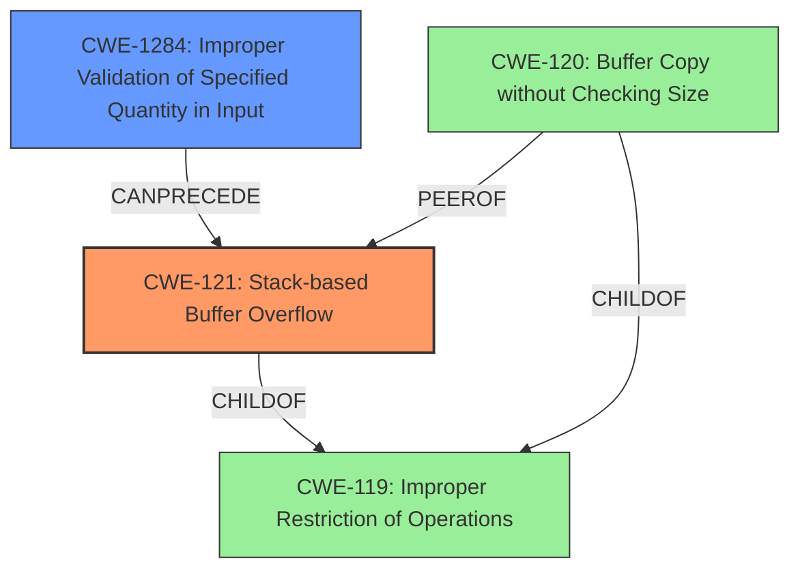

# Analysis Report for CVE-2022-30473

# Vulnerability Analysis Report: CVE-2022-30473

## Description

Tenda AC Series Router AC18_V15.03.05.19(6318) has a stack-based buffer overflow vulnerability in function form_fast_setting_wifi_set

## Vulnerability Description Key Phrases

**Weakness:** stack-based buffer overflow
**Product:** Tenda AC Series Router
**Version:** AC18_V15.03.05.19(6318)
**Component:** function form_fast_setting_wifi_set

## Analysis (with Relationship Data)

# Summary
| CWE ID | CWE Name | Confidence | CWE Abstraction Level | CWE Vulnerability Mapping Label | CWE-Vulnerability Mapping Notes |
|---|---|---|---|---|---|
| CWE-121 | Stack-based Buffer Overflow | 0.95 | Variant | Allowed | Primary CWE |
| CWE-120 | Buffer Copy without Checking Size of Input ('Classic Buffer Overflow') | 0.70 | Base | Allowed-with-Review | Secondary Candidate |

## Evidence and Confidence

*   **Confidence Score:** 0.90
*   **Evidence Strength:** HIGH

- **Analysis and Justification:**
  - *Explanation:* The vulnerability description clearly states a "**stack-based buffer overflow**" in the function `form_fast_setting_wifi_set`. The CVE Reference Links Content Summary further details that the code copies user-provided input for the `ssid` parameter into a smaller stack-based buffer using `strcpy` without a length check. This aligns directly with CWE-121 (Stack-based Buffer Overflow). While CWE-120 (Buffer Copy without Checking Size of Input) is a broader category, the specific mention of "stack-based" makes CWE-121 a more precise fit. The use of `strcpy` without checking the size of the input is a classic example of how stack-based buffer overflows occur. CWE-121 is a Variant level CWE, making it an appropriate level of abstraction. The MITRE mapping guidance for CWE-121 allows its use.

  - *Relationship Analysis:* CWE-121 is a variant of buffer overflow vulnerabilities. While it doesn't have direct relationships listed in the provided information, it is implicitly related to other buffer overflow CWEs like CWE-120 (Buffer Copy without Checking Size of Input). This relationship reinforces the selection of a buffer overflow CWE.

- **Confidence Score:**
  - Confidence: 0.95 (High confidence due to explicit mention of stack-based buffer overflow and supporting details in CVE Reference Links Content Summary).

---

## Criticism of Analysis

Okay, here's a review of the provided analysis, incorporating the full CWE specifications and focusing on mapping guidance and mitigations:

**Overall Assessment:**

The analysis is well-structured and generally accurate. The primary CWE mapping to **CWE-121: Stack-based Buffer Overflow** is appropriate and well-justified. The inclusion of **CWE-120: Buffer Copy without Checking Size of Input ('Classic Buffer Overflow')** as a secondary candidate is also reasonable, though the analysis correctly prioritizes CWE-121.

**Detailed Review:**

**1. CWE-121: Stack-based Buffer Overflow (Primary)**

*   **Confidence:** 0.95 (Excellent Confidence)
*   **Justification:** The reasoning is strong. The description explicitly mentions a stack-based buffer overflow, and the details about `strcpy` usage without length checks are a textbook example.
*   **CWE Specification Adherence:**
    *   **Abstraction:** Variant - Correct. CWE-121 is a variant of the broader buffer overflow category.
    *   **Mapping Guidance:** Usage: Allowed. The analysis correctly notes this and the "Acceptable-Use" reason.
    *   **Relationships:** The analysis notes the ChildOf relationship to CWE-788 and CWE-787 and that CWE-121 is a variant of the buffer overflow. This aligns well with the CWE specifications.
    *   **Potential Mitigations:**The analysis doesn't explicitly mention mitigations, however, it should be noted that the specification for CWE-121 provides three specific mitigations:
         *   **Mitigation 1:** Operation, Build and Compilation - Environment Hardening:  Using compiler-based buffer overflow detection mechanisms (e.g., /GS flag in Visual Studio, FORTIFY\_SOURCE in GCC).
         *   **Mitigation 2:** Architecture and Design:  Using abstraction libraries to abstract away risky APIs.
         *   **Mitigation 3:** Implementation: Implementing and performing bounds checking on input.
*   **Improvements:** Explicitly mentioning even one of the mitigations from the CWE specification would strengthen the analysis. Specifically, mentioning the use of compiler flags like `/GS` or `FORTIFY_SOURCE` as a mitigation would be relevant. Also, noting the importance of bounds checking on the input `ssid` parameter before copying it to the stack-based buffer would be useful.

**2. CWE-120: Buffer Copy without Checking Size of Input ('Classic Buffer Overflow') (Secondary)**

*   **Confidence:** 0.70 (Good Confidence)
*   **Justification:** As a broader category of buffer overflow, it's a valid consideration. The use of `strcpy` without length checks directly matches CWE-120's description.
*   **CWE Specification Adherence:**
    *   **Abstraction:** Base - Correct. CWE-120 is a base-level CWE.
    *   **Mapping Guidance:** Usage: Allowed-with-Review. The analysis implicitly acknowledges this by making it a secondary candidate. The "Frequent Misuse" reason is valid, as CWE-120 can be overused simply because it mentions "buffer overflow."
    *   **Relationships:** The analysis should note the ChildOf relationship to CWE-119.
    *   **Potential Mitigations:**The analysis doesn't explicitly mention mitigations, however, it should be noted that the specification for CWE-120 provides three specific mitigations:
         *   **Mitigation 1:** Requirements - Language Selection: Using a memory-safe language or constructs.
         *   **Mitigation 2:** Architecture and Design - Libraries or Frameworks: Using safe string handling libraries like SafeStr or Strsafe.h.
         *   **Mitigation 3:** Operation, Build and Compilation - Environment Hardening: Using compiler-based buffer overflow detection mechanisms (e.g., /GS flag in Visual Studio, FORTIFY\_SOURCE in GCC).
*   **Improvements:** The analysis could explicitly state *why* CWE-121 is preferred over CWE-120 (the stack allocation is explicitly mentioned in the description). Adding a mitigation from the CWE specification would be useful. The language selection mitigation is probably too high-level here, but mentioning safe string libraries or compiler flags would be beneficial.

**3. Retriever Results Analysis:**

The Retriever Results section provides a list of potential CWEs. Here's how they relate to the main analysis and whether they warrant further consideration:

*   **CWE-193: Off-by-one Error:** Low relevance. While off-by-one errors *can* lead to buffer overflows, the primary issue here is the complete *lack* of size checking, not an error in the boundary calculation.
*   **CWE-195: Signed to Unsigned Conversion Error:** Very low relevance. There's no indication of signed/unsigned conversions contributing to the overflow in the provided information.
*   **CWE-170: Improper Null Termination:** Low relevance, but could potentially be a contributing factor. If `strcpy` is used and the input string exactly fills the buffer without a null terminator, this *could* be an issue. However, the primary problem is the overflow itself.
*   **CWE-676: Use of Potentially Dangerous Function:** Moderate relevance. `strcpy` is a poster child for dangerous functions. This could be a secondary CWE, but it's more of a symptom than the root cause (the root cause is the missing size check).
*   **CWE-122: Heap-based Buffer Overflow:** Irrelevant. The vulnerability is explicitly stack-based.
*   **CWE-190: Integer Overflow or Wraparound:** Very low relevance. No indication of integer overflows contributing to the vulnerability.
*   **CWE-126: Buffer Over-read:** Irrelevant. The vulnerability is an over*write*, not an over*read*.
*   **CWE-1284: Improper Validation of Specified Quantity in Input:** This is a strong candidate for a secondary CWE. The root cause is that the `ssid` parameter is not validated for length *before* being copied. This directly aligns with the CWE-1284 description: "The product receives input that is expected to specify a quantity (such as size or length), but it does not validate or incorrectly validates that the quantity has the required properties."

**Recommendation for Improving the Analysis:**

1.  **Add a Mitigation:** Explicitly mention one or two relevant mitigations from the CWE-121 (and potentially CWE-120) specifications in the analysis. Emphasize the importance of input validation and bounds checking.
2.  **Strengthen the Justification for Choosing CWE-121:** Explicitly state why CWE-121 is a *more precise* fit than CWE-120 (stack allocation is explicitly mentioned).
3.  **Consider CWE-1284 as a Secondary CWE:** Add CWE-1284 as a second contributing factor, specifically focusing on the lack of input validation for the length of the `ssid` parameter.  This CWE helps explain the *root cause* of the vulnerability.
4.  **Relationships:** Explicitly mention the ChildOf relationships of CWE-120 to CWE-119.

**Revised Summary Table:**

| CWE ID  | CWE Name                                                                | Confidence | CWE Abstraction Level | CWE Vulnerability Mapping Label | CWE-Vulnerability Mapping Notes                                                                                                                                                                                                    |
| ------- | ----------------------------------------------------------------------- | ---------- | --------------------- | ------------------------------- | --------------------------------------------------------------------------------------------------------------------------------------------------------------------------------------------------------------------------------- |
| CWE-121 | Stack-based Buffer Overflow                                             | 0.95       | Variant               | Allowed                         | Primary CWE                                                                                                                                                                                                                       |
| CWE-1284 | Improper Validation of Specified Quantity in Input                      | 0.80       | Base                  | Allowed                         | Secondary CWE. The `ssid` parameter is not validated for length before being used in the `strcpy` function.                                                                                                                            |
| CWE-120 | Buffer Copy without Checking Size of Input ('Classic Buffer Overflow') | 0.70       | Base                  | Allowed-with-Review             | Tertiary Candidate. Broader category of buffer overflows. Less specific than CWE-121 because it doesn't explicitly mention stack allocation, and less specific than CWE-1284 because it doesn't address the root cause of missing input validation. |

By incorporating these suggestions, the analysis will be more robust, align more closely with CWE's intended usage, and provide more actionable insights for remediation.

## Final Resolution

# Summary
| CWE ID | CWE Name | Confidence | CWE Abstraction Level | CWE Vulnerability Mapping Label | CWE-Vulnerability Mapping Notes |
|---|---|---|---|---|---|
| **CWE-121** | **Stack-based Buffer Overflow** | 0.95 | Variant | Allowed | Primary CWE |
| **CWE-1284** | **Improper Validation of Specified Quantity in Input** | 0.80 | Base | Allowed | Secondary Candidate |

## Evidence and Confidence

*   **Confidence Score:** 0.93
*   **Evidence Strength:** HIGH

## Relationship Analysis
The primary weakness is **CWE-121: Stack-based Buffer Overflow**. This is a variant of the broader **CWE-119: Improper Restriction of Operations within the Bounds of a Memory Buffer**, indicating a hierarchical relationship. The secondary weakness, **CWE-1284: Improper Validation of Specified Quantity in Input**, represents the root cause, as the lack of input validation on the `ssid` parameter precedes the buffer overflow. This creates a chain relationship where improper input validation leads to a buffer overflow. **CWE-120: Buffer Copy without Checking Size of Input ('Classic Buffer Overflow')** is a peer of **CWE-121** and also a child of **CWE-119**, representing a potential alternative classification, but **CWE-121** is more specific due to the stack allocation.

## Vulnerability Chain
The vulnerability chain starts with **CWE-1284: Improper Validation of Specified Quantity in Input**. The `ssid` parameter's length is not validated before being used in the `strcpy` function. This leads to **CWE-121: Stack-based Buffer Overflow**, where the overly long input is copied to a smaller stack-based buffer, overwriting adjacent memory. The consequence is potential code execution and system compromise.

## Summary of Analysis
The initial analysis correctly identified **CWE-121: Stack-based Buffer Overflow** as the primary weakness based on the vulnerability description, which explicitly states "stack-based buffer overflow". The provided evidence also mentions that the code copies user-provided input for the `ssid` parameter into a smaller stack-based buffer using `strcpy` without a length check, which supports this conclusion. The criticism suggested adding **CWE-1284** as a secondary CWE, focusing on the lack of input validation for the length of the `ssid` parameter. This aligns well with the CWE-1284 description: "The product receives input that is expected to specify a quantity (such as size or length), but it does not validate or incorrectly validates that the quantity has the required properties." I agree with the criticism.

The relationships influenced my decision to include **CWE-1284** as a secondary CWE because it clarifies the root cause of the vulnerability. The vulnerability chain shows how the lack of input validation leads directly to the buffer overflow.

The selected CWEs are at the optimal level of specificity. **CWE-121** is a Variant, making it more specific than the Base **CWE-120**. **CWE-1284** is a Base CWE that describes the specific type of missing input validation. These choices provide a clear and accurate picture of the vulnerability.

*Report generated on 2025-03-18 13:19:36*
