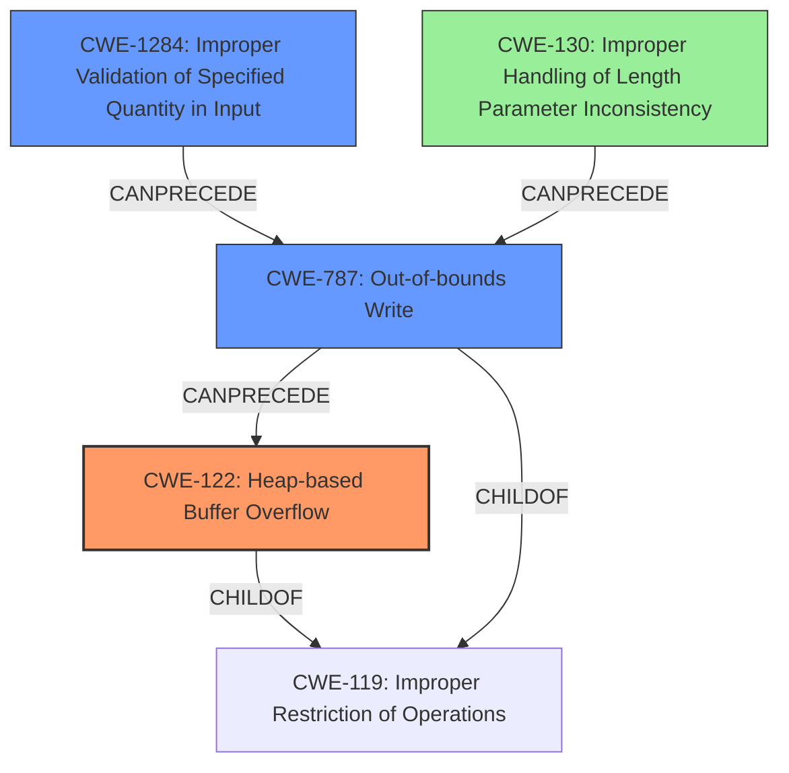

# Analysis Report for CVE-2022-30474

# Vulnerability Analysis Report: CVE-2022-30474

## Description

Tenda AC Series Router AC18_V15.03.05.19(6318) was discovered to contain a heap overflow in the httpd module when handling /goform/saveParentControlInfo request.

## Vulnerability Description Key Phrases

**Weakness:** heap overflow
**Product:** Tenda AC Series Router
**Version:** AC18_V15.03.05.19(6318)
**Component:** httpd module

## Analysis (with Relationship Data)

# Summary
| CWE ID | CWE Name | Confidence | CWE Abstraction Level | CWE Vulnerability Mapping Label | CWE-Vulnerability Mapping Notes |
|---|---|---|---|---|---|
| CWE-122 | Heap-based Buffer Overflow | 0.95 | Variant | Primary | Allowed |
| CWE-787 | Write What Where Condition | 0.6 | Base | Secondary | Allowed |
| CWE-1284 | Improper Validation of Specified Quantity in Input | 0.5 | Base | Secondary | Allowed |

## Evidence and Confidence

*   **Confidence Score:** 0.9
*   **Evidence Strength:** HIGH

- **Analysis and Justification:**  
  - *Explanation:* The vulnerability description explicitly states a "**heap overflow**" in the httpd module, specifically when handling the `/goform/saveParentControlInfo` request. The CVE reference links content summary confirms this by stating the root cause is a heap overflow in the `saveParentControlInfo` function due to the use of `strcpy` without a length check when copying the user-provided `deviceId` parameter. This directly aligns with CWE-122, which is a "Heap-based Buffer Overflow." CWE-122 is a Variant level CWE, which is preferred. The use of `strcpy` without length validation leads to writing beyond the allocated buffer, this aligns with CWE-787. CWE-1284 highlights that the product does not validate or incorrectly validates that the quantity has the required properties. In this case, the deviceId length is not validated, which leads to the heap overflow.
  
  - *Relationship Analysis:* CWE-122 is a variant of a buffer overflow. CWE-787 describes the act of writing beyond the allocated buffer size and is a base level CWE. CWE-1284 is a base level CWE that describes the root cause of the buffer overflow: the quantity (size of the deviceId) is not validated.

- **Confidence Score:**  
  - Confidence: 0.95 (High evidence from technical description and CVE reference materials)

---

## Criticism of Analysis

Okay, I've reviewed your analysis of the Tenda AC Series Router heap overflow vulnerability, considering the full CWE specifications you provided. Here's my critique:

**Overall Assessment:**

The analysis is generally good and accurately identifies the core vulnerability as a heap-based buffer overflow. The reasoning is clearly explained, and the confidence level is appropriately high. The inclusion of secondary CWEs adds useful context.

**Detailed Critique:**

*   **CWE-122: Heap-based Buffer Overflow (Primary)**

    *   **Accuracy:** Correct. The vulnerability is explicitly described as a heap overflow, and the use of `strcpy` without length checks directly leads to this.  The description of CWE-122 aligns perfectly with the vulnerability's nature.
    *   **Abstraction Level:**  Using the Variant level CWE is appropriate as it directly describes the type of buffer overflow.
    *   **Mapping Guidance:** The rationale aligns with the mapping guidance for CWE-122, which favors Variant-level CWEs when appropriate.
    *   **Mitigations:**  The provided mitigations (language choice, abstraction libraries, and compiler-based overflow detection) are all relevant and standard defenses against buffer overflows.
    *   **Observed Examples:** The provided examples match the chain of events. An overly long string is written to memory without performing proper validation.

*   **CWE-787: Out-of-bounds Write (Secondary)**

    *   **Accuracy:** Correct. CWE-787 describes the *action* that causes the vulnerability. The `strcpy` function writes beyond the allocated bounds of the buffer.
    *   **Abstraction Level:** As a Base CWE, it's suitable as a secondary classification, providing a broader understanding of the issue.
    *   **Mapping Guidance:**  The mapping guidance is accurate. This CWE describes the action of writing past the end of a buffer.
    *   **Mitigations:** The suggested mitigations are standard practices to prevent memory corruption, like choosing safe languages or using secure string handling libraries.
     *   **Observed Examples:** The examples point to chain events that are similar to this scenario.

*   **CWE-1284: Improper Validation of Specified Quantity in Input (Secondary)**

    *   **Accuracy:** Correct. This CWE identifies the *root cause* of the overflow. The program fails to validate the length of the `deviceId` parameter before copying it into the buffer.
    *   **Abstraction Level:** Using this Base CWE helps understand the fundamental error in the software's design.
    *   **Mapping Guidance:** The rationale aligns with the mapping guidance, which encourages using Base-level CWEs to describe the root causes.
    *   **Mitigations:** "Accept known good" input validation is the core mitigation and is perfectly applicable here. Strict input validation can prevent this vulnerability from occurring.
    *    **Observed Examples:** The examples are similar to the chain of events. Lack of proper validation can lead to other CWEs.

**Recommendations for Improvement:**

1.  **Chain Explanation:** While the "Relationship Analysis" section touches on the connections between CWEs, you could explicitly state the vulnerability chain in more detail.  For example:  "CWE-1284 leads to CWE-787, which manifests as CWE-122. Specifically, the lack of validation of the `deviceId` length (CWE-1284) allows an attacker to provide an oversized string, which causes an out-of-bounds write (CWE-787) to a heap-allocated buffer, resulting in a heap-based buffer overflow (CWE-122)."

2.  **Retriever Results:**  Consider analyzing why certain CWEs were highly ranked in the Retriever Results but not chosen in the final analysis. For example:
    *   **CWE-78 (OS Command Injection):**  Explain why this is *not* considered a strong candidate.  Perhaps the `deviceId` parameter is *not* directly used to construct an OS command, but rather a string within the application's logic. Briefly stating why this CWE is incorrect adds clarity.
    *   **CWE-121 (Stack-based Buffer Overflow):** Clarify why this is not as applicable as CWE-122.

3.  **Potential Mitigations Specificity:** Tailor the "Potential Mitigations" section to the specific context of the vulnerability. For example:
    *   For CWE-1284, mention *specific* validation techniques for the `deviceId` parameter, such as: "Implement a maximum length check for the `deviceId` parameter. Reject requests where the length exceeds the allocated buffer size."
    *   For CWE-787, recommend the use of `strncpy` instead of `strcpy` and verify null termination explicitly.

4. **CWE-130 (Improper Handling of Length Parameter Inconsistency):** Although CWE-1284 was selected, CWE-130 is similar and could be added as a tertiary CWE. The lack of consistency between the specified length parameter (the maximum length of the `deviceId`) and the actual length of the data received.

**Revised Summary Table:**

| CWE ID | CWE Name | Confidence | CWE Abstraction Level | CWE Vulnerability Mapping Label | CWE-Vulnerability Mapping Notes |
|---|---|---|---|---|---|
| CWE-122 | Heap-based Buffer Overflow | 0.95 | Variant | Primary | Allowed |
| CWE-787 | Out-of-bounds Write | 0.6 | Base | Secondary | Allowed |
| CWE-1284 | Improper Validation of Specified Quantity in Input | 0.5 | Base | Secondary | Allowed |
| CWE-130 | Improper Handling of Length Parameter Inconsistency | 0.3 | Base | Tertiary | Allowed |

**Justification for Addition:**
The data received from the `deviceId` does not match what is expected. In other words, the router expects that the `deviceId` size will be equal to or less than X. If the length is greater than X, there is an inconsistency, which leads to a buffer overflow.

**In summary,** your analysis is solid. The suggestions above aim to enhance its clarity, precision, and actionability by providing more specific mitigation recommendations and explicitly addressing alternative CWE mappings.

## Final Resolution

# Summary
| CWE ID | CWE Name | Confidence | CWE Abstraction Level | CWE Vulnerability Mapping Label | CWE-Vulnerability Mapping Notes |
|---|---|---|---|---|---|
| CWE-122 | Heap-based Buffer Overflow | 0.95 | Variant | Primary | Allowed |
| CWE-787 | Out-of-bounds Write | 0.7 | Base | Secondary | Allowed |
| CWE-1284 | Improper Validation of Specified Quantity in Input | 0.6 | Base | Secondary | Allowed |
| CWE-130 | Improper Handling of Length Parameter Inconsistency | 0.4 | Base | Tertiary | Allowed |

## Evidence and Confidence

*   **Confidence Score:** 0.95
*   **Evidence Strength:** HIGH

## Relationship Analysis
The primary CWE is CWE-122, a variant of buffer overflows. The vulnerability chain starts with CWE-1284 (Improper Validation of Specified Quantity in Input), where the length of the deviceId is not validated. This leads to CWE-787 (Out-of-bounds Write) because `strcpy` is used without a length check, causing data to be written beyond the allocated buffer. This out-of-bounds write manifests as CWE-122 (Heap-based Buffer Overflow) because the buffer is allocated on the heap. CWE-130 is a tertiary CWE because the size of the deviceId is inconsistent with the expected size, also contributing to the overflow. The abstraction levels (Variant for CWE-122, Base for CWE-787, CWE-1284, and CWE-130) provide a good balance between specificity and general understanding.

## Vulnerability Chain
The vulnerability chain begins with the **ROOTCAUSE**: the lack of input validation (CWE-1284 and CWE-130). The product does not properly validate the length of the `deviceId` parameter. This leads to **WEAKNESS**: an out-of-bounds write (CWE-787) when `strcpy` copies the oversized input into a heap-allocated buffer. The **IMPACT** is a heap-based buffer overflow (CWE-122), potentially leading to arbitrary code execution or denial of service.

## Summary of Analysis
The initial analysis and criticism both correctly identify CWE-122 as the primary **WEAKNESS**. The addition of CWE-787 and CWE-1284 as secondary CWEs provides additional context. The suggestion to add CWE-130 as a tertiary CWE is also valid, as the size of the `deviceId` is inconsistent with the expected size.

The evidence from the vulnerability description states "**heap overflow**" in the httpd module. The CVE reference confirms that the root cause is a heap overflow in the `saveParentControlInfo` function due to the use of `strcpy` without a length check when copying the user-provided `deviceId` parameter. This directly aligns with CWE-122.

The graph relationships helped clarify the vulnerability chain, showing how the lack of input validation (CWE-1284 and CWE-130) leads to an out-of-bounds write (CWE-787), resulting in a heap-based buffer overflow (CWE-122).

The selected CWEs are at the optimal level of specificity. CWE-122 is a Variant that directly describes the type of buffer overflow. CWE-787, CWE-1284, and CWE-130 are Base CWEs that provide a broader understanding of the issue and its root cause.

*Report generated on 2025-03-18 13:20:18*
