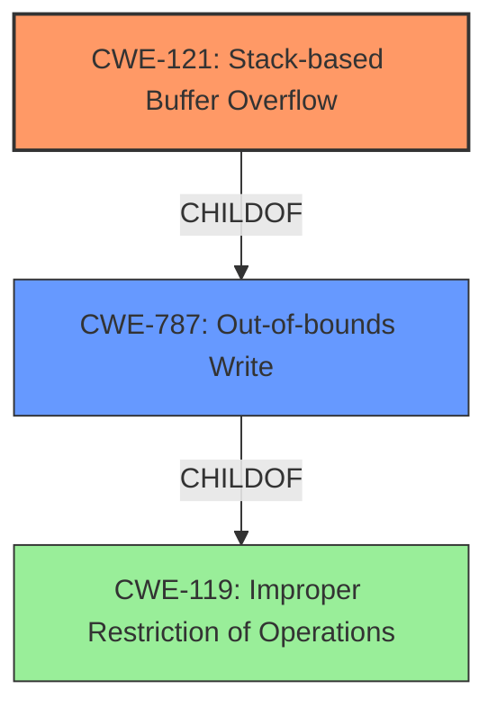

# Final Resolution for CVE-2022-30475

# Summary
| CWE ID | CWE Name | Confidence | CWE Abstraction Level | CWE Vulnerability Mapping Label | CWE-Vulnerability Mapping Notes |
|---|---|---|---|---|---|
| CWE-121 | Stack-based Buffer Overflow | 0.95 | Variant | Primary | Allowed. Precise mapping of the **WEAKNESS** root cause. Vulnerable buffer is located on the stack. |
| CWE-787 | Out-of-bounds Write | 0.70 | Base | Secondary | Allowed. A stack-based buffer overflow is a *type* of out-of-bounds write. Less specific than CWE-121. |

## Evidence and Confidence

*   **Confidence Score:** 0.95
*   **Evidence Strength:** HIGH

## Relationship Analysis
The primary CWE, **CWE-121 (Stack-based Buffer Overflow)**, is a variant of **CWE-787 (Out-of-bounds Write)**, which in turn is a child of **CWE-119 (Improper Restriction of Operations within the Bounds of a Memory Buffer)**. This hierarchical relationship indicates that **CWE-121** provides the most specific and accurate classification for this vulnerability. The vulnerability chain involves an unbounded copy operation into a stack-based buffer, leading to an out-of-bounds write.

## Vulnerability Chain
The vulnerability chain begins with the lack of proper bounds checking when copying user-supplied data (`wpapsk_crypto` parameter) into a stack-based buffer using `strcpy` within the `fromSetWirelessRepeat` function. This leads directly to a **CWE-121 (Stack-based Buffer Overflow)**, which is a specific instance of **CWE-787 (Out-of-bounds Write)**. The impact is potential arbitrary code execution due to overwriting return addresses or other critical data on the stack.

## Summary of Analysis
The initial analysis correctly identified **CWE-121 (Stack-based Buffer Overflow)** as the primary **WEAKNESS**. This assessment is based on the vulnerability description explicitly stating a "stack-based buffer overflow" and the supporting CVE reference materials confirming the unbounded copy operation into a stack-based buffer. The criticism further reinforces this by suggesting mitigations tailored to **CWE-121**, such as compiler-based overflow detection and safe string handling functions.

The graph relationships influenced the final selection by highlighting the hierarchical relationship between **CWE-121**, **CWE-787**, and **CWE-119**, confirming that **CWE-121** offers the optimal level of specificity. While **CWE-787** is a valid secondary classification, **CWE-121** more accurately reflects the root cause of the vulnerability. The fact that the buffer is allocated on the stack makes CWE-121 a more precise mapping.

The provided evidence and relationship analysis strongly support the conclusion that **CWE-121 (Stack-based Buffer Overflow)** is the most appropriate primary **CWE** for this vulnerability.