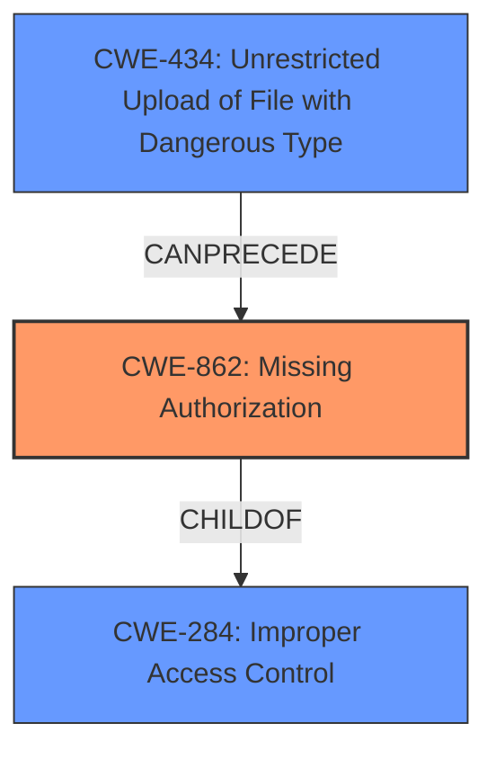

# Final Resolution for CVE-2022-30508

# Summary
| CWE ID | CWE Name | Confidence | CWE Abstraction Level | CWE Vulnerability Mapping Label | CWE-Vulnerability Mapping Notes |
|---|---|---|---|---|---|
| CWE-862 | Missing Authorization | 0.85 | Class | Allowed-with-Review | The `delete` parameter in `upload.php` allows file deletion without any authorization checks, enabling any user to delete any file accessible by the web server process. |
| CWE-434 | Unrestricted Upload of File with Dangerous Type | 0.40 | Base | Allowed | The product allows the upload or transfer of dangerous file types that are automatically processed within its environment. |

  - The Primary CWE should be first and noted as the Primary CWEs
  - The secondary candidate CWEs should be next and noted as secondary candidates.
  - The confidence is a confidence score 0 to 1 to rate your confidence in your assessment for that CWE.
  - The CWE Abstraction Level as one of these values: Base, Variant, Pillar, Class, Compound
  - The Mapping Notes Usage as one of these values: Allowed, Allowed-with-Review, Prohibited, Discouraged

## Evidence and Confidence

*   **Confidence Score:** 0.80
*   **Evidence Strength:** MEDIUM

## Relationship Analysis
- Parent-child hierarchical relationships: CWE-862 is a child of CWE-284 (Improper Access Control), which is a more general class.
- Chain relationships showing progression of vulnerability: The chain could involve CWE-434 (if dangerous files are uploaded) potentially leading to CWE-862 (Missing Authorization on deletion), ultimately resulting in arbitrary file deletion.
- Peer relationships that offered alternative classifications: CWE-732 was considered but deemed less accurate than CWE-862 because the primary issue is the absence of an authorization check, not necessarily an incorrect assignment.
- How abstraction levels influenced your selection: The choice of CWE-862 (Class) was influenced by the absence of more specific Base-level CWEs that directly address the lack of authorization during file deletion. While a Base-level CWE is preferred, the description best matches CWE-862.

## Vulnerability Chain
The chain of root cause and weaknesses that followed for the Vulnerability Description.
  - Map the sequence from initial flaw to final impact
  - Identify which CWEs represent root causes vs. impacts
  - Note any missing links in the chain based on relationship data

The primary root cause is the **lack of authorization checks (CWE-862)** in the `upload.php` script. This **WEAKNESS** allows any user to attempt to delete any file accessible by the web server process. If combined with **unrestricted file upload (CWE-434)**, an attacker could upload a malicious file and then delete legitimate files, or even the malicious file itself to evade detection. The final impact is **arbitrary file deletion**, leading to potential data loss, system instability, or even code execution if critical system files are deleted.

## Summary of Analysis
My analysis concludes that CWE-862 (Missing Authorization) is the most appropriate primary classification for this vulnerability. This decision is based on:

- The vulnerability description explicitly stating "**arbitrary file deletion** vulnerability in `upload.php` via the delete parameter." This strongly suggests a **lack of proper authorization checks** before file deletion.
- The criticism of the initial analysis correctly pointed out the need to investigate the authorization mechanisms (or lack thereof) for file deletion.
- The provided CWE specifications confirm that CWE-862 directly addresses the scenario where a product does not perform an authorization check when an actor attempts to access a resource or perform an action.
- The relationship analysis shows that CWE-862 is a child of CWE-284 (Improper Access Control), which is a more general category. While a more specific Base CWE would be ideal, CWE-862 is the closest match at the Class level.

CWE-434 (Unrestricted Upload of File with Dangerous Type) could be a secondary contributing factor, especially if the system allows uploading files with dangerous extensions or content. However, it's not the direct cause of the file deletion vulnerability, but it can lead to more severe consequences.

The selection of CWE-862 is at the optimal level of specificity given the available information. While a Base-level CWE would be preferred, none of the provided Base CWEs directly address the absence of authorization during file deletion. The vulnerability's core issue is the **missing authorization check**, which aligns perfectly with CWE-862's description.