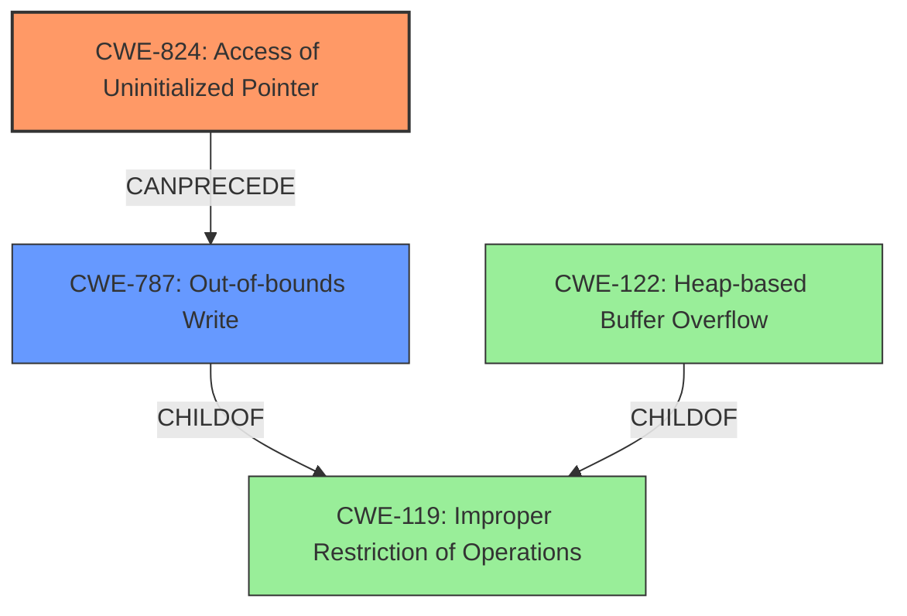

# Analysis Report for CVE-2022-30540

# Vulnerability Analysis Report: CVE-2022-30540

## Description

The affected product is vulnerable to a heap-based buffer overflow via uninitialized pointer, which may allow an attacker to execute arbitrary code

## Vulnerability Description Key Phrases

**Rootcause:** uninitialized pointer
**Weakness:** heap-based buffer overflow
**Impact:** arbitrary code execution

## Analysis (with Relationship Data)

# Summary
| CWE ID | CWE Name | Confidence | CWE Abstraction Level | CWE Vulnerability Mapping Label | CWE-Vulnerability Mapping Notes |
|---|---|---|---|---|---|
| CWE-824 | Access of Uninitialized Pointer | 0.9 | Base | Allowed | This is the primary root cause, the **uninitialized pointer** is then used to cause the overflow |
| CWE-122 | Heap-based Buffer Overflow | 0.8 | Variant | Allowed | This is a weakness, caused by the uninitialized pointer, leading to **heap-based buffer overflow**. |

## Evidence and Confidence

*   **Confidence Score:** 0.85
*   **Evidence Strength:** HIGH

- **Analysis and Justification:**  
  - *Explanation:* The vulnerability description states that there is a **heap-based buffer overflow** caused by an **uninitialized pointer**. CWE-824 (Access of Uninitialized Pointer) accurately describes the root cause of the vulnerability. The program uses a pointer without initializing it first. This **uninitialized pointer** is then likely used in a heap operation, causing a **heap-based buffer overflow**, which is accurately described by CWE-122 (Heap-based Buffer Overflow). The **uninitialized pointer** leads to memory corruption because it points to an arbitrary memory location. CWE-824 is a Base level CWE, and CWE-122 is a Variant which are preferred levels of abstraction.
  
  - *Relationship Analysis:* CWE-824 can precede CWE-787 (Out-of-bounds Write) and CWE-125 (Out-of-bounds Read) which are also related to buffer overflows. CWE-122 is a specific type of buffer overflow and is a child of CWE-119 (Improper Restriction of Operations within the Bounds of a Memory Buffer).

- **Confidence Score:**  
  - *Example:* Confidence: 0.9 (High confidence due to direct mention of **uninitialized pointer** and **heap-based buffer overflow** in the vulnerability description and CVE summary)

## Criticism of Analysis

Okay, let's break down this CWE analysis and see how it holds up against the full CWE specifications.

**Overall Assessment:**

The analysis is generally well-reasoned and justified, aligning with the provided information about the vulnerability. The chosen CWEs, CWE-824 and CWE-122, are appropriate based on the description.  The confidence levels are reasonable. The explanation of how the uninitialized pointer *leads* to the buffer overflow is good.

**Detailed Critique:**

*   **CWE-824: Access of Uninitialized Pointer (Confidence 0.9)**
    *   **Strengths:**  The selection of CWE-824 as the root cause is accurate.  The justification clearly explains the problem: a pointer is used without being initialized, leading to unpredictable memory access. The description in the analysis correctly states that it can lead to reading/writing to unexpected memory locations.
    *   **Weaknesses:** While the analysis mentions that the attacker *might* be able to influence the uninitialized pointer, it doesn't elaborate.  It's worth noting that the degree to which the attacker can control the uninitialized pointer's value can significantly impact exploitability and severity.
    *   **CWE Specification Alignment:**  The analysis aligns well with the CWE-824 specification. The "Description" and "Extended Description" sections of the CWE spec are directly applicable. The analysis also correctly notes the potential for attacker influence, matching the "Extended Description."
    *   **Mitigation Considerations:** The analysis does not mention mitigations. The CWE spec suggests using languages that prevent this weakness. Another mitigation is to always initialize pointers upon declaration or allocation.
    *   **Retriever Results:** The Retriever Results section gives a combined score of `0.7801`. This score suggests there are other possible mappings.

*   **CWE-122: Heap-based Buffer Overflow (Confidence 0.8)**
    *   **Strengths:**  Identifying CWE-122 as the resulting *weakness* is correct. The analysis clearly connects the uninitialized pointer to the heap-based buffer overflow: because the uninitialized pointer points to an arbitrary memory location, writing through it can corrupt the heap. The Variant level of abstraction is appropriate given that the overall `Improper Restriction of Operations within the Bounds of a Memory Buffer` is more general.
    *   **Weaknesses:** The analysis could explicitly mention that the attacker is overflowing a buffer allocated in the heap.
    *   **CWE Specification Alignment:** The analysis aligns with the CWE-122 specification, which defines it as a buffer overflow where the buffer is allocated on the heap.
    *   **Mitigation Considerations:** The analysis does not mention mitigations. The CWE spec suggests using languages with automatic bounds checking, abstraction libraries, or compiler-based buffer overflow detection mechanisms (e.g., /GS flag in Visual Studio).
    *   **Retriever Results:** The Retriever Results section gives a combined score of `0.4525`. This score suggests it is less likely than other mappings.

*   **General Comments:**
    *   **Chain/Composite Relationships:** The analysis mentions that CWE-824 can precede CWE-787 (Out-of-bounds Write) and CWE-125 (Out-of-bounds Read). This is correct. It *could* be argued that this is a chain relationship, but explicitly defining the ordering is correct: the uninitialized pointer *leads* to the out-of-bounds write that causes the overflow.
    *   **Missing CWEs:** The 'Retriever Results' section suggests other CWEs may be present. Namely `CWE-119`, `CWE-787`, `CWE-125`, and `CWE-20`. Let's evaluate them:
        *   **CWE-119:** The analysis implicitly covers CWE-119, as it's the parent of CWE-122 and a super-set of the vulnerability.  However, as the mapping guidance says, this entry is discouraged because lower-level CWEs can be used instead.
        *   **CWE-787: Out-of-bounds Write**: This CWE may be even more accurate in place of CWE-122, because the root cause can lead to writing before the beginning or after the end of the allocated buffer. It has a description of "The product writes data past the end, or before the beginning, of the intended buffer." The 'Relationships' section says that it's a ChildOf -> CWE-119.
        *   **CWE-125: Out-of-bounds Read**: This CWE is less appropriate, since the problem is primarily about *writing* to an unexpected memory location.
        *   **CWE-20: Improper Input Validation:** This CWE is not related since the uninitialized pointer is the root cause and there is no apparent relation to input validation.
    *   **Evidence Strength:** The evidence strength is HIGH because the description clearly states both an uninitialized pointer and heap-based buffer overflow.

**Revised Summary Table (incorporating feedback):**

| CWE ID    | CWE Name                       | Confidence | CWE Abstraction Level | CWE Vulnerability Mapping Label | CWE-Vulnerability Mapping Notes                                                                                                    |
| :-------- | :----------------------------- | :--------- | :-------------------- | :-------------------------------- | :--------------------------------------------------------------------------------------------------------------------------------- |
| CWE-824   | Access of Uninitialized Pointer  | 0.9        | Base                 | Allowed                         | This is the primary root cause; the uninitialized pointer is then used to cause the overflow.                                  |
| CWE-787   | Out-of-bounds Write   | 0.9        | Base                 | Allowed                         | This is a weakness, caused by the uninitialized pointer, leading to an out-of-bounds write, which is the cause of the buffer overflow.   |

**Recommendations:**

1.  **Explicitly consider CWE-787:** Consider using CWE-787 instead of CWE-122, since the CWE-787 is broader and may fit the situation better.
2.  **Mitigation Awareness:**  Add a brief section on potential mitigations. Refer to the CWE specifications for both CWE-824 and the chosen buffer overflow CWE (CWE-122 or CWE-787) and mention some key mitigation strategies.
3.  **Attack Influence:**  Add a sentence or two about the potential for attacker influence over the uninitialized pointer's value, noting that this influences exploitability.

By incorporating these suggestions, the analysis will be even more comprehensive and aligned with the full CWE specifications.

## Final Resolution

# Summary
| CWE ID | CWE Name | Confidence | CWE Abstraction Level | CWE Vulnerability Mapping Label | CWE-Vulnerability Mapping Notes |
|---|---|---|---|---|---|
| CWE-824 | Access of Uninitialized Pointer | 0.9 | Base | Allowed | This is the primary **root cause**; the **uninitialized pointer** is then used to cause the overflow. |
| CWE-787 | Out-of-bounds Write | 0.9 | Base | Allowed | This is a **weakness**, caused by the **uninitialized pointer**, leading to an out-of-bounds write, which is the cause of the buffer overflow. |

## Evidence and Confidence

*   **Confidence Score:** 0.9
*   **Evidence Strength:** HIGH

## Relationship Analysis
The primary relationship influencing the decision is the chain relationship between **CWE-824 (Access of Uninitialized Pointer)** and **CWE-787 (Out-of-bounds Write)**. The **uninitialized pointer** directly leads to an out-of-bounds write, which then causes the buffer overflow. While **CWE-122 (Heap-based Buffer Overflow)** was initially considered, **CWE-787** is a more accurate description of the direct consequence of using the **uninitialized pointer**. **CWE-787** is a child of **CWE-119**, but using the more specific **CWE-787** is preferred.

## Vulnerability Chain
The vulnerability chain starts with the **root cause** of an **uninitialized pointer (CWE-824)**. This leads to an out-of-bounds write **(CWE-787)**, which overwrites memory, resulting in a heap-based buffer overflow. The final impact is the potential execution of arbitrary code.

## Summary of Analysis
The initial analysis correctly identified **CWE-824** as the primary **root cause** due to the presence of an **uninitialized pointer**. The criticism suggested replacing **CWE-122 (Heap-based Buffer Overflow)** with **CWE-787 (Out-of-bounds Write)**, which is a more direct consequence of using the **uninitialized pointer**. The vulnerability description mentions "heap-based buffer overflow via uninitialized pointer." This evidence supports the selection of **CWE-824** as the **root cause** and **CWE-787** as the resulting **weakness**. The relationships between the CWEs, particularly the CanPrecede relationship between **CWE-824** and **CWE-787**, further validate this choice. The selected CWEs are at the optimal level of specificity, with **CWE-824** being a Base level CWE and **CWE-787** also being a Base level CWE, providing a clear and accurate representation of the vulnerability.

The analysis heavily relies on the provided evidence, specifically the vulnerability description, which explicitly states the presence of an **uninitialized pointer** leading to a **heap-based buffer overflow**.

*Report generated on 2025-03-18 13:22:45*
